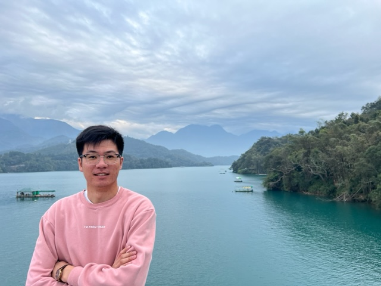
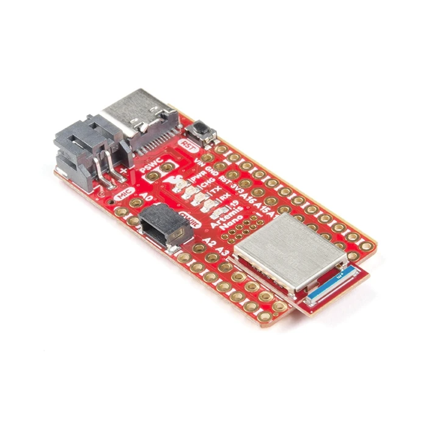

# Ben Liao

Hi! I am a first year PhD student in Prof. Khurram Afridi's group, researching power electronics. My current research project focuses on designing a controller for a portion of a capacitive wireless charging system.

I am taking this class to learn some state-space control theory, and (in general) as a purely for-fun elective, as I have always thought dynamic robots were really awesome and did not get to take a class like this in my undergraduate studies.

I graduated from UC Berkeley in Fall 2022 with degrees in Electrical Engineering & Computer Science, and Mechanical Engineering.

# Lab Reports

Click on the images to navigate to the lab report!

## Lab 1

