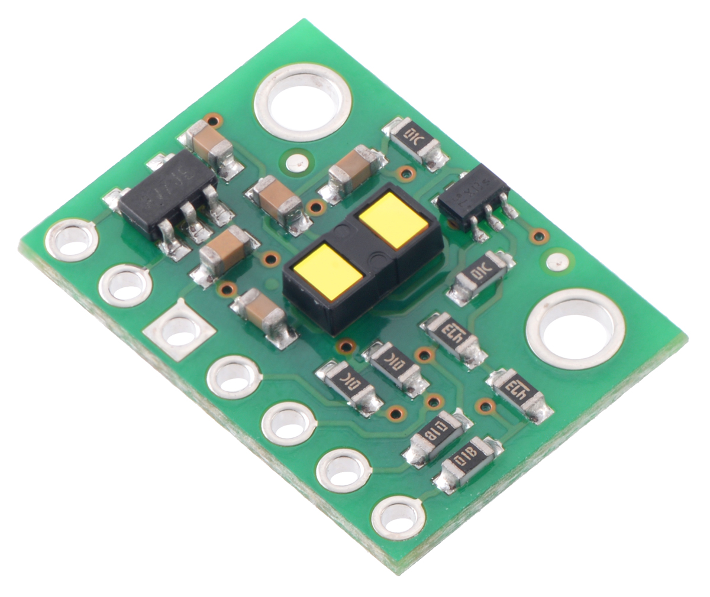
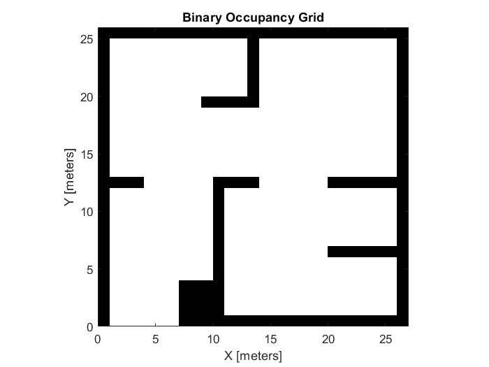

# Ben Liao

Hi! I am a first year PhD student in Prof. Khurram Afridi's group, researching power electronics. My current research project focuses on designing a controller for a portion of a capacitive wireless charging system.

I am taking this class to learn some state-space control theory, and (in general) as a purely for-fun elective, as I have always thought dynamic robots were really awesome and did not get to take a class like this in my undergraduate studies.

I graduated from UC Berkeley in Fall 2022 with degrees in Electrical Engineering & Computer Science, and Mechanical Engineering.

# Lab Reports

Click on the images to navigate to the lab report!

## Lab 1 - Artemis and Bluetooth

## Lab 2 - Inertial Measurement Unit (IMU)

## Lab 3 - Time of Flight (ToF) Sensors

## Lab 4 - Motor Drivers && Motors

## Lab 5 - PID Control (Part 1)

## Lab 6 - PID Control (Part 2)

## Lab 7 - Kalman Filter

## Lab 8 - Stunt

## Lab 9 - Mapping

