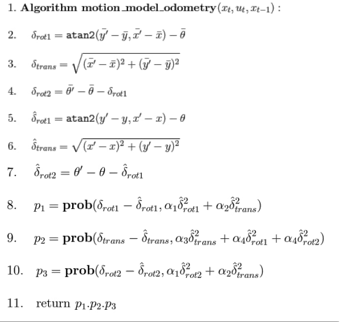
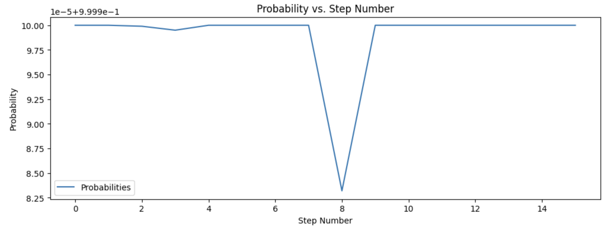

# Lab 10 Report

In this lab, we used a simulation in a Jupyter notebook to perform localization in a virtual recreation of the map in our lab space, and verified its performance.

## Lab Tasks

Here, I outline the code that was written to perform the simulation.

### `compute_control()` function

This function takes the current and previous robot poses and computes how the robot traveled from the previous pose to the current pose as a sequence of three actions: a rotation at the current location, a translation along the line between the previous and current positions, and a rotation at the current location. Here is the implemented function:

```python
def compute_control(cur_pose, prev_pose):
    """ Given the current and previous odometry poses, this function extracts
    the control information based on the odometry motion model.

    Args:
        cur_pose  ([Pose]): Current Pose
        prev_pose ([Pose]): Previous Pose 

    Returns:
        [delta_rot_1]: Rotation 1  (degrees)
        [delta_trans]: Translation (meters)
        [delta_rot_2]: Rotation 2  (degrees)
    """
    cur_yaw = cur_pose[2]
    prev_yaw = prev_pose[2]

    dx = cur_pose[0] - prev_pose[0]
    dy = cur_pose[1] - prev_pose[1]

    # get angle theta between current position and previous position
    theta = math.atan2(dy, dx)

    # compute rotation at previous position, translation, and rotation at current position
    delta_rot_1 = theta - prev_yaw
    delta_trans = math.sqrt(dx**2 + dy**2)
    delta_rot_2 = cur_yaw - prev_yaw - delta_rot_1

    # normalize angles
    delta_rot_1 = mapper.normalize_angle(delta_rot_1)
    delta_rot_2 = mapper.normalize_angle(delta_rot_2)
    
    return delta_rot_1, delta_trans, delta_rot_2
```

### `odom_motion_model()` function

This function takes the current and previous pose and computes the probability that the robot actually ended up at its current pose. We follow the steps outlined on the slides:



Implementing these equations results in the following code:

```python
def odom_motion_model(cur_pose, prev_pose, u):
    """ Odometry Motion Model

    Args:
        cur_pose  ([Pose]): Current Pose
        prev_pose ([Pose]): Previous Pose
        (rot1, trans, rot2) (float, float, float): A tuple with control data in the format 
                                                   format (rot1, trans, rot2) with units (degrees, meters, degrees)
    Returns:
        prob [float]: Probability p(x'|x, u)
    """

    # obtain the control sequence to get from current pose to previous pose
    delta_rot_1, delta_trans, delta_rot_2 = compute_control(cur_pose, prev_pose)

    # extract and normalize angles for the actual control input
    delta_rot_1_hat, delta_trans_hat, delta_rot_2_hat = u
    delta_rot_1_hat = mapper.normalize_angle(delta_rot_1_hat)
    delta_rot_2_hat = mapper.normalize_angle(delta_rot_2_hat)

    # get the probability that the robot is in the current pose given the control action
    p1 = loc.gaussian(delta_rot_1, delta_rot_1_hat, loc.odom_rot_sigma)
    ptrans = loc.gaussian(delta_trans, delta_trans_hat, loc.odom_trans_sigma)
    p2 = loc.gaussian(delta_rot_2, delta_rot_2_hat, loc.odom_rot_sigma)

    # return the product of the three probabilities
    return p1 * ptrans * p2
```

### `prediction_step()` function

This function implements the prediction step of the Bayes filter. It updates the giant array of probabilities, one for every possible robot pose, based on the current and previous poses. Since this is just the prediction step, we do not take into account any new sensor measurements, as there are none. Here is the code that implements this:

```python
def prediction_step(cur_odom, prev_odom):
    """ Prediction step of the Bayes Filter.
    Update the probabilities in loc.bel_bar based on loc.bel from the previous time step and the odometry motion model.

    Args:
        cur_odom  ([Pose]): Current Pose
        prev_odom ([Pose]): Previous Pose
    """

    # get the control action u between the current and previous odometer values
    u = compute_control(cur_odom, prev_odom)

    # initialize the updated beliefs
    bel_bar = np.zeros([mapper.MAX_CELLS_X, mapper.MAX_CELLS_Y, mapper_MAX_CELLS_A])

    # loop through all of the possible previous robot poses
    for prev_pose_x in range(mapper.MAX_CELLS_X):
        for prev_pose_y in range(mapper.MAX_CELLS_Y):
            for prev_pose_yaw in range(mapper.MAX_CELLS_A):

                # if the probability of this previous pose is greater than some minimum threshold
                if(loc.bel[prev_pose_x, prev_pose_y, prev_pose_yaw] > .0001):

                    # loop through all of the possible poses again and compute the probability that
                    # this is the current pose, given the specified previous pose
                    for cur_pose_x in range(mapper.MAX_CELLS_X):
                        for cur_pose_y in range(mapper.MAX_CELLS_Y):
                            for cur_pose_yaw in range(mapper.MAX_CELLS_A):
                                prev_pose = mapper.from_map(prev_pose_x, prev_pose_y, prev_pose_yaw)
                                cur_pose = mapper.from_map(cur_pose_x, cur_pose_y, cur_pose_yaw)
                                prob = odom_motion_model(cur_pose, prev_pose, u)
                                bel = loc.bel[prev_pose_x, prev_pose_y, prev_pose_yaw]
                                bel_bar[cur_pose_x, cur_pose_y, cur_pose_yaw] += prob * bel
    
    # normalize the belief table
    loc.bel = np.true_divide(loc.bel,np.sum(loc.bel))
```

### `sensor_model()` function

This function takes as input an array of sensor measurements at a given location and outputs the likelihood that we received each measurement. Here is the code that implements this:

```python
def sensor_model(obs):
    """ This is the equivalent of p(z|x).

    Args:
        obs ([ndarray]): A 1D array consisting of the true observations for a specific robot pose in the map 

    Returns:
        [ndarray]: Returns a 1D array of size 18 (=loc.OBS_PER_CELL) with the likelihoods of each individual sensor measurement
    """

    prob_array = []
    for i in range(mapper.OBS_PER_CELL):
        prob_array += [loc.gaussian(loc.obs_range_data[i][0], obs[i], loc.sensor_sigma)]
        
    return prob_array 
```

### `update_step()` function

This updates the local belief probability array given new sensor information. Here is the code that implements this:

```python
def update_step():
    """ Update step of the Bayes Filter.
    Update the probabilities in loc.bel based on loc.bel_bar and the sensor model.
    """
    # for every possible robot pose, get the probability that we got the given sensor readings
    # then incorporate those readings into the local belief array
    for x in range(mapper.CELLS_X):
        for y in range(mapper.MAX_CELLS_Y):
            for a in range(mapper.MAX_CELLS_A):
                sensor_prob = np.prod(sensor_model(mapper.get_views(x,y,a)))
                loc.bel[x][y][a] = sensor_prob * loc.bel_bar[x][y][a]

    # normalize the probabilities
    loc.bel = np.true_divide(loc.bel,np.sum(loc.bel))
```

### Simulation Result

Running the simulation, we obtain the following:

<iframe width="560" height="315" src="https://www.youtube.com/embed/raUq9ZvNYIA?si=ZVK8zchFnqEGdosz" title="YouTube video player" frameborder="0" allow="accelerometer; autoplay; clipboard-write; encrypted-media; gyroscope; picture-in-picture; web-share" referrerpolicy="strict-origin-when-cross-origin" allowfullscreen></iframe>

The green line is the ground truth of where the robot actually is, the blue line is where the robot believes it is, and the red line is where the odometry model believes the robot is. We can see that incorporating the sensor measurements really improves the accuracy of using the odometry model (i.e. dead reckoning).

Below is a plot of the probability that the robot is at each pose as it moves along its journey through the map (there are 15 steps, corresponding to the dots on the map):



Notice the y-axis -- the probability is either 1.0 or extremely close to 1.0 for every single time step, showing the power of Bayes' filter being able to pinpoint the position of the robot even with noisy sensor data and an extremely inaccurate odometry model!

## Acknowledgements

* Sophia Lin (lab partner -- we worked on this lab together since it was all simulation)
* A variety of people from past years
