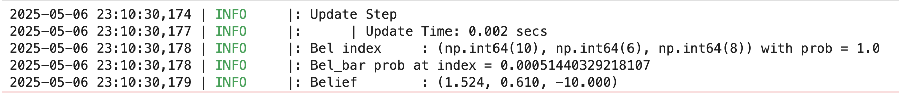

# Lab 11 Report

In this lab, we combined our scanning from lab 9 with our localization math from lab 10 to perform localization on the real map setup in the fast robots lab room using scans at set locations.

## Lab Tasks

### Simulation Result

First, we run the provided code to perform localization in simulation to make sure that the files were copied into the right locations on the local filesystem. The result is the same as in Lab 10. Below is a screenshot of a successful run of the localization simulation result:


### Real Result

#### C and Python Code Setup

First, we upload the code from Lab 9 to the robot, with a small number of changes to get the robot to spin 18 times in increments of 20 degrees each, to round out the full 360 degrees. I also changed the direction of the scan from clockwise to counterclockwise. Here is the relevant code:

```cpp
// degrees per turn
#define DEG_PER_TURN -20.0

// max. angle we're at at the end of our 18th turn
#define MAX_ANGLE -360.0

// number of data points
#define NUM_POINTS 18
```

I noticed as well that there was a semantic error in the lab 9 code, causing the robot to take two data points at 0 degrees instead of just 1. I fixed it by doing the following:

```cpp
void loop() {
    // Listen for connections
    BLEDevice central = BLE.central();

    // If a central is connected to the peripheral
    if (central) {
        Serial.print("Connected to: ");
        Serial.println(central.address());

        // While central is connected
        while (central.connected()) {

            myICM.readDMPdataFromFIFO(&data);
            
            // if want to run pid loop
            if (run_pid_loop) {

                // if space in the TOF sensor array
                if (tof_arr_ix < tof_log_size) {
                    // get ToF data (see lab 9)
                }

                // Is valid data available and space in array?
                if ((imu_arr_ix < imu_log_size) && ((myICM.status == ICM_20948_Stat_Ok) || (myICM.status == ICM_20948_Stat_FIFOMoreDataAvail))) {
                    // get IMU data (see lab 9)
                }

                // if in measure state, take ToF data, store it, and then flip to turn state
                if (mvmt_state == MEASURE) {
                    // take ToF data
                    if (tof_arr_ix < 3) {
                        continue;
                    }
                    distance_data[turn_counter] = tof_data_two[tof_arr_ix - 1];
                    turn_counter++;

                    // if we are at the max angle, we're done
                    if (angle_setpoint == MAX_ANGLE) {
                        mvmt_state = END;
                    } else {
                        mvmt_state = TURN;
                        angle_setpoint += DEG_PER_TURN; // <---------- MOVED THIS LINE HERE -------
                    }
                    mvmt_state_start_time = millis();
                }

                // if in turn state and the allotted time for a turn has passed, increment the setpoint and flip to measure state
                if (mvmt_state == TURN && millis() - mvmt_state_start_time > TURN_TIME) {
                    // ************************* LINE USED TO BE HERE ********************* //
                    mvmt_state = MEASURE;
                }
            }

            // Send data
            write_data();

            // Read data
            read_data();
        }
        Serial.println("Disconnected");
    }
}
```

On the Python side, due to the way I implemented the Lab 9 code, it was not simple to implement the function `perform_observation_loop()` in the `RealRobot()` class. Instead of doing that, I split the update step into separate cells so I could run the data acquisition in the same way as in Lab 9. Here is the Python code, with the `#######` separating the different cells:

```python
##############
distance_data = []

def distance_log_notification_handler(uuid, characteristic):
    s = ble.bytearray_to_string(characteristic)
    strs = s.split('|')
    
    distance_data.append((float(strs[0]) / 100.0) + 0.08)
        
ble.start_notify(ble.uuid['RX_STRING'], distance_log_notification_handler)

##############

# Reset Plots
cmdr.reset_plotter()

# Init Uniform Belief
loc.init_grid_beliefs()

# Plot Odom and GT
# current_odom, current_gt = robot.get_pose()
# cmdr.plot_gt(current_gt[0], current_gt[1])
# cmdr.plot_odom(current_odom[0], current_odom[1])

##############

# run command for some number of seconds
run_pid_time = 20;
ble.send_command(CMD.START_PID_MVMT, "");
time.sleep(run_pid_time);
ble.send_command(CMD.STOP_PID_MVMT, "");

# clear the list, then send command to get data back
distance_data.clear()

ble.send_command(CMD.SEND_DISTANCE_LOGS, "");

##############

# put the data into the Localization class
loc.set_obs_data(np.array(distance_data)[np.newaxis].T, np.arange(0, 360, 20).T)

# Run Update Step
loc.update_step()
loc.plot_update_step_data(plot_data=True)

x = 5.0 # x-coordinate of Ground Truth
y = 3.0 # y-coordinate of Ground Truth
cmdr.plot_gt((x * 12.0 * 2.54) / 100.0, (y * 12.0 * 2.54) / 100.0)

##############
```

Notice that doing it this way, we need to put the acquired data into the `loc` object manually using a simple setter function that I wrote for this purpose:

```python
class BaseLocalization():
    # .....
    
    # setter functions for obs_range_data and obs_bearing_data
    def set_obs_data(self, obs_range_data, obs_bearing_data):
        self.obs_range_data = obs_range_data
        self.obs_bearing_data = obs_bearing_data
```

#### Physical Results

Below is a video of the robot performing a localization scan at the (5, -3) scan location:

<iframe width="560" height="315" src="https://www.youtube.com/embed/P6aR9uQS4cE?si=Qa3pIXXj_Buht5kb" title="YouTube video player" frameborder="0" allow="accelerometer; autoplay; clipboard-write; encrypted-media; gyroscope; picture-in-picture; web-share" referrerpolicy="strict-origin-when-cross-origin" allowfullscreen></iframe>

And here are the localization results for the four separate marked robot poses. For each pose, I have included 1) the ground truth (green) and predicted location (blue) of the robot on the 2D map provided; 2) a screenshot of the belief output by the Bayes filter as well as the probability the Bayes filter believes that the robot is in its output location; and 3) the ground truth location of the robot, converted to meters for easier direct comparison with the Bayes filter output.

**(-3, -2) pose** (this localization was great, the two points are right on top of each other):


**(0, 3) pose** (this localization was also great, with the two points right on top of each other):


**(5, -3) pose** (this localization was also great, with the two points right on top of each other):


**(5, 3) pose** (this was the least accurate localization):





As you can clearly see, the localization algorithm and Bayes filter is extraordinarily accurate! The only localization that I wasn't able to get an accurate localization for was the (5, 3) pose, and I think it was because there are a lot of close walls in that area that might not be able to be read accurately by the ToF sensor in long mode.

## Acknowledgements

* Cheney Zhang (for keeping the lab open for me an extra 30 minutes or so to acquire the data)
* Pengru Lung (for telling me what was good enough for the localization)
* Katarina Duric (for giving me some pointers on common mistakes for when implementing the code)

