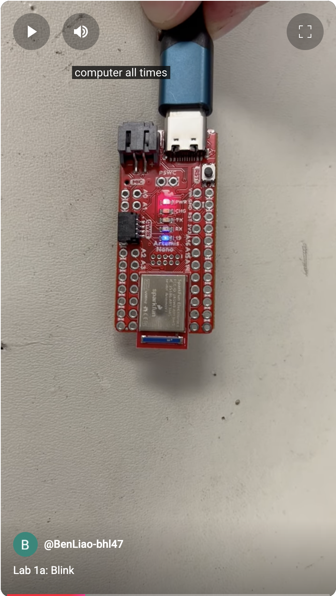
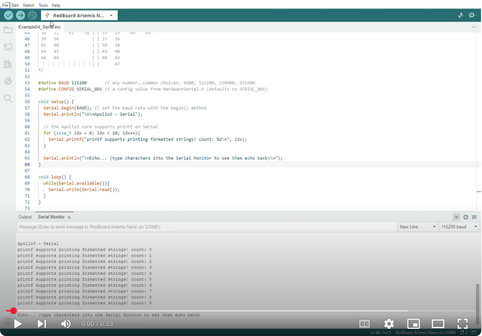
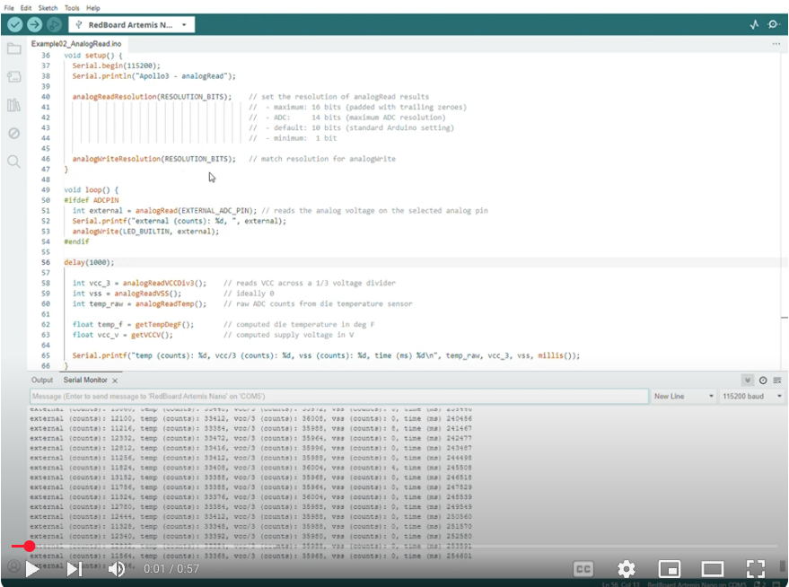
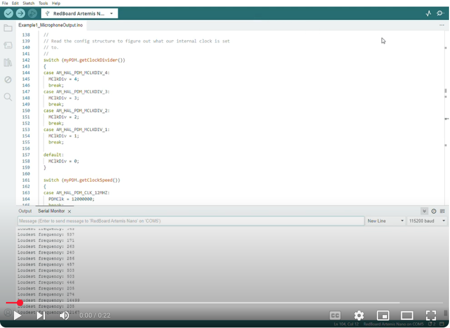
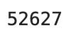
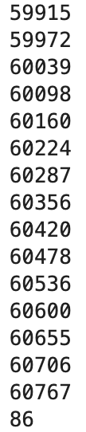
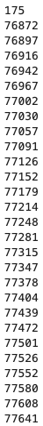
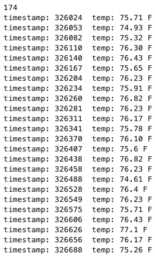
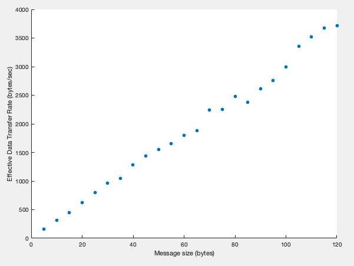
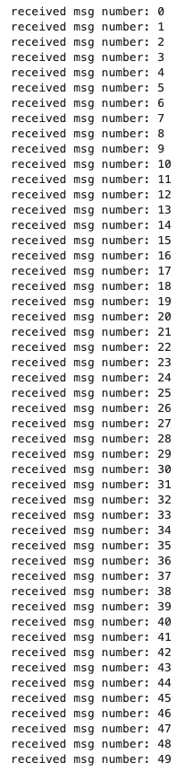

# Lab 1 Report

In this lab, we familiarized ourselves with the Artemis Nano microcontroller and the software framework the class provides us to send commands / receive data to the board via Bluetooth.

## Prelab

### Setup

To set up my computer for this class, the following steps were taken:

1. Download Arduino IDE and install the appropriate bootloader software for the Artemis Nano
2. Download the Arduino Bluetooth package in the Arduino IDE
3. Install Python 3.13 and set up a virtual environment with `venv` in which to run a Jupyter notebook

As part of the prelab, we had to establish a working Bluetooth connection between the Artemis and the computer. After loading the example `ble_arduino.ino` to the board, the Artemis printed its MAC address to the serial monitor in the Arduino IDE:


### Codebase

We also needed to familiarize ourselves with the codebase used to communicate between the Artemis and computer. Below is a brief explanation of the codebase:

On the Arduino side, we define classes `RobotCommand`, `BLEStringCharacteristic`, and `EString` to help us process received commands, interpret the received data, and maniuplate the received strings, respectively. 

On the Python side, we define functions which help us send (`send_command()`) and receive (`receive_string/float/int()`, `start_notify()`) commands and their arguments to and from the Artemis in a standardized way.

The Artemis and the computer can be connected via Bluetooth. The Artemis advertises its MAC address as well as a unique identifier. The computer has access to the identifier and connects to the Artemis using this identifier. Then, the two sides can talk to each other by exchanging messages (bytearrays).

## Lab Tasks

### Configurations

To configure the Bluetooth connection, I used a Python snippet to generate a random UUID specific to my board, so that my computer did not accidentally send commands to somebody else's board in the lab. The UUID needs to be input into the Bluetooth configurations of both the computer side (Python) and the Artemis side (C++):

On the Python side, in `connection.yaml`:

```python
artemis_address: 'C0:C2:8A:89:98:08'

ble_service: '1850f67f-72cc-41ef-8c6b-fe981e8c9eda'
```

On the C++ side, in `ble_arduino.ino`:

```cpp
#define BLE_UUID_TEST_SERVICE "1850f67f-72cc-41ef-8c6b-fe981e8c9eda"
```

### Lab 1a, Task 1: Connect Artemis to Computer

Here is a screenshot of the Artemis showing up in the Arduino IDE Boards and Port:


### Lab 1a, Task 2: Blink

I downloaded the "Blink" example from the Arduino examples and ran it. Here is a video of it working:

[](https://youtube.com/shorts/i5GIhiIritA?feature=share "Blink Video")

### Lab 1a, Task 3: Example4_Serial

I downloaded the "Example4_Serial" example from the Arduino examples and ran it. Here is a video of it working:

[](https://youtu.be/jhlCMhnNLHs "Serial Read Video")

### Lab 1a, Task 4: Example2_analogRead

I downloaded the "Example2_analogRead" example from the Arduino examples and ran it. Here is a video of it working:

[](https://youtu.be/tNaCE0wkh1c "Temp Sensor Video")

### Lab 1a, Task 5: Example1_MicrophoneOutput

I downloaded the "Example1_MicrophoneOutput" example from the Arduino examples and ran it. Here is a video of it working:

[](https://youtu.be/VDYVDc8w6B8 "Microphone Video")

### Lab 1a, Task 6: C Tone Detector

In this task, we were asked to create a program that blinks the Artemis' built-in LED when any "C" tone is played. To do this, I wrote a function that determined whether a given frequency was a C:

```cpp
// returns 1 if loudest_freq is C; returns 0 otherwise
uint8_t is_C (uint32_t loudest_freq)
{
  const uint32_t C_low_range = 257;
  const uint32_t C_high_range = 265;
  uint8_t ret = 8; // return value
  uint8_t going_up = (loudest_freq > C_high_range) ? 0 : 1;
  double temp = 0.0;

  while (ret == 8) {
    // if loudest frequency is within the range
    if (loudest_freq < C_high_range && loudest_freq > C_low_range) {
      ret = 1;
      break;
    }

    // special case if loudest_freq is 0 for some reason
    if (loudest_freq == 0) {
      ret = 0;
      break;
    }

    // if going down and below C_low_range, it's not a C
    if (!going_up && (loudest_freq < C_low_range)) {
      ret = 0;
      break;
    }

    // if going up and above C_high_range, it's not a C
    if (going_up && (loudest_freq > C_high_range)) {
      ret = 0;
      break;
    }

    // else, update the value of loudest_freq in accordance with going_up:
    // multiply by 2 if going up; divide by 2 if going down
    if (going_up) {
      loudest_freq *= 2;
    } else {
      // round to nearest integer when dividing by 2
      temp = (double) loudest_freq / 2.0;
      loudest_freq = (uint32_t) (temp + 0.5);
    }
  }
  
  return ret;
}
```

Then, in the loop, I wrote some logic to blink the LED if the current tone being played was a C, and turn the LED off when it is not a C:

```cpp
void loop() {

    ...
    
    if (is_C(loudest_freq)) {
          if (currentMillis - previousMillis >= interval) {
            previousMillis = currentMillis;
            if (LED_state == LOW) {
              LED_state = HIGH;
              Serial.printf("LED_state: ON\n");
            } else {
              LED_state = LOW;
              Serial.printf("LED_state: OFF\n");
            }
          }
        } else {
          // turn the LED off (not a C)
          LED_state = 0;
        }
    
        digitalWrite(LED_BUILTIN, LED_state);

        ...
}
```

`currentMillis` holds the current time as returned by the `millis()` function. `previousMillis` holds the last time that the LED state was changed (high to low, or low to high); this is what creates the blinking effect. `interval` is 1000, so the blinking frequency is 0.5 Hz (on for 1 second, off for 1 second, and so on).

Below is a demo of this code working:


### Lab 1b, Task 1: `ECHO` Command

The `ECHO` command was modified in the Arduino code to append the words `"Artemis says -> "` to the front of the received string, then send it back to the computer:

```cpp
case ECHO:

    // Extract the next value from the command string as a character array
    success = robot_cmd.get_next_value(char_arr);
    if (!success)
        return;

    tx_estring_value.clear();
    tx_estring_value.append("Artemis says -> ");
    tx_estring_value.append(char_arr);
    tx_characteristic_string.writeValue(tx_estring_value.c_str());

    Serial.print("Sent back: ");
    Serial.println(tx_estring_value.c_str());
    
    break;
```

To test the command in Python, I used the following code in the Jupyter notebook:

```python
ble.send_command(CMD.ECHO, "Happy Chinese New Year!")
s = ble.receive_string(ble.uuid['RX_STRING'])
print(s)
```

The resulting output is shown in the screenshot below:


### Lab 1b, Task 2: `SEND_THREE_FLOATS` Command

The `SEND_THREE_FLOATS` command was filled out in the Arduino code to receive three `float`s from the computer and print them to the Serial Monitor in the Arduino IDE:

```cpp
case SEND_THREE_FLOATS:
    float float_a, float_b, float_c;

    // Extract the next value from the command string as an float
    success = robot_cmd.get_next_value(float_a);
    if (!success)
        return;

    // Extract the next value from the command string as an float
    success = robot_cmd.get_next_value(float_b);
    if (!success)
        return;

    // Extract the next value from the command string as an float
    success = robot_cmd.get_next_value(float_c);
    if (!success)
        return;

    Serial.print("Three Floats: ");
    Serial.print(float_a);
    Serial.print(", ");
    Serial.print(float_b);
    Serial.print(", ");
    Serial.println(float_c);

    break;
```

To test the command in Python, I used the following code in the Jupyter notebook:

```python
ble.send_command(CMD.SEND_THREE_FLOATS, "0.1|-1.7|1777.0")
```

The resulting output is shown in the screenshot below:


### Lab 1b, Task 3: `GET_TIME_MILLIS` Command

The `GET_TIME_MILLIS` command was filled out in the Arduino code to get a time using the `millis()` function, convert the `unsigned long` into a string, and append the characters `T:` to the front:

```cpp
case GET_TIME_MILLIS:

    // get current time and sprintf it into a string
    currentMillis = millis();
    sprintf(char_arr, "T:%u", currentMillis);

    tx_estring_value.clear();
    tx_estring_value.append(char_arr);
    tx_characteristic_string.writeValue(tx_estring_value.c_str());

    break;
```

To test the command in Python, I used the following code in the Jupyter notebook:

```python
ble.send_command(CMD.GET_TIME_MILLIS, "")
s = ble.receive_string(ble.uuid['RX_STRING'])
print(s)
```

The resulting output is shown in the screenshot below:


### Lab 1b, Task 4: Notification Handler

In this task, we were asked to write a notification handler to process the result of running the `GET_TIME_MILLIS` (i.e. strip the starting `T:` from the result and print it):

```python
def task4_notification_handler(uuid, characteristic):
    s = ble.receive_string(uuid)
    print(s[2:]) # print only time part of the string

ble.start_notify(ble.uuid['RX_STRING'], task4_notification_handler)

ble.send_command(CMD.GET_TIME_MILLIS, "")
```

The resulting output is shown in the screenshot below:



### Lab 1b, Task 5: Data Transfer Rate with Notification Handler

In this task, we were asked to write a loop that sent the `GET_TIME_MILLIS` command as fast as possible and compute the data transfer rate. We used the same notification handler from Task 4, and wrote the following code in the Jupyter notebook to perform the desired actions and calculations:

```python
t_end = time.time() + 5 # run the loop for 5 seconds
recvd_msgs = 0 # counter on number of received messages

while time.time() < t_end:
    ble.send_command(CMD.GET_TIME_MILLIS, "")
    recvd_msgs += 1

print(recvd_msgs)
```

Part of the resulting output is shown in the screenshot below:



The 86 at the bottom of the screenshot is how many messages were received in the allotted time of 5 seconds. Therefore, the effective data transfer rate is 86 * (60/5) = **1056 messages per minute**, or around **18 messages per second**.

### Lab 1b, Task 6: `SEND_TIME_DATA` Command

In this task, we were asked to write a command which did the same thing as task 5, except buffered the sending of the data from the Artemis to the computer until the very end. I created two new commands:

* `GET_TIME_MILLIS_BUF`, which, when received, calls the `millis()` function and stores the value into the next available spot in a global array on the Artemis
* `SEND_TIME_DATA`, which, when received, goes through the global array and sends all of the stored values one at a time as a string back to the computer, then resets the array for future use

Here is the definition of the global array, which is near the top of the `ble_arduino.ino` file:

```cpp
// variables for holding times for lab 1b task 6 onward
const int arr_max_len = 1000;
unsigned long current_millis_arr[arr_max_len];
int arr_ix = 0; // for holding current index into array
```

Here is the code for `GET_TIME_MILLIS_BUF` on the Arduino:

```cpp
case GET_TIME_MILLIS_BUF:

    // get current time and put it into array, without sending it back to computer
    if (arr_ix < arr_max_len) {  
      current_millis_arr[arr_ix] = millis();
      arr_ix++;
    }
    break;
```

Here is the code for `SEND_TIME_DATA`:

```cpp
case SEND_TIME_DATA:

    // loop through array, sending each value as a string back to the computer
    for (int i = 0; i < arr_ix; i++) {
      sprintf(char_arr, "T:%u", current_millis_arr[i]);

      Serial.println(char_arr);

      tx_estring_value.clear();
      tx_estring_value.append(char_arr);
      tx_characteristic_string.writeValue(tx_estring_value.c_str());
    }

    // reset the array indexer
    arr_ix = 0;

    break;
```

To test the code, this loop was written in Python:

```python
t_end = time.time() + 5 # run the loop for 5 seconds
recvd_msgs = 0 # counter on number of received messages

while time.time() < t_end:
    ble.send_command(CMD.GET_TIME_MILLIS_BUF, "")
    recvd_msgs += 1

print(recvd_msgs)

# receive the messages
ble.send_command(CMD.SEND_TIME_DATA, "")
```

A notification handler essentially the same as the one from Task 4/5 received the messages and printed them out. Part of the resulting output is shown in the screenshot below:



### Lab 1b, Task 7: `GET_TEMP_READINGS` Command

In this task, we were asked to add a second array to hold the current temperature readings, in addition to the timestamps that were recorded in Task 6. I used the same command structure as Task 6, creating two commands:

* `GET_TIME_AND_TEMP_BUF` to record the time and temperatures when received and store them in two global arrays
* `GET_TEMP_READINGS` to loop through the arrays and send them to the computer in bulk

I added an additional array to the global definitions from Task 6:

```cpp
// variables for holding times for lab 1b task 6 onward
const int arr_max_len = 1000;
unsigned long current_millis_arr[arr_max_len];
float temps_arr[arr_max_len];                           // <---------- this array
int arr_ix = 0; // for holding current index into array
```

Here is the code for `GET_TIME_AND_TEMP_BUF` on the Arduino:

```cpp
case GET_TIME_AND_TEMP_BUF:

    // get current time and temp put into arrays, without sending it back to computer
    if (arr_ix < arr_max_len) {  
      current_millis_arr[arr_ix] = millis();
      temps_arr[arr_ix] = getTempDegF();  // get computed die temperature in deg F
      arr_ix++;
    }
    break;
```

Here is the code for `GET_TEMP_READINGS` on the Arduino:

```
case GET_TEMP_READINGS:

    char buffer[16];

    // loop through array, sending each value as a string back to the computer
    for (int i = 0; i < arr_ix; i++) {
      sprintf(char_arr, "T:%u|T:%d.%02d", current_millis_arr[i], (int) temps_arr[i], (int)(temps_arr[i] * 100.0) % 100);

      Serial.println(char_arr);

      tx_estring_value.clear();
      tx_estring_value.append(char_arr);
      tx_characteristic_string.writeValue(tx_estring_value.c_str());
    }

    // reset the array indexer
    arr_ix = 0;

    break;
```

In Python, the notification handler had to be modified in order to parse the incoming data into two separate parts: the temperature and the timestamp:

```python
def task7_notification_handler(uuid, characteristic):
    s = ble.bytearray_to_string(characteristic)
    timestamp, temp = s.split('|') # split into the two parts
    print("timestamp:", timestamp[2:], " temp:", temp[2:], "F") # print to terminal

ble.start_notify(ble.uuid['RX_STRING'], task7_notification_handler)
```

To test this set of commands, the following loop was written in Python:

```python
t_end = time.time() + 5 # run the loop for 5 seconds
recvd_msgs = 0 # counter on number of received messages

while time.time() < t_end:
    ble.send_command(CMD.GET_TIME_AND_TEMP_BUF, "")
    recvd_msgs += 1

print(recvd_msgs)

# receive the messages
ble.send_command(CMD.GET_TEMP_READINGS, "")
```
Part of the resulting output is shown in the screenshot below:




### Lab 1b, Task 8: Discussion of Data Transfer Rates

The first method (Task 5) is good when you want to get the data immediately from the robot for processing on the computer. However, it is about half the speed as the second method.

The second method (Task 6/7) is good when you don't care about getting the data immediately from the robot and instead want the robot to perform a task, compute stuff by itself while it does the task (and log the data), then send the logged data back to the computer for processing and analysis upon completion. It can "effectively" transfer data at a much higher rate than the first method (in the case that I did it, it was about twice as fast, but if you had a task which did not involve calling another command over Bluetooth and just computations onboard the Artemis, I can imagine it being hundreds if not thousands of times faster than the first method).

Since the Artemis board has 384 kB of RAM, and let's say the average data that we send back is a `float` (4 bytes), we can store (very approximately) 384,000 / 4 = 96,000 data points on board the Artemis before sending it back. (In reality, a decent bit lower, as the program itself takes up maybe 20% of the RAM, and there are other things that need to be stored as the program runs as well).

### Lab 1b, Task 9: Effective Data Rate and Overhead

To calculate the effective data rate, we write a loop start at a message size of 5 bytes and go up to a message size of 120 bytes. We send as many messages as possible in 1 second for each message size between 5 and 120 bytes, in steps of 5 bytes. We record how many messages we were able to send, and multiply it by the message size to get the effective data rate in bytes / second.

This required creating a new command called `SEND_REPLY_OF_SIZE` which took one argument: the size of the reply to send back, in bytes. Here is the code for the command in Arduino:

```cpp
case SEND_REPLY_OF_SIZE:
    int size_of_reply;

    // Extract the next value from the command string as an integer
    success = robot_cmd.get_next_value(size_of_reply);
    if (!success)
        return;

    // fill buffer with specified number of "data" (just the character 'a')
    for (i = 0; i < size_of_reply; i++) {
      buf[i] = 'a';
    }
    buf[i] = '\0'; // null terminate

    // send it back
    tx_estring_value.clear();
    tx_estring_value.append(buf);
    tx_characteristic_string.writeValue(tx_estring_value.c_str());

    break;
```

This is the loop in Python to calculate the effective data rates of the messages:

```python
size_of_message = list()
effective_data_rate = list()

for i in range(5, 125, 5):
    # send commands for the artemis to send replies of size i for 1 second
    t_end = time.time() + 1 # run the loop for 1 second
    recvd_msgs = 0 # counter on number of received messages
    
    while time.time() < t_end:
        ble.send_command(CMD.SEND_REPLY_OF_SIZE, str(i))
        recvd_msgs += 1

    size_of_message.append(i)
    effective_data_rate.append(recvd_msgs * i)
    
    print(i)
    print(recvd_msgs * i)

print(size_of_message)
print(effective_data_rate)
```

Here is a plot of the resulting arrays illustrating the relationship between the message size and the effective data transfer rate (made in MATLAB):



### Lab 1b, Task 10: Reliability

In this task, we were asked to send data from the Artemis to the computer faster than the maximum rate suggested by Task 9, and use the notification handler to see if the computer could still receive all of the data without dropping any of it.

To do this, I made a new command called `RELIABILITY_TEST` which sent 50 120-byte long messages to the computer as fast as possible. I then made a notification handler in Python to receive the data and print out a count of which messages it received, from 0 to 50.

Here is the code for the `RELIABILITY_TEST` command on the Arduino:

```cpp
case RELIABILITY_TEST:
  char buf_to_send[150];
  
  // construct buffer with 120 characters in it
  for (i = 0; i < 120; i++) {
    buf[i] = 'a';
  }
  buf[i] = '\0'; // null terminate

  // construct buffer to send by putting number in front of the buf and send it
  for (i = 0; i < 50; i++) {
    sprintf(buf_to_send, "%d|%s", i, buf);

    // send it back
    tx_estring_value.clear();
    tx_estring_value.append(buf_to_send);
    tx_characteristic_string.writeValue(tx_estring_value.c_str());
  }

  break;
```

Here is the code to perform the test in Python:

```python
def task10_notification_handler(uuid, characteristic):
    s = ble.bytearray_to_string(characteristic)
    number, data = s.split('|') # split into the two parts
    print("received msg number:", number) # print to terminal

ble.start_notify(ble.uuid['RX_STRING'], task10_notification_handler)

ble.send_command(CMD.RELIABILITY_TEST, "")
```

The resulting output is shown in the screenshot below:



We observe that the computer does not drop any of the data, despite it being sent from the Artemis faster than the suggested maximum rate in Task 9. I believe this is because when the Artemis sends data faster than the computer can process it, the incoming unprocessed data simply fills up a queue on the socket in the computer. The data is taken out of the queue by the Python script at a slower rate than the data is arriving from the Artemis, so the size of the queue grows, but eventually the Python script will get to it and take all of the data out of the queue and process it without dropping any of the data. In an extreme case, one can imagine a scenario where the Artemis sends so much data that the queue becomes full, but this should be hard to do as the amount of available memory on your computer is very large compared to the Artemis.

## Discussion

A big challenge for me was getting the lab to work on my Windows computer; for some reason it kept blue-screening and the data transfer rates were also horrendously low. So I had to re-do the lab on my Macbook and got much better results.

I got familiar with the Python and C++ frameworks we are going to use to communicate wirelessly with the robots in this class, which I'm sure will be very useful throughout the class.

I learned about the limitations of the speed of the Bluetooth communication and different ways to send data back from the Artemis to the computer for processing.

## Acknowledgements

* Sophia Lin (lab partner -- worked together in lab)
* Steven Sun (Markdown website suggestion)
