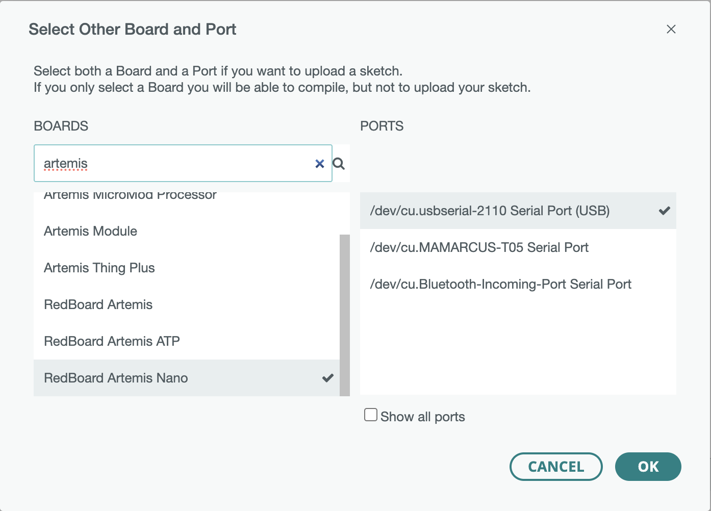

# Lab 1 Report

In this lab, we familiarized ourselves with the Artemis Nano microcontroller and the software framework the class provides us to send commands / receive data to the board via Bluetooth.

## Prelab

### Setup

To set up my computer for this class, the following steps were taken:

1. Download Arduino IDE and install the appropriate bootloader software for the Artemis Nano
2. Download the Arduino Bluetooth package in the Arduino IDE
3. Install Python 3.13 and set up a virtual environment with `venv` in which to run a Jupyter notebook

As part of the prelab, we had to establish a working Bluetooth connection between the Artemis and the computer. After loading the example `ble_arduino.ino` to the board, the Artemis printed its MAC address to the serial monitor in the Arduino IDE:


### Codebase

We also needed to familiarize ourselves with the codebase used to communicate between the Artemis and computer. Below is a brief explanation of the codebase:

On the Arduino side, we define classes `RobotCommand`, `BLEStringCharacteristic`, and `EString` to help us process received commands, interpret the received data, and maniuplate the received strings, respectively. 

On the Python side, we define functions which help us send (`send_command()`) and receive (`receive_string/float/int()`, `start_notify()`) commands and their arguments to and from the Artemis in a standardized way.

The Artemis and the computer can be connected via Bluetooth. The Artemis advertises its MAC address as well as a unique identifier. The computer has access to the identifier and connects to the Artemis using this identifier. Then, the two sides can talk to each other by exchanging messages (bytearrays).

## Lab Tasks

### Configurations

To configure the Bluetooth connection, I used a Python snippet to generate a random UUID specific to my board, so that my computer did not accidentally send commands to somebody else's board in the lab. The UUID needs to be input into the Bluetooth configurations of both the computer side (Python) and the Artemis side (C++):

On the Python side, in `connection.yaml`:

```python
artemis_address: 'C0:C2:8A:89:98:08'

ble_service: '1850f67f-72cc-41ef-8c6b-fe981e8c9eda'
```

On the C++ side, in `ble_arduino.ino`:

```cpp
#define BLE_UUID_TEST_SERVICE "1850f67f-72cc-41ef-8c6b-fe981e8c9eda"
```

### Lab 1a, Task 1: Connect Artemis to Computer

Here is a screenshot of the Artemis showing up in the Arduino IDE Boards and Port:



### Lab 1a, Task 2: Blink

I downloaded the "Blink" example from the Arduino examples and ran it. Here is a video of it working:

### Lab 1a, Task 3: Example4_Serial

I downloaded the "Example4_Serial" example from the Arduino examples and ran it. Here is a video of it working:

### Lab 1a, Task 4: Example2_analogRead

I downloaded the "Example2_analogRead" example from the Arduino examples and ran it. Here is a video of it working:

### Lab 1a, Task 5: Example1_MicrophoneOutput

I downloaded the "Example1_MicrophoneOutput" example from the Arduino examples and ran it. Here is a video of it working:

### Lab 1a, Task 6: C Tone Detector

In this task, we were asked to create a program that blinks the Artemis' built-in LED when any "C" tone is played. To do this, I wrote a function that determined whether a given frequency was a C:

```cpp
// returns 1 if loudest_freq is C; returns 0 otherwise
uint8_t is_C (uint32_t loudest_freq)
{
  const uint32_t C_low_range = 257;
  const uint32_t C_high_range = 265;
  uint8_t ret = 8; // return value
  uint8_t going_up = (loudest_freq > C_high_range) ? 0 : 1;
  double temp = 0.0;

  while (ret == 8) {
    // if loudest frequency is within the range
    if (loudest_freq < C_high_range && loudest_freq > C_low_range) {
      ret = 1;
      break;
    }

    // special case if loudest_freq is 0 for some reason
    if (loudest_freq == 0) {
      ret = 0;
      break;
    }

    // if going down and below C_low_range, it's not a C
    if (!going_up && (loudest_freq < C_low_range)) {
      ret = 0;
      break;
    }

    // if going up and above C_high_range, it's not a C
    if (going_up && (loudest_freq > C_high_range)) {
      ret = 0;
      break;
    }

    // else, update the value of loudest_freq in accordance with going_up:
    // multiply by 2 if going up; divide by 2 if going down
    if (going_up) {
      loudest_freq *= 2;
    } else {
      // round to nearest integer when dividing by 2
      temp = (double) loudest_freq / 2.0;
      loudest_freq = (uint32_t) (temp + 0.5);
    }
  }
  
  return ret;
}
```

Then, in the loop, I wrote some logic to blink the LED if the current tone being played was a C, and turn the LED off when it is not a C:

```cpp
void loop() {

    ...
    
    if (is_C(loudest_freq)) {
          if (currentMillis - previousMillis >= interval) {
            previousMillis = currentMillis;
            if (LED_state == LOW) {
              LED_state = HIGH;
              Serial.printf("LED_state: ON\n");
            } else {
              LED_state = LOW;
              Serial.printf("LED_state: OFF\n");
            }
          }
        } else {
          // turn the LED off (not a C)
          LED_state = 0;
        }
    
        digitalWrite(LED_BUILTIN, LED_state);

        ...
}
```

`currentMillis` holds the current time as returned by the `millis()` function. `previousMillis` holds the last time that the LED state was changed (high to low, or low to high); this is what creates the blinking effect. `interval` is 1000, so the blinking frequency is 0.5 Hz (on for 1 second, off for 1 second, and so on).

Below is a demo of this code working:


### Lab 1b, Task 1: `ECHO` Command

The `ECHO` command was modified in the Arduino code to append the words `"Artemis says -> "` to the front of the received string, then send it back to the computer:

```cpp
case ECHO:

    // Extract the next value from the command string as a character array
    success = robot_cmd.get_next_value(char_arr);
    if (!success)
        return;

    tx_estring_value.clear();
    tx_estring_value.append("Artemis says -> ");
    tx_estring_value.append(char_arr);
    tx_characteristic_string.writeValue(tx_estring_value.c_str());

    Serial.print("Sent back: ");
    Serial.println(tx_estring_value.c_str());
    
    break;
```

To test the command in Python, I used the following code in the Jupyter notebook:

```python
ble.send_command(CMD.ECHO, "Happy Chinese New Year!")
s = ble.receive_string(ble.uuid['RX_STRING'])
print(s)
```

With the resulting output in the screenshot below:


