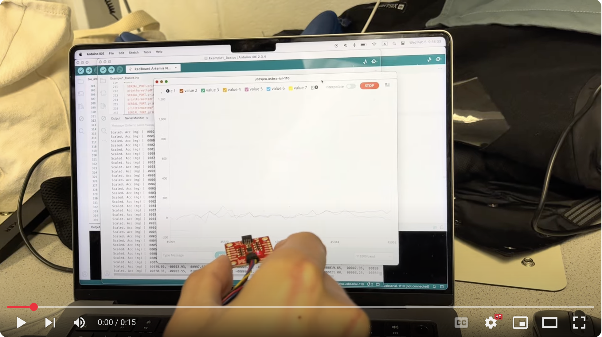
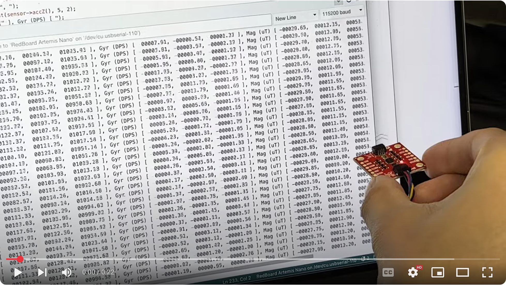
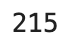

# Lab 2 Report

In this lab, we familiarized ourselves with the Inertial Measurement Unit (IMU) provided in our lab kit.

## Setup

Here is a picture of the connection I made between the Artemis board and IMU using the QWIIC connect cable. Notice that the IMU is plugged into the Artemis on the I2C side, not the SPI side.


### IMU Demo Code

In this step, I downloaded the Example code from the Arduino library and ran it. Below are two videos showing that the IMU functions correctly:

Accelerometer demo video:

* Notice that the three sensor value traces oscillate around their steady-state value as I shake the breakout board along the corresponding axis.

[](https://youtu.be/Kcku1Q7TimA "Accelerometer Demo Video")

Gyroscope demo video:

* Notice that the gyroscope sensor values (the second group of three numbers) oscillate between approximately +250 and -250 when I rotate the breakout board along the corresponding axis. I demonstrate the IMU functionality from the first column to the third column.

[](https://youtu.be/TDgxyGB8UOc "Gyroscope Demo Video")

### `AD0_VAL` Discussion

According to the example code, `AD0_VAL` is the last bit of the I2C address of the IMU. On our breakout board, the default is 1, so we set it as such:

```cpp
// The value of the last bit of the I2C address.
// On the SparkFun 9DoF IMU breakout the default is 1, and when the ADR jumper is closed the value becomes 0
#define AD0_VAL 1
```

## IMU Data Sampling

### Arduino Implementation

To sample data as fast as possible, I added commands: `START_IMU_LOG`, `STOP_IMU_LOG`, and `SEND_IMU_LOGS`. `START_IMU_LOG` simply tells the Artemis to start logging IMU data into the global arrays. `STOP_IMU_LOG` tells the Artemis to stop logging. `SEND_IMU_LOGS` loops through all of the global arrays and sends the data, one timestamp at a time, back to the computer.

On the Artemis side, I added these global variables to sample the data:

```cpp
bool log_imu_data = false;
const int imu_log_size = 500;
float accel_x[imu_log_size], accel_y[imu_log_size], accel_z[imu_log_size];
float gyro_x[imu_log_size], gyro_y[imu_log_size], gyro_z[imu_log_size];
unsigned long times[imu_log_size];
int arr_ix = 0;
```

A couple things to note (**ANSWERING QUESTIONS IN LAB INSTRUCTIONS HERE**):

* `log_imu_data` is a flag that determines whether IMU data is logged in the main loop
* We use separate arrays for logging all of the accelerometer and gyrometer data. If we used one big array (or a 2D array), we would have to access six memory locations in vastly different locations each time we log one data point, which may result in a large number of cache misses, especially as the maximum number of sampled data points becomes very large
* `arr_ix` is the index into all of the arrays
* We have the data arrays contain `float` because the accelerometer and gyroscope data probably have around one or two decimal points of precision at best, so we can't use `int` but don't need the extra precision offered by `double`.

`START_IMU_LOG` and `STOP_IMU_LOG` simply set the flag to the correct value and returns:

```cpp
case START_IMU_LOG:
    log_imu_data = true;
    break;

case STOP_IMU_LOG:
    log_imu_data = false;
    break;
```

In the main loop, I added some logic to log the data when `log_imu_data` is set to `true` and there is still space in the arrays:

```cpp
// While central is connected
while (central.connected()) {

    // if want to log IMU data, read and store it
    if (log_imu_data && arr_ix < imu_log_size && myICM.dataReady()) {
        myICM.getAGMT();
        accel_x[arr_ix] = myICM.accX();
        accel_y[arr_ix] = myICM.accY();
        accel_z[arr_ix] = myICM.accZ();
        gyro_x[arr_ix] = myICM.gyrX();
        gyro_y[arr_ix] = myICM.gyrY();
        gyro_z[arr_ix] = myICM.gyrZ();
        times[arr_ix] = millis();
        arr_ix++;
    }
    
    // Send data
    write_data();

    // Read data
    read_data();
}
```

To send all the data back, we call the `SEND_IMU_LOGS` command, which is implemented as follows:

```cpp
case SEND_IMU_LOGS:
    // construct string to send back to computer and send back
    for (int i = 0; i < arr_ix; i++) {
        sprintf(char_arr, "%u|%d.%02d|%d.%02d|%d.%02d|%d.%02d|%d.%02d|%d.%02d", times[i],
                                                      (int) accel_x[i], abs((int) (accel_x[i] * 100.0) % 100), 
                                                      (int) accel_y[i], abs((int) (accel_y[i] * 100.0) % 100),
                                                      (int) accel_z[i], abs((int) (accel_z[i] * 100.0) % 100),
                                                      (int) gyro_x[i], abs((int) (gyro_x[i] * 100.0) % 100),
                                                      (int) gyro_y[i], abs((int) (gyro_y[i] * 100.0) % 100),
                                                      (int) gyro_z[i], abs((int) (gyro_z[i] * 100.0) % 100));

        tx_estring_value.clear();
        tx_estring_value.append(char_arr);
        tx_characteristic_string.writeValue(tx_estring_value.c_str());
    }

    // reset the array index
    arr_ix = 0;

    break;
```

The floating point values need to be formatted like this because `%f` doesn't function in format strings in the Arduino IDE.

After removing all debugging print statements and delays in the code, we can use this code to figure out how quickly (and for how long) we can sample the IMU data.

### Sampling Speed and Size Limits

In Python, we use the commands implemented in the previous section to find IMU data samplign speed and size limits on the Artemis.

We first define seven Python lists (three axes of the accelerometer, three axes of the gyrometer, and timestamp), then define a notification handler to parse the incoming data into those seven lists. Finally, we run the test by sending an `START_IMU_LOG` command, wait 0.5 seconds, then `STOP_IMU_LOG` command. Finally, send a `SEND_IMU_LOGS` command to record the data. At the end, print out how many data points it received, and this gives us an idea of what the data rate is on the IMU:

```python
accel_x = list()
accel_y = list()
accel_z = list()
gyro_x = list()
gyro_y = list()
gyro_z = list()
times = list()

def imu_log_notification_handler(uuid, characteristic):
    s = ble.bytearray_to_string(characteristic)
    tm, a_x, a_y, a_z, g_x, g_y, g_z = s.split('|')
    accel_x.append(a_x)
    accel_y.append(a_y)
    accel_z.append(a_z)
    gyro_x.append(g_x)
    gyro_y.append(g_y)
    gyro_z.append(g_z)
    times.append(tm)

ble.start_notify(ble.uuid['RX_STRING'], imu_log_notification_handler)

# log data for 0.5 seconds
ble.send_command(CMD.START_IMU_LOG, "");
time.sleep(0.5);
ble.send_command(CMD.STOP_IMU_LOG, "");

# clear the lists, then send command to get data back
accel_x.clear()
accel_y.clear()
accel_z.clear()
gyro_x.clear()
gyro_y.clear()
gyro_z.clear()
times.clear()

ble.send_command(CMD.SEND_IMU_LOGS, "");

print(len(times))
```

The print statement output is 215, as shown in the screenshot:




