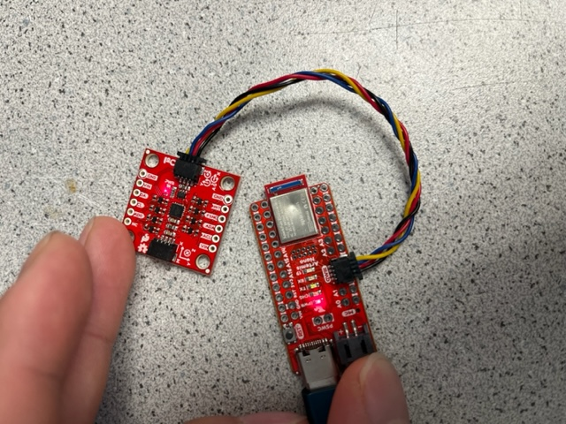

# Lab 2 Report

In this lab, we familiarized ourselves with the Inertial Measurement Unit (IMU) provided in our lab kit.

## IMU Setup

Here is a picture of the connection I made between the Artemis board and IMU using the QWIIC connect cable:



## IMU Demo Code

In this step, I downloaded the Example code from the Arduino library and ran it. Below is a video showing that the IMU functions correctly:


## `AD0_VAL` Discussion

According to the example code, `AD0_VAL` is the last bit of the I2C address of the IMU. On our breakout board, the default is 1, so we set it as such:

```cpp
// The value of the last bit of the I2C address.
// On the SparkFun 9DoF IMU breakout the default is 1, and when the ADR jumper is closed the value becomes 0
#define AD0_VAL 1
```

