# Lab 2 Report

In this lab, we familiarized ourselves with the Inertial Measurement Unit (IMU) provided in our lab kit.

## Setup

Here is a picture of the connection I made between the Artemis board and IMU using the QWIIC connect cable. Notice that the IMU is plugged into the Artemis on the I2C side, not the SPI side.


### IMU Demo Code

In this step, I downloaded the Example code from the Arduino library and ran it. Below are two videos showing that the IMU functions correctly:

Accelerometer demo video:

* Notice that the three sensor value traces oscillate around their steady-state value as I shake the breakout board along the corresponding axis.

[](https://youtu.be/Kcku1Q7TimA "Accelerometer Demo Video")

Gyroscope demo video:

* Notice that the gyroscope sensor values (the second group of three numbers) oscillate between approximately +250 and -250 when I rotate the breakout board along the corresponding axis. I demonstrate the IMU functionality from the first column to the third column.

[](https://youtu.be/TDgxyGB8UOc "Gyroscope Demo Video")

### `AD0_VAL` Discussion

According to the example code, `AD0_VAL` is the last bit of the I2C address of the IMU. On our breakout board, the default is 1, so we set it as such:

```cpp
// The value of the last bit of the I2C address.
// On the SparkFun 9DoF IMU breakout the default is 1, and when the ADR jumper is closed the value becomes 0
#define AD0_VAL 1
```

## Sample Data

### Arduino Implementation

To sample data as fast as possible, I added commands: `START_IMU_LOG`, `STOP_IMU_LOG`, and `SEND_IMU_LOGS`. `START_IMU_LOG` simply tells the Artemis to start logging IMU data into the global arrays. `STOP_IMU_LOG` tells the Artemis to stop logging. `SEND_IMU_LOGS` loops through all of the global arrays and sends the data, one timestamp at a time, back to the computer.

On the Artemis side, I added these global variables to sample the data:

```cpp
bool log_imu_data = false;
const int imu_log_size = 500;
float accel_x[imu_log_size], accel_y[imu_log_size], accel_z[imu_log_size];
float gyro_x[imu_log_size], gyro_y[imu_log_size], gyro_z[imu_log_size];
unsigned long times[imu_log_size];
int arr_ix = 0;
```

A couple things to note (**ANSWERING QUESTIONS IN LAB INSTRUCTIONS HERE**):

* `log_imu_data` is a flag that determines whether IMU data is logged in the main loop
* We use separate arrays for logging all of the accelerometer and gyrometer data. If we used one big array (or a 2D array), we would have to access six memory locations in vastly different locations each time we log one data point, which may result in a large number of cache misses, especially as the maximum number of sampled data points becomes very large
* `arr_ix` is the index into all of the arrays
* We have the data arrays contain `float` because the accelerometer and gyroscope data probably have around one or two decimal points of precision at best, so we can't use `int` but don't need the extra precision offered by `double`.

`START_IMU_LOG` and `STOP_IMU_LOG` simply set the flag to the correct value and returns:

```cpp
case START_IMU_LOG:
    log_imu_data = true;
    break;

case STOP_IMU_LOG:
    log_imu_data = false;
    break;
```

In the main loop, I added some logic to log the data when `log_imu_data` is set to `true` and there is still space in the arrays:

```cpp
// While central is connected
while (central.connected()) {

    // if want to log IMU data, read and store it
    if (log_imu_data && arr_ix < imu_log_size && myICM.dataReady()) {
        myICM.getAGMT();
        accel_x[arr_ix] = myICM.accX();
        accel_y[arr_ix] = myICM.accY();
        accel_z[arr_ix] = myICM.accZ();
        gyro_x[arr_ix] = myICM.gyrX();
        gyro_y[arr_ix] = myICM.gyrY();
        gyro_z[arr_ix] = myICM.gyrZ();
        times[arr_ix] = millis();
        arr_ix++;
    }
    
    // Send data
    write_data();

    // Read data
    read_data();
}
```

To send all the data back, we call the `SEND_IMU_LOGS` command, which is implemented as follows:

```cpp
case SEND_IMU_LOGS:
    // construct string to send back to computer and send back
    for (int i = 0; i < arr_ix; i++) {
        sprintf(char_arr, "%u|%d.%02d|%d.%02d|%d.%02d|%d.%02d|%d.%02d|%d.%02d", times[i],
                                                      (int) accel_x[i], abs((int) (accel_x[i] * 100.0) % 100), 
                                                      (int) accel_y[i], abs((int) (accel_y[i] * 100.0) % 100),
                                                      (int) accel_z[i], abs((int) (accel_z[i] * 100.0) % 100),
                                                      (int) gyro_x[i], abs((int) (gyro_x[i] * 100.0) % 100),
                                                      (int) gyro_y[i], abs((int) (gyro_y[i] * 100.0) % 100),
                                                      (int) gyro_z[i], abs((int) (gyro_z[i] * 100.0) % 100));

        tx_estring_value.clear();
        tx_estring_value.append(char_arr);
        tx_characteristic_string.writeValue(tx_estring_value.c_str());
    }

    // reset the array index
    arr_ix = 0;

    break;
```

The floating point values need to be formatted like this because `%f` doesn't function in format strings in the Arduino IDE.

After removing all debugging print statements and delays in the code, we can use this code to figure out how quickly (and for how long) we can sample the IMU data.

### Sampling Speed and Size Limits

In Python, we use the commands implemented in the previous section to find IMU data samplign speed and size limits on the Artemis.

We first define seven Python lists (three axes of the accelerometer, three axes of the gyrometer, and timestamp), then define a notification handler to parse the incoming data into those seven lists. Finally, we run the test by sending an `START_IMU_LOG` command, wait 0.5 seconds, then `STOP_IMU_LOG` command. Finally, send a `SEND_IMU_LOGS` command to record the data. At the end, print out how many data points it received, and this gives us an idea of what the data rate is on the IMU:

```python
accel_x = list()
accel_y = list()
accel_z = list()
gyro_x = list()
gyro_y = list()
gyro_z = list()
times = list()

def imu_log_notification_handler(uuid, characteristic):
    s = ble.bytearray_to_string(characteristic)
    tm, a_x, a_y, a_z, g_x, g_y, g_z = s.split('|')
    accel_x.append(a_x)
    accel_y.append(a_y)
    accel_z.append(a_z)
    gyro_x.append(g_x)
    gyro_y.append(g_y)
    gyro_z.append(g_z)
    times.append(tm)

ble.start_notify(ble.uuid['RX_STRING'], imu_log_notification_handler)

# log data for 0.5 seconds
ble.send_command(CMD.START_IMU_LOG, "");
time.sleep(0.5);
ble.send_command(CMD.STOP_IMU_LOG, "");

# clear the lists, then send command to get data back
accel_x.clear()
accel_y.clear()
accel_z.clear()
gyro_x.clear()
gyro_y.clear()
gyro_z.clear()
times.clear()

ble.send_command(CMD.SEND_IMU_LOGS, "");

print(len(times))
```

The print statement output is 215, as shown in the screenshot:


Since we sampled data here for 0.5 seconds, this gives a sampling rate of approximately 215 / 0.5 = **430 samples per second**.

If we have 384 kB of RAM and six arrays to split that RAM across, that is 64 kB of RAM per array. Each float is 32 bits (4 bytes), so each array can hold about 16,000 elements. At a rate of 430 sample per second, that is 16,000/430 = 37 seconds of data. So in summary, using a very liberal estimate:

* **Maximum array size (bytes)**: 64 kB
* **Maximum array size (elements)**: 16,000
* **Maximum sampling time**: 37 seconds

Using the rates calculated above we calculate that we need about 430 samples/sec * 5 sec = 2150 elements in our arrays. We make them 3000 elements long just in case. In Python, we set the start and stop flags 5 seconds apart to sample 5 seconds worth of data, and send it back. This resulted in the following plot:

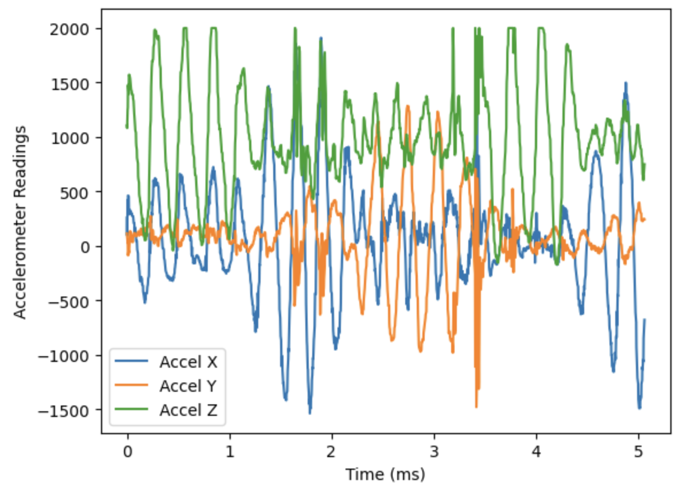

This shows that we can successfully log 5 seconds worth of IMU data from the Artemis and send it back.

### Artemis loop speed vs. IMU Sampling Speed

To test whether the Artemis loop is faster than the IMU sampling speed, I added the following `if` statements above the IMU sampling `if` statement in the main loop on the Artemis:

```cpp
if (log_imu_data && arr_ix < imu_log_size) {
    count++;
}

if (arr_ix == 190) {
    Serial.println(count);
    count = 0;
}

// if want to log IMU data, read and store it
if (log_imu_data && arr_ix < imu_log_size && myICM.dataReady()) {
    myICM.getAGMT();
    accel_x[arr_ix] = myICM.accX();
    accel_y[arr_ix] = myICM.accY();
    accel_z[arr_ix] = myICM.accZ();
    gyro_x[arr_ix] = myICM.gyrX();
    gyro_y[arr_ix] = myICM.gyrY();
    gyro_z[arr_ix] = myICM.gyrZ();
    times[arr_ix] = millis();
    arr_ix++;
}
```

While we are trying to log IMU data, we also increment a counter `count`. Each time the `while` loop on the Artemis runs, `count` is incremented, but if there are times when the loop executes but there is not data ready on the IMU (i.e. `myICM.dataReady()` returns `false`), then `count` will increment, but no data will be logged. Thus, when we have recorded 190 data points (`arr_ix == 190`), we should expect `count` to be much greater than 190 if the Artemis loop was looping much faster than the samplign time. Running the test, however, reveals the following:

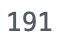

This means that each time the `while` loop executes, we are getting a new IMU reading. At first glance, this doesn't make sense, since you would think that the Artemis microcontroller clock being 48 MHz would imply that the loop would execute many times before the `dataReady()` function returned `true`. However, this is not the case; my best guess as to why the two counts match is that the `dataReady()` function actually blocks execution of its thread while it waits for new IMU data to be procured.

### Timestamped Data

Lastly, to prove that the code can send timestamped data in arrays, here is a screenshot of the received strings from the Artemis on the Python side:

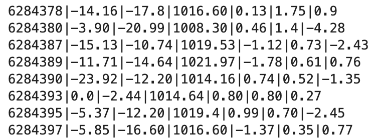

This was generated by adding a `print` in the notification handler:

```python
def imu_log_notification_handler(uuid, characteristic):
    s = ble.bytearray_to_string(characteristic)
    print(s) # <-------------------------------- this line
    tm, a_x, a_y, a_z, g_x, g_y, g_z = s.split('|')
    accel_x.append(a_x)
    accel_y.append(a_y)
    accel_z.append(a_z)
    gyro_x.append(g_x)
    gyro_y.append(g_y)
    gyro_z.append(g_z)
    times.append(tm)
```

## Accelerometer

### Roll and Pitch Computation

To compute the roll and pitch angles in degrees, we can use the accelerometer's ability to detect gravity and some trigonometry on the raw X, Y, and Z axes data. The measured X acceleration, Y acceleration, and Z acceleration are related to the roll (phi) and pitch (theta) angles (in degrees), by the following equations:


First, we take compute the roll and pitch measurements at -90, 0, and 90 degrees. I implemented three more commands: `START_PROC_IMU_LOG`, `STOP_PROC_IMU_LOG`, and `SEND_PROC_IMU_LOGS`. These commands work in the exact same way as the `START_IMU_LOG`, `STOP_IMU_LOG` and `SEND_IMU_LOGS` commands implemented in the previous section: the first two set a flag to start and stop logging data, and the third sends the logged data back.

In the Arduino main loop, I added another `if` statement which implements the above equations and inserts the result into the global arrays:

```cpp
// if want to log processed IMU data, read and store it
if (log_processed_imu_data && arr_ix < imu_log_size && myICM.dataReady()) {
    myICM.getAGMT();
    accel_x_curr = myICM.accX();
    accel_y_curr = myICM.accY();
    accel_z_curr = myICM.accZ();
    gyro_x_curr = myICM.gyrX();
    gyro_y_curr = myICM.gyrY();
    gyro_z_curr = myICM.gyrZ();
    times[arr_ix] = millis();

    // perform calculations to get roll, pitch
    accel_roll[arr_ix] = (180.0 / M_PI) * atan2(accel_y_curr, accel_z_curr);
    accel_pitch[arr_ix] = (180.0 / M_PI) * atan2(accel_x_curr, accel_z_curr);

    arr_ix++;
}
```

On the Python side, I wrote a new notification handler, very similar to the one used in the previous section, and used it to record data for 0.5 seconds while I held the IMU against a box in a particular orientation:

```python
roll = list()
pitch = list()
times = list()
def imu_proc_log_notification_handler(uuid, characteristic):
    s = ble.bytearray_to_string(characteristic)
    tm, roll_curr, pitch_curr = s.split('|')
    roll.append(float(roll_curr))
    pitch.append(float(pitch_curr))
    times.append(int(tm))

ble.start_notify(ble.uuid['RX_STRING'], imu_proc_log_notification_handler)

# log data for some number of seconds
log_data_for_time = 0.5;

ble.send_command(CMD.START_PROC_IMU_LOG, "");
time.sleep(log_data_for_time);
ble.send_command(CMD.STOP_PROC_IMU_LOG, "");

# clear the lists, then send command to get data back
roll.clear()
pitch.clear()
times.clear()

ble.send_command(CMD.SEND_PROC_IMU_LOGS, "");

print(np.average(roll))

print(np.average(pitch))
```

Below are the results for the screenshots:

* 0 degrees pitch and 0 degrees roll:

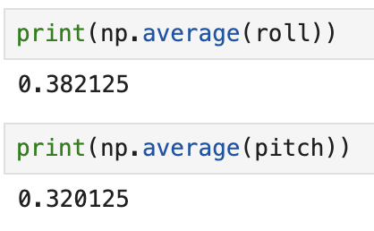

* +90 degrees pitch:

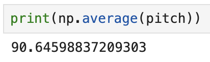

* -90 degrees pitch:

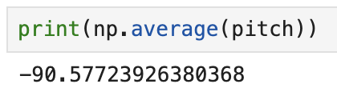

* +90 degrees roll:

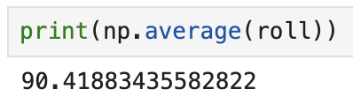

* -90 degrees roll:

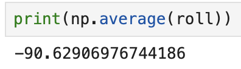

It can be noted that the observed uncalibrated values are already very accurate!

### Two-Point Calibration

To try to further improve the accelerometer accuracy, we follow the following instructions on an article about two-point calibration on Adafruit's website:

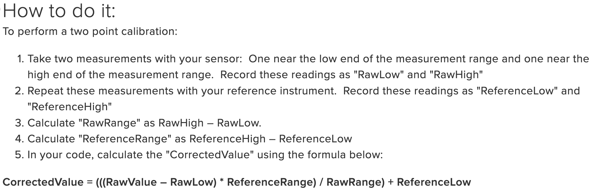

Applied to the pitch, we have RawHigh = 90.65, RawLow = -90.58, and RawRange = 181.23. Our ReferenceLow is -90, and ReferenceRange is 180.0. This gives us the following equation:


And we can see that if we now plug in the measured raw low and measured raw high into the equation, we get exactly +90 degrees and -90 degrees out:

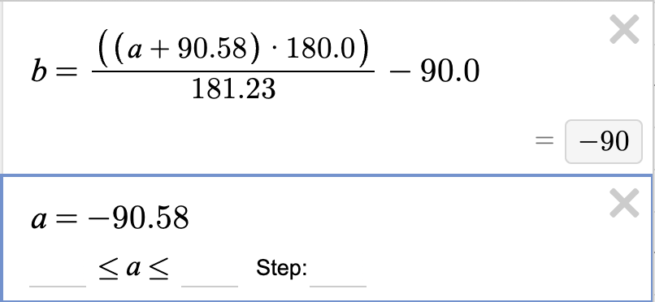

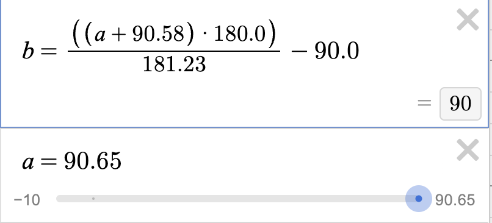

Similarly, for roll, we have RawHigh = 90.42, RawLow = -90.63, and RawRange = 181.05. Our ReferenceLow and ReferenceRange are the same as for pitch. This gives us the following equation:


And similarly, we can plug in measured raw low and high into the equation and get exactly +90 degrees and -90 degrees out:

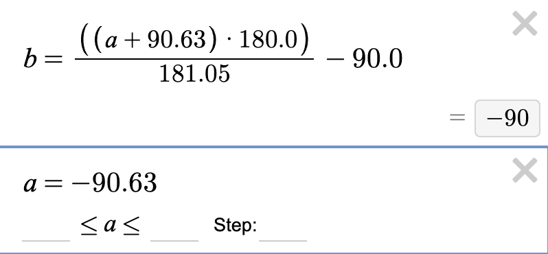

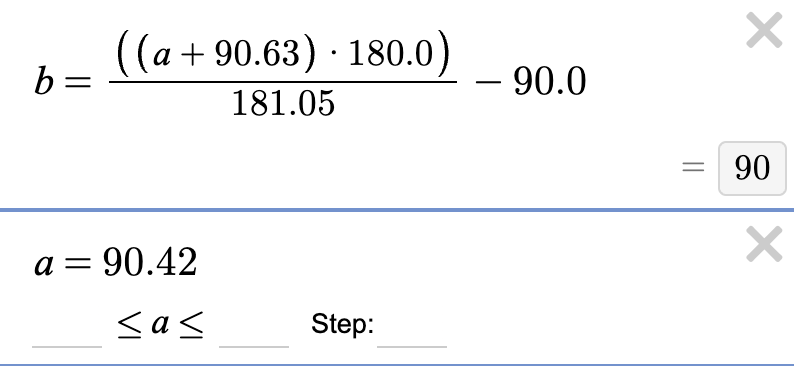

**In summary, the accelerometer by default is already quite accurate and precise! The correction factors are 0.9942 and 0.9932, which are very close to 1.**

### Noise Analysis (FFT)

My Python code for the FFT was heavily based on the example given at [this website](https://pythonnumericalmethods.studentorg.berkeley.edu/notebooks/chapter24.04-FFT-in-Python.html).

I took a sample of 1 second while pitching the IMU up and down. After taking the FFT, I plotted the time domain and frequency domain signals right next to each other:

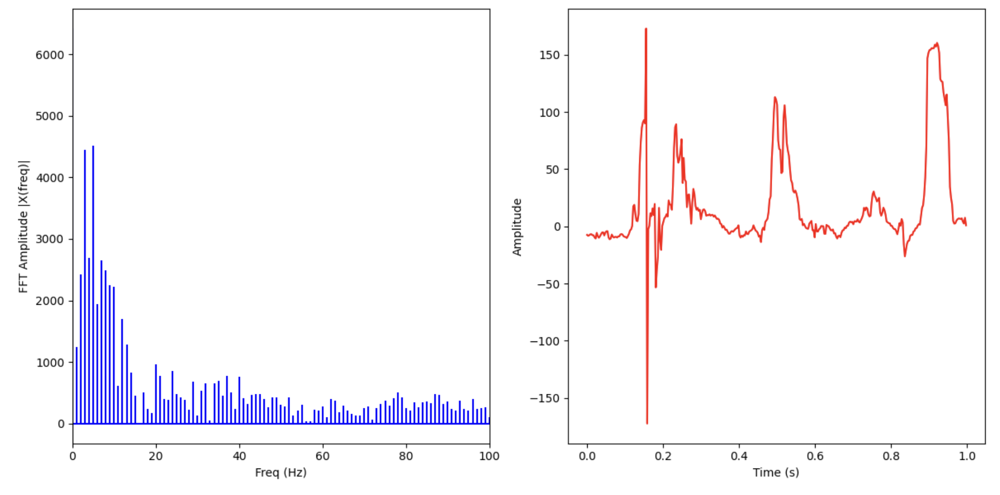

We see that the time domain signal has three pitches up and down in one second (about 3 Hz), so we expect to see a peak in the FFT at around those frequencies. Indeed, in the FFT, we see peaks at 3 and 4 Hz, before a steep drop-off down to the base-level white noise from the accelerometer.

Next, I took a sample of 1 second where I hit the table lightly around the IMU and plotted the time domain signal along with the FFT:

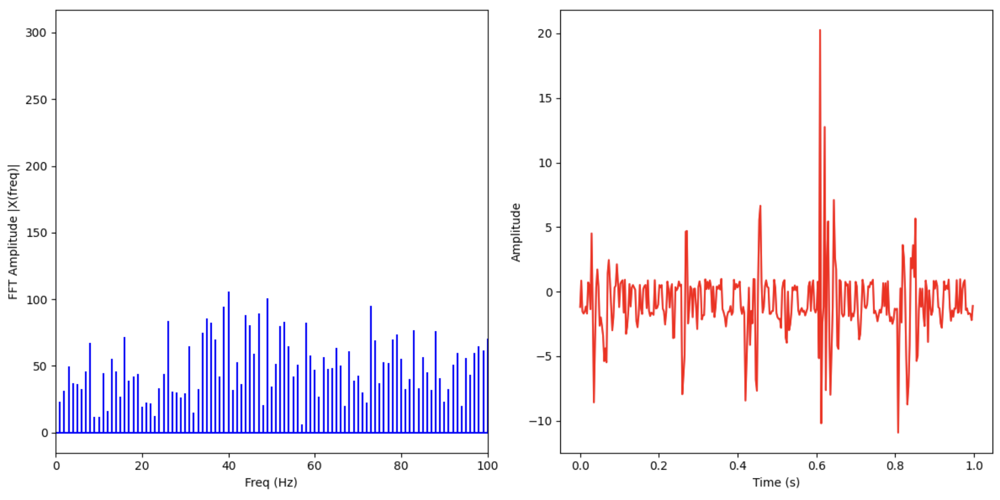

We see the table-hitting appear in the time-domain signal with a medium-sized amplitude, and around 5 Hz, but they are very big spikes (meaning that the noise component is also very high). We see that this signal does not appear in the FFT (drowned out by noise). 

### Low-Pass Filter

To implement an effective low-pass filter, let's look at the first 1-second pitch sample I took in the previous section:


To filter out the noise, we pick a cutoff frequency somewhat above our desired signal frequency, which is 3 Hz in this case. Let's pick 10 Hz to start. From class, we have the formula:


Plugging in and solving for RC, we have RC = 0.0159. Then, to find the value of alpha, we have the following formula from class (with sampling period T = (1/350) = 0.002857 seconds):


Solving for alpha, we have alpha = 0.152. 

On the Arduino side, I added the low-pass filter computation in the same `if` statement where I am computing the roll and pitch values:

```cpp
// if want to log processed IMU data, read and store it
if (log_processed_imu_data && arr_ix < imu_log_size && myICM.dataReady()) {
    myICM.getAGMT();
    accel_x_curr = myICM.accX();
    accel_y_curr = myICM.accY();
    accel_z_curr = myICM.accZ();
    gyro_x_curr = myICM.gyrX();
    gyro_y_curr = myICM.gyrY();
    gyro_z_curr = myICM.gyrZ();
    times[arr_ix] = millis();

    // perform calculations to get roll, pitch
    accel_roll[arr_ix] = (180.0 / M_PI) * atan2(accel_y_curr, accel_z_curr);
    accel_pitch[arr_ix] = (180.0 / M_PI) * atan2(accel_x_curr, accel_z_curr);

    //  *************** low-pass filter implementation **************** //
    if (arr_ix == 0) {
        lpf_accel_roll[0] = accel_roll[arr_ix];
        lpf_accel_pitch[0] = accel_pitch[arr_ix];
    } else {
        lpf_accel_roll[arr_ix] = accel_alpha * (accel_roll[arr_ix]) + (1.0 - accel_alpha) * (lpf_accel_roll[arr_ix - 1]);
        lpf_accel_pitch[arr_ix] = accel_alpha * (accel_pitch[arr_ix]) + (1.0 - accel_alpha) * (lpf_accel_pitch[arr_ix - 1]);
    }

    arr_ix++;
}
```

I added the newly computed values to be returned by the `SEND_PROC_IMU_LOGS` command:

```cpp
/*
 * This command tells the Artemis to send back all processed IMU data and reset the logging arrays
 */
case SEND_PROC_IMU_LOGS:
      // construct string to send back to computer and send back
      for (int i = 0; i < arr_ix; i++) {
          sprintf(char_arr, "%u|%d.%02d|%d.%02d|%d.%02d|%d.%02d", times[i],
                                                      (int) accel_roll[i], abs((int) (accel_roll[i] * 100.0) % 100), 
                                                      (int) accel_pitch[i], abs((int) (accel_pitch[i] * 100.0) % 100),
                                                      (int) lpf_accel_roll[i], abs((int) (lpf_accel_roll[i] * 100.0) % 100),
                                                      (int) lpf_accel_pitch[i], abs((int) (lpf_accel_pitch[i] * 100.0) % 100));

          tx_estring_value.clear();
          tx_estring_value.append(char_arr);
          tx_characteristic_string.writeValue(tx_estring_value.c_str());
      }

      // reset the array index
      arr_ix = 0;

      break;
```

Taking a 1-second sample and plotting the time domain signal and FFT of both the raw and filtered data on top of each other, we obtain the following figure:

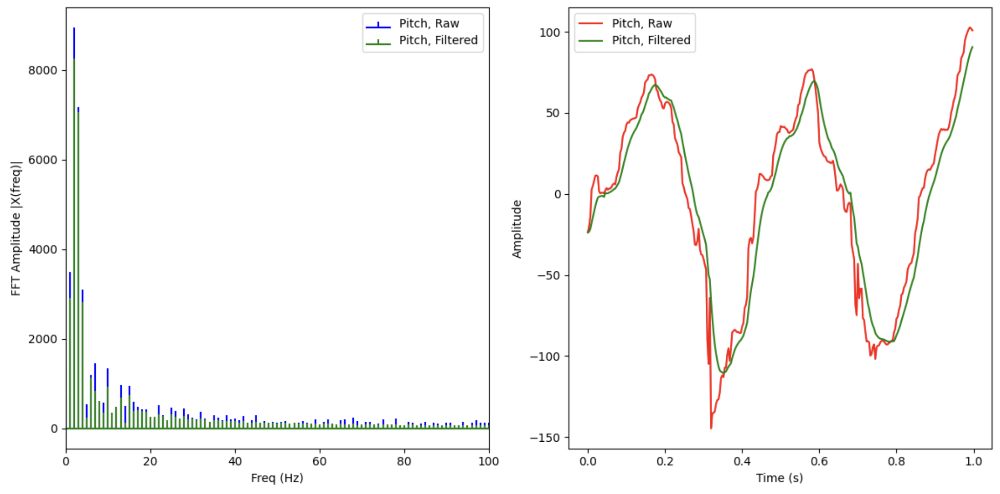

We see that the filtered data FFT has less content across the entire spectrum, but the effect is more pronounced above the cutoff frequency. In the time domain signal, we see that the low-pass filter is quite effective at smoothing out the sharp edges of the raw data curve, while also inducing a little bit of phase lag in the signal as expected for a low-pass filter.

## Gyroscope

### Roll, Pitch, Yaw Computation

From the class sides, we can estimate the roll, pitch, and yaw of the IMU using the gyroscope with the following equation:


Theta, phi, and psi can all be estimated using the same equation; the gyroscope measures the rate of change of these three variables. 

On the Arduino side, I added additional logic in the `if` statement from above to also compute the gyroscope roll/pitch/yaw estimations:

```cpp
// if want to log processed IMU data, read and store it
if (log_processed_imu_data && arr_ix < imu_log_size && myICM.dataReady()) {
    myICM.getAGMT();
    accel_x_curr = myICM.accX();
    accel_y_curr = myICM.accY();
    accel_z_curr = myICM.accZ();
    gyro_x_curr = myICM.gyrX();
    gyro_y_curr = myICM.gyrY();
    gyro_z_curr = myICM.gyrZ();
    times[arr_ix] = millis();

    // accelerometer calculations to get roll, pitch
    accel_roll[arr_ix] = (180.0 / M_PI) * atan2(accel_y_curr, accel_z_curr);
    accel_pitch[arr_ix] = (180.0 / M_PI) * atan2(accel_x_curr, accel_z_curr);

    // gyroscope calculations to get roll, pitch, yaw
    if (arr_ix == 0) {
        gyro_roll[0] = accel_roll[0];
        gyro_pitch[0] = accel_pitch[0];
        gyro_yaw[0] = 0;
    } else {
        dt = float(times[arr_ix] - times[arr_ix - 1]) / 1000.0;
        gyro_roll[arr_ix] = gyro_roll[arr_ix - 1] + (gyro_x_curr * dt);
        gyro_pitch[arr_ix] = gyro_pitch[arr_ix - 1] + (gyro_y_curr * dt);
        gyro_yaw[arr_ix] = gyro_yaw[arr_ix - 1] + (gyro_z_curr * dt);
    }
```

Notice that we start the roll and pitch estimations at the accelerometer roll and pitch estimations at that time. Since we have no estimation from the accelerometer for the yaw, we simply set the yaw estimation to 0 degrees at time t = 0. 

As before, I also added these three data series to be returned by the `SEND_PROC_IMU_LOGS` command. This has been ommitted for brevity.

On the Python side, I created a new notification handler, again very similar to the one used for the previous portions. I took data for 5 seconds, and actuated the IMU in such a way to create a large disturbance in yaw, pitch, and then roll. I then plotted the resulting data. Below is the relevant Python code:

```python
accel_roll = list()
accel_pitch = list()
lpf_roll = list()
lpf_pitch = list()
gyro_roll = list()
gyro_pitch = list()
gyro_yaw = list()
times = list()

def imu_proc_log_notification_handler_gyro(uuid, characteristic):
    s = ble.bytearray_to_string(characteristic)
    tm, accel_roll_curr, accel_pitch_curr, lpf_roll_curr, lpf_pitch_curr, gyro_roll_curr, gyro_pitch_curr, gyro_yaw_curr = s.split('|')
    
    accel_roll.append(float(accel_roll_curr))
    accel_pitch.append(float(accel_pitch_curr))
    
    lpf_roll.append(float(lpf_roll_curr))
    lpf_pitch.append(float(lpf_pitch_curr))

    gyro_roll.append(float(gyro_roll_curr))
    gyro_pitch.append(float(gyro_pitch_curr))
    gyro_yaw.append(float(gyro_yaw_curr))
    
    times.append(int(tm))

ble.start_notify(ble.uuid['RX_STRING'], imu_proc_log_notification_handler_gyro)

# log data for some number of seconds
log_data_for_time = 5;

ble.send_command(CMD.START_PROC_IMU_LOG, "");
time.sleep(log_data_for_time);
ble.send_command(CMD.STOP_PROC_IMU_LOG, "");

# clear the lists, then send command to get data back
accel_roll.clear()
accel_pitch.clear()
lpf_roll.clear()
lpf_pitch.clear()
gyro_roll.clear()
gyro_pitch.clear()
gyro_yaw.clear()
times.clear()

ble.send_command(CMD.SEND_PROC_IMU_LOGS, "");

# Convert all the data in the lists to floats and ints; subtract first time from times to get 0-indexed time
first_time = int(times[0])

for i in range(len(times)):
    times[i] = int(times[i])
    times[i] -= first_time
    times[i] /= 1000.0 # convert to seconds
    
# Make a plot
plt.plot(times, gyro_roll, label = "Gyro Roll")
plt.plot(times, gyro_pitch, label = "Gyro Pitch")
plt.plot(times, gyro_yaw, label = "Gyro Yaw")
plt.xlabel("Time (ms)")
plt.ylabel("Gyroscope Estimations")
plt.legend()
plt.show()
```

Below is the resulting plot, showing the gyroscope estimation. It is clear the gyroscope is able to detect the three disturbances in yaw, pitch, and roll; however, it the gyroscope drift is also quite significant, especially at the end of the sampling time.

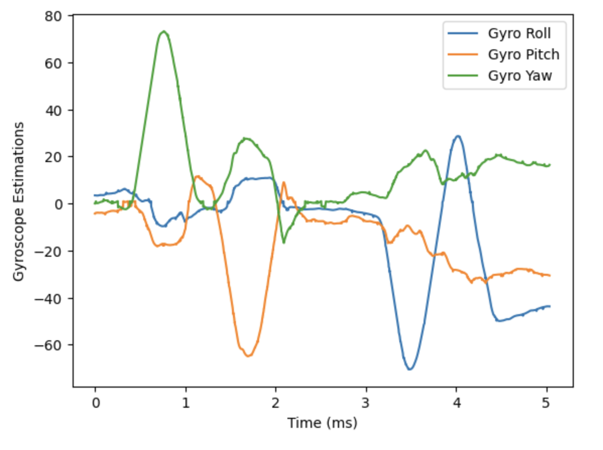

### Comparison with Accelerometer

We can only really properly compare the pitch and roll estimations between the accelerometer and gyroscope, so from this point forward in the lab, we will ignore the yaw estimation from the gyroscope.

Here are plots of the accelerometer, gyroscope, and low-pass-filtered accelerometer data for roll (top) and pitch (bottom) over 5 seconds:

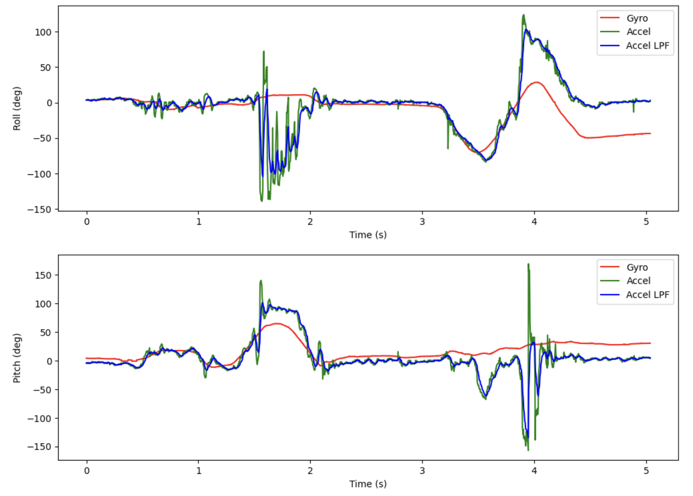

Note that the accelerometer readings does not exhibit drift over time, but is fairly noisy with large spikes. The gyroscope readings are much smoother and less noisy, but do exhibit quite some drift over time.


