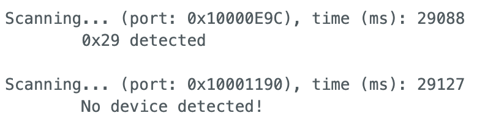

# Lab 3 Report

In this lab, we familiarized ourselves with the Time of Flight (ToF) Sensors provided in our lab kit.

## Prelab

The ToF sensors communicate with the Artemis using the I2C protocol; they have a **default address of 0x52**, as mentioned in the datasheet.

I want to communicate with both ToF sensors simultaneously, so I will need to change the address of one of the ToF sensors in the software setup. When doing the planning and mapping portion of the class, it will be useful to gather distance information from both sensors at the same time while moving through the obstacle course. I won't need to turn on and turn off the sensors constantly in order to gather data from both sensors.

I originally wanted to put one sensor in front, and one sensor on the side, but after temporarily placing the sensor on the car and looking at how close the wheels were to obstructing the side-facing sensor's field of view, I decided against putting the sensor on the side. The field of view to the front and back of the car are identical and quite wide, meaning that they will hopefully allow me to process the data in the same way onboard the Artemis. So I decided to mount one sensor on the front and one sensor on the back. It may be possible for the sensors to miss some obstacles that are thin and to the left or right of the car, if the car is driving too fast. But, if the field of view of the ToF sensors is wide enough, I believe this arrangement won't miss any obstacles.

The wiring diagram is as follows:


Note that I need an extra wire on the XSHUT of one of the ToF sensors connected to a GPIO pin on the Artemis (I chose A2). This way, in the software, I can turn one of the ToF sensors on and off at will, which will be useful for reprogramming the I2C address of the sensor.

## Lab Tasks

### Self-Powering Artemis from Battery (_Task 1_)

In this task, we were asked to attach a JST connector to the 650 mAh battery we were given in the lab kit, and demonstrate that the Artemis was able to run from the battery power. Below is a video demonstrating the `ECHO` and `PING` commands from Lab 1 working over Bluetooth to my Artemis running off battery power only:

<iframe width="560" height="315" src="https://www.youtube.com/embed/AWIFE3QcFvA?si=nEgzgX8hOBOaXlA_" title="YouTube video player" frameborder="0" allow="accelerometer; autoplay; clipboard-write; encrypted-media; gyroscope; picture-in-picture; web-share" referrerpolicy="strict-origin-when-cross-origin" allowfullscreen></iframe>

### I2C Address Scanning (_Tasks 2, 3, 4, 5_)

In this task, we downloaded the example code for I2C communication onto the Artemis and ran a scan of all I2C devices connected to the Artemis. Below is a screenshot of the result of the scan:



We see that the address is `0x29`. which is not the same as the expected `0x52` as specified in the datasheet. This is because in the I2C protocol, the least-significant-bit (LSB) of the 8-bit address specifies whether it is a message from the master to the slave (LSB = 0) or a message from the slave to the master (LSB = 1). So, in reality, the I2C device only has seven bits to specify its address; the eighth bit is determined by the direction of the message being sent.

Thus, the `0x52` address provided in the datasheet is the address of the sensor to the controlling device (i.e. the address of the ToF sensor from the perspective of the Artemis), as its LSB is 0 (`0x52 = 0b 0101 0010`). The scan simply prints out the first seven bits which actually specify the address of the device, which are `0b 0101 001`. Padding an extra 0 on the front gives `0b 0010 1001`, which is the `0x29` that we see in the screenshot.

### ToF Sensor Ranging Modes (_Task 6_)

The ToF Sensor has three modes: short, medium, and long. Below is a screenshot of the table in the datasheet discussing the modes:


The short mode is the least impacted by strong ambient light; the fast robots lab has pretty strong artificial lighting (we are not trying to drive the robot in the dark). 130 cm is also not that short of a distance to sense; with good control, it should be possible to drive the car within a meter of all of the obstacles in the course and thus not miss any obstacles. Finally, the short range has the smallest possible time budget of 20 ms, which theoretically can give readings up to 50 Hz. So, for all of these reasons, I chose the **short ranging mode** to operate my ToF sensors.


### Collecting Data from ToF Sensors (_Tasks 8, 9 (part), 10, 11, 12_)

I decided to mix up the order of the lab tasks somewhat; I got everything working with two sensors with the Artemis relaying all of the data back to the computer reliably first, then I characterized the ToF sensors second.

As described in the prelab, I soldered a wire from the Artemis `A2` pin to the `XSHUT` pin of one of the ToF sensors, as shown in the picture below:


To communicate with both sensors, I included the following definitions in my Arduino sketch and initialized my ToF sensors like so:

```cpp
// Interrupt and shutdown pins for second ToF
#define TOF2_SHUTDOWN_PIN A2

#define ALT_I2C_ADDR 0x28 // Reprogrammed I2C address of TOF Sensor 1

SFEVL53L1X myTOF1;
SFEVL53L1X myTOF2(Wire, TOF2_SHUTDOWN_PIN);
```

Then, in the `setup()` function, I included this sequence of commands to initialize both sensors properly:

```cpp
// Shut down Sensor 2
pinMode(TOF2_SHUTDOWN_PIN, OUTPUT);
digitalWrite(TOF2_SHUTDOWN_PIN, LOW);

// Reprogram the address of Sensor 1
myTOF1.setI2CAddress(ALT_I2C_ADDR);

// Init Sensor 1
if (myTOF1.begin() != 0) {
  Serial.println("Sensor 1 failed to begin. Please check wiring. Freezing...");
  while (1);
}
myTOF1.setDistanceModeShort(); // set the distance mode of the sensor to "short"
Serial.println("TOF Sensor 1 successfully online!");

// Bring Sensor 2 back online
digitalWrite(TOF2_SHUTDOWN_PIN, HIGH);

// Init Sensor 2
if (myTOF2.begin() != 0) {
  Serial.println("Sensor 2 failed to begin. Please check wiring. Freezing...");
  while (1);
}
myTOF2.setDistanceModeShort(); // set the distance mode of the sensor to "short"
Serial.println("TOF Sensor 2 successfully online!");
```

Seeing that I eventually need to send the IMU data along with the ToF data in this and future labs, I decided to integrate the ToF data collection into my code from Lab 2 immediately. I added three commands: `START_SENSOR_LOG`, `STOP_SENSOR_LOG`, and `SEND_SENSOR_LOGS`. The first two commands simply set a flag telling the Arduino when to start or stop recording sensor data into global arrays (from both the IMU and the ToF sensors). `SEND_SENSOR_LOGS` tells the Artemis to send back all of the data in the global arrays back to the computer.

To implement this on the Arduino side, I defined the following the global variables for the IMU and ToF:
```cpp
// flag to log sensor data
bool log_sensor_data = false;

// ******************************** IMU ****************************** //
const int imu_log_size = 2000;
float accel_x[imu_log_size], accel_y[imu_log_size], accel_z[imu_log_size];
float gyro_x[imu_log_size], gyro_y[imu_log_size], gyro_z[imu_log_size];
float accel_roll[imu_log_size], accel_pitch[imu_log_size];
float gyro_roll[imu_log_size], gyro_pitch[imu_log_size], gyro_yaw[imu_log_size];
float lpf_accel_roll[imu_log_size], lpf_accel_pitch[imu_log_size];
float comp_roll[imu_log_size], comp_pitch[imu_log_size];
unsigned long imu_times[imu_log_size];
int imu_arr_ix = 0;
float dt;

float accel_alpha = 0.152; // accelerometer LPF alpha
float comp_alpha = 0.001; // complementary filter alpha

// for holding values when we take raw readings in the main loop
float accel_x_curr, accel_y_curr, accel_z_curr, gyro_x_curr, gyro_y_curr, gyro_z_curr;

// ******************************** TOF ****************************** //

const int tof_log_size = 1000;
float tof_data_one[tof_log_size]; // data from TOF1
float tof_data_two[tof_log_size]; // data from TOF2
unsigned long tof_times[tof_log_size];
int tof_arr_ix = -1;
```

In the `loop()` function, I have the following logic to get the acquire and calculate the requested data from the sensors and put them into the global arrays:

```cpp
// if want to log sensor data
if (log_sensor_data) {
    
    // if space in IMU array and there is data ready
    if (imu_arr_ix < imu_log_size && myICM.dataReady()) {

        /*
         * Implementation of the IMU data collection and calculation
         * Unchanged from Lab 2 (see that report for details)
         */
         
    }
     
    // if space in the TOF sensor array
    if (tof_arr_ix < tof_log_size) {
        // if first measurement, simply start a measurement
        // else, if sensors have data ready, take measurements and record, and start a new measurement
        if (tof_arr_ix == -1) {
            myTOF1.startRanging();
            myTOF2.startRanging();
            tof_arr_ix++;
        } else if (myTOF1.checkForDataReady() && myTOF2.checkForDataReady()) {
            tof_data_one[tof_arr_ix] = ((float) myTOF1.getDistance()) / 10.0;
            tof_data_two[tof_arr_ix] = ((float) myTOF2.getDistance()) / 10.0;
            tof_times[tof_arr_ix] = millis();

            myTOF1.clearInterrupt();
            myTOF1.stopRanging();
            myTOF1.startRanging();

            myTOF2.clearInterrupt();
            myTOF2.stopRanging();
            myTOF2.startRanging();

            tof_arr_ix++;
        }
    }
}
```

A few things to note here:

* This logic ensures that the `loop()` function is not blocking while waiting for the ToF sensors to collect data. We are looping through as fast as possible: if there is IMU data ready, we calculate and record it; if there is TOF sensor data ready, we record it. (**part of task 9 of the lab**)
* We now need to keep track of two sets of timestamps, since the IMU sends back data much faster than the ToF sensors
* On the first iteration of the loop, the ToF sensors may have been ranging for a long time beforehand or have inaccurate measurements, so we need to clear it by starting a new measurement on the first loop through. We set `tof_arr_ix` to `-1` for this reason. After that, we simply check if both sensors have data ready; if they both do, we get their measurements (converted to cm), record them (along with the time), stop the measurement, and start a new one.

Finally, in the `handle_command` function, we have the following implementations of `START_SENSOR_LOG` and `STOP_SENSOR_LOG` (which simply sets the appropriate flag to the desired value), as well as `SEND_SENSOR_LOGS` (which sends to the computer the processed IMU data first, followed by the ToF sensor data):

```cpp
/*
 * This command tells the Artemis to start logging sensor data (both IMU and TOF)
 */
case START_SENSOR_LOG:
    log_sensor_data = true;
    break;

/*
 * This command tells the Artemis to stop logging sensor data (both IMU and TOF)
 */
case STOP_SENSOR_LOG:
    log_sensor_data = false;
    break;
    
/*
 * This command tells the Artemis to send back all IMU and TOF sensor data and reset logging arrays
 */
case SEND_SENSOR_LOGS:
      // construct string to send back IMU data
      for (int i = 0; i < imu_arr_ix; i++) {
          sprintf(char_arr, "%u|%d.%02d|%d.%02d|%d.%02d", imu_times[i],
                                                      (int) comp_roll[i], abs((int) (comp_roll[i] * 100.0) % 100),
                                                      (int) comp_pitch[i], abs((int) (comp_pitch[i] * 100.0) % 100),
                                                      (int) gyro_yaw[i], abs((int) (gyro_yaw[i] * 100.0) % 100));
                                                  

          tx_estring_value.clear();
          tx_estring_value.append(char_arr);
          tx_characteristic_string.writeValue(tx_estring_value.c_str());
      }

      // reset the IMU array index
      imu_arr_ix = 0;

      // construct string to send back TOF data
      for (int i = 0; i < tof_arr_ix; i++) {
          sprintf(char_arr, "%u|%d.%02d|%d.%02d", tof_times[i],
                                        (int) tof_data_one[i], abs((int) (tof_data_one[i] * 100.0) % 100),
                                        (int) tof_data_two[i], abs((int) (tof_data_two[i] * 100.0) % 100));

          tx_estring_value.clear();
          tx_estring_value.append(char_arr);
          tx_characteristic_string.writeValue(tx_estring_value.c_str());
      }

      // reset the TOF array index
      tof_arr_ix = -1;

      break;
```

On the Python side, we initialize empty lists to hold all of the data, and write a notification handler to process the incoming strings. The strings that come back from a call of `SEND_SENSOR_LOGS` have two types:

1. The IMU data, which have 4 parts: the timestamp, the complementary filter roll estimation, the complementary filter pitch estimation, and the gyroscope. 
2. The ToF data, which have 3 parts: the timestamp, the ToF 1 data, and the ToF 2 data

Thus, we can figure out which sensor's data we are receiving by looking at the length of the list after being spliced. 

To receive the data from the Artemis, we send a `START_SENSOR_LOG` command, wait a certain amount of seconds while the Artemis is collecting data, and then a `STOP_SENSOR_LOG` command. Then, we clear the data lists, and then send a `SEND_SENSOR_LOGS` command to get the data onto the computer. Here is the code:

```python
comp_roll = list()
comp_pitch = list()
gyro_yaw = list()
imu_times = list()

tof_one = list()
tof_two = list()
tof_times = list()

def sensor_log_notification_handler(uuid, characteristic):
    s = ble.bytearray_to_string(characteristic)
    strs = s.split('|')

    if (len(strs) == 4):
        imu_times.append(int(strs[0]))
        comp_roll.append(float(strs[1]))
        comp_pitch.append(float(strs[2]))
        gyro_yaw.append(float(strs[3]))
    else:
        tof_times.append(int(strs[0]))
        tof_one.append(float(strs[1]))
        tof_two.append(float(strs[2]))

ble.start_notify(ble.uuid['RX_STRING'], sensor_log_notification_handler)

# log data for some number of seconds
log_data_for_time = 2;

ble.send_command(CMD.START_SENSOR_LOG, "");
time.sleep(log_data_for_time);
ble.send_command(CMD.STOP_SENSOR_LOG, "");

# clear the lists, then send command to get data back
comp_roll.clear()
comp_pitch.clear()
gyro_yaw.clear()
imu_times.clear()
tof_one.clear()
tof_times.clear()

ble.send_command(CMD.SEND_SENSOR_LOGS, "");
```

During the time that we are logging data, we oscillate the IMU about roll, pitch, and yaw, then wave our hand in front of the first ToF sensor, and then the second ToF sensor. The received data is shown below, which **demonstrates that we are able to send data from the IMU as well as data from both ToF sensors simultaneously, and that all of the sensors are working** (tasks 8, 10, 11, and 12 of the lab):


The following is a video of me collecting the data shown in the above graph:

<iframe width="560" height="315" src="https://www.youtube.com/embed/O1i3tFoIsHk?si=qFRHh6GWSSPDe8Th" title="YouTube video player" frameborder="0" allow="accelerometer; autoplay; clipboard-write; encrypted-media; gyroscope; picture-in-picture; web-share" referrerpolicy="strict-origin-when-cross-origin" allowfullscreen></iframe>

### Discussion of Loop Speed (_Task 9_)

Here, we want to characterize the rates at which various activities are happening on the Artemis. To do this, we run the same test as before, but we run it for one second instead of eight. We also insert a counter in the `if` statement in the main `loop()` function that counts how many times we check for new sensor data in that one second. We can count how many times we received ToF data and IMU data by looking at the length of the received data arrays from each sensor. Here are the results:


We see that the ToF sensors are returning data at 19 Hz (19 data points in 1 second), the IMU is returning data at exactly 200 Hz (200 data points in 1 second), and the loop is also looping 200 Hz. This means the IMU data collection is the limiting factor, not the ToF sensors.

The main loop counter was implemented as follows:

```cpp
// *************** GLOBAL VARIABLES ******** //
// counter for main loop
int count = 0;

...

/*
 * In handle_command() function:
 */
case SEND_SENSOR_LOGS:
     /*
      * Send sensor data back, as discussed above
      */

    // print out the counter for the main loop, then reset it
    Serial.print("Main loop counter: ");
    Serial.println(count);
    count = 0;

    break;

...


/*
 * In loop() function:
 */
 
// if want to log sensor data
if (log_sensor_data) {
    // increment counter for main loop
    count++;

    // if space in IMU array and there is data ready
    if (imu_arr_ix < imu_log_size && myICM.dataReady()) {
        /*
         * Do IMU data collection as discussed in Lab 2
         */
    }

    // if space in the TOF sensor array
    if (tof_arr_ix < tof_log_size) {
        /*
         * Do TOF data collection as discussed above
         */
    }
}
```

### ToF Sensor Characterization (_Task 7_)

Below is a picture of the setup that I used to test the ToF sensors. The sensor is taped to the back of my computer, with a tape measure running out in front of the sensor. I placed my fast robots box on the tape measure at set distances to perform various tests on the sensor.


First, I performed a test to measure the range, accuracy, and reliability of the sensor together. I moved the box away from the sensor in 10-cm increments, starting at 10 cm away, until the sensor started giving me nonsensical readings. At each distance, I had the ToF sensor record data for 5 seconds (around 100 data points); I calculated the mean of the data (which would give me some measure of the accuracy), as well as the standard deviation (which would give me some measure of the reliability). The range could be determined by the distance at which either the accuracy or the standard deviation started to increase by a large amount (meaning the sensor was not giving real data any more).

Here are the resulting plots:


We see that the sensor is accurate to within about +/- 1 cm (wow!) up to a distance of around 80 cm, so we could say that the sensor has a range of ~80 cm. However, the standard deviation and error don't really "blow up" until 140-150 cm, so the sensor data is still useable (albeit with more error) between distances of 80-140 cm. So, we could also say that the sensor has a range of ~140 cm (which agrees with the datasheet). The accuracy is clearly also quite good. The reliability (quantified by the standard deviation in the bottom plot) is also very good, being around 0.1 cm for basically all distances less than 120 cm. 

Finally, I performed a test to determine the effect that time budgeting has on the reliability and accuracy. For this, I added a new command `SET_TIMING_BUDGET` to the Artemis, so I didn't have to recompile the code each time. On the Arduino side, I implemented it with this code:

```cpp
/*
 * Set the timing budget of the TOF1 sensor
 */
case SET_TIMING_BUDGET:
    int timing_budget;

    // Extract the next value from the command string as an integer
    success = robot_cmd.get_next_value(timing_budget);
    if (!success)
        return;

    myTOF1.setTimingBudgetInMs((uint16_t) timing_budget);

    timing_budget = (int) myTOF1.getTimingBudgetInMs();
    Serial.print("Timing Budget is now: ");
    Serial.println(timing_budget);
    
    break;
```

Basically, I used the `setTimingBudgetInMs()` function in the library to change the timing budget of the ToF sensor.

I than changed the timing budget in the Python code and ran several tests with the box 40 cm away from the sensor, calculating the measured distance (accuracy) and the standard deviation (reliability) each time. The results of the tests are below:


We see that the accuracy is not really affected at all by the timing budget (note the scale of the y-axis). Pretty much every timing budget gave us a reading that was extremely close to the actual distance of 40 cm. However, timing budgets lower than the default of 50 ms gave us appreciably larger standard deviations and thus lower reliability. On that curve, it seems that a timing budget somewhere between 50 and 100 ms offers a good trade-off between reliability and speed.

### Infrared Sensor Discussion (_Task 13 (part)_)

As discussed in lecture, there are three main types of IR distance sensors: amplitude, triangulation, and ToF. 

Amplitude-based IR sensors are extremely cheap, but are short range and are not very good at rejecting differences in the target's color or texture, nor do they work in high-ambient-light settings. They work by having a single emitter (IR LED) and a single receiver (a photodiode); the signal from the sensor is solely a function of how much IR energy that photodiode detects.

Triangualtion-based IR sensors are sort of middle-of-the-road with everything: moderate cost, moderate range, moderately good at rejecting differences in the target's color or texture. However, they do not work in high-ambient light settings. They do have a low refresh rate though. They work by having a single emitter (IR LED) and a row of receivers. The signal from the sensor is a function of both the strength of the signals coming into the photodiodes and which photodiode is the strongest (which means it is more accurate than the amplitude-based IR sensors).

ToF IR sensors are the most expensive and have the longest range. They can reject differences in the target's color or texture, and can work (in diminished capacity) in high-ambient-light settings. They have the lowest refresh rate and require intensive processing to generate their output signals. They work by sending out pulses of IR light and performing analysis on the timing and strength of the returned pulses to determine an object's distance.

### Sensitivity to Texture & Color (_Task 13 (part)_)


## Acknowledgements

* Sophia Lin (lab partner)
* Steven Sun (lending me a tape measure)
* Jeffery Cai (debugging, questions about soldering)
* [This website](https://community.st.com/t5/imaging-sensors/can-we-change-the-vl53l1x-address/m-p/310169) for a helpful forum answer on how to reprogram I2C addresses via software

