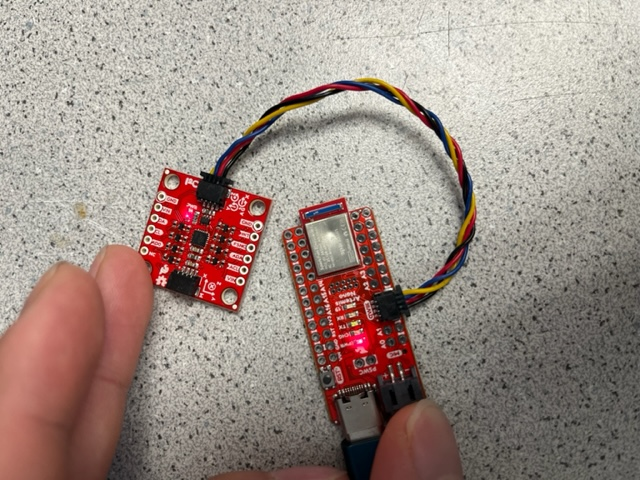

# Lab 3 Report

In this lab, we familiarized ourselves with the Time of Flight (ToF) Sensors provided in our lab kit.

## Prelab

The ToF sensors communicate with the Artemis using the I2C protocol; they have a **default address of 0x52**, as mentioned in the datasheet.

I want to communicate with both ToF sensors simultaneously, so I will need to change the address of one of the ToF sensors in the software setup. When doing the planning and mapping portion of the class, it will be useful to gather distance information from both sensors at the same time while moving through the obstacle course. I won't need to turn on and turn off the sensors constantly in order to gather data from both sensors.

I originally wanted to put one sensor in front, and one sensor on the side, but after temporarily placing the sensor on the car and looking at how close the wheels were to obstructing the side-facing sensor's field of view, I decided against putting the sensor on the side. The field of view to the front and back of the car are identical and quite wide, meaning that they will hopefully allow me to process the data in the same way onboard the Artemis. So I decided to mount one sensor on the front and one sensor on the back. It may be possible for the sensors to miss some obstacles that are thin and to the left or right of the car, if the car is driving too fast. But, if the field of view of the ToF sensors is wide enough, I believe this arrangement won't miss any obstacles.

The wiring diagram is as follows (**REPLACE WITH REAL IMAGE**):

Note that I need an extra wire on the XSHUT of both ToF sensors connected to GPIO pins on the Artemis. This way, in the software, I have control over when the devices reset (I can turn on / turn off the sensors at will).

## Lab Tasks

For this lab, most of the tasks were done with one sensor. Below is a picture showing how the sensor was connected to to the Artemis. Later, when we need the IMU and the second ToF sensors, they were simply plugged into the remaining two ports of the QWIIC 4-way Multiport board:

### Self-Powering Artemis from Battery

In this task, we were asked to attach a JST connector to the 650 mAh battery we were given in the lab kit, and demonstrate that the Artemis was able to run from the battery power. Below is a video demonstrating the `ECHO` and `PING` commands from Lab 1 working over Bluetooth to my Artemis running off battery power only:

<iframe width="560" height="315" src="https://www.youtube.com/embed/AWIFE3QcFvA?si=nEgzgX8hOBOaXlA_" title="YouTube video player" frameborder="0" allow="accelerometer; autoplay; clipboard-write; encrypted-media; gyroscope; picture-in-picture; web-share" referrerpolicy="strict-origin-when-cross-origin" allowfullscreen></iframe>

### I2C Address Scanning

In this task, we downloaded the example code for I2C communication onto the Artemis and ran a scan of all I2C devices connected to the Artemis. Below is a screenshot of the result of the scan:

We see that the address is `0x29`. which is not the same as the expected `0x52` as specified in the datasheet. This is because in the I2C protocol, the least-significant-bit (LSB) of the 8-bit address specifies whether it is a message from the master to the slave (LSB = 0) or a message from the slave to the master (LSB = 1). So, in reality, the I2C device only has seven bits to specify its address; the eighth bit is determined by the direction of the message being sent.

Thus, the `0x52` address provided in the datasheet is the address of the sensor to the controlling device (i.e. the address of the ToF sensor from the perspective of the Artemis), as its LSB is 0 (`0x52 = 0b 0101 0010`). The scan simply prints out the first seven bits which actually specify the address of the device, which are `0b 0101 001`. Padding an extra 0 on the front gives `0b 0010 1001`, which is the `0x29` that we in the resulting screenshot.

### ToF Sensor Ranging Modes

The ToF Sensor has three modes: short, medium, and long. Below is a screenshot of the table in the datasheet discussing the modes:

The short mode is the least impacted by strong ambient light; the fast robots lab has pretty strong artificial lighting (we are not trying to drive the robot in the dark). 130 cm is also not that short of a distance to sense; with good control, it should be possible to drive the car within a meter of all of the obstacles in the course and thus not miss any obstacles. Finally, the short range has the fastest response ranging time budget of 20 ms, which theoretically can give readings up to 50 Hz. So, for all of these readings, I chose the **short ranging mode** to operate my ToF sensors.

