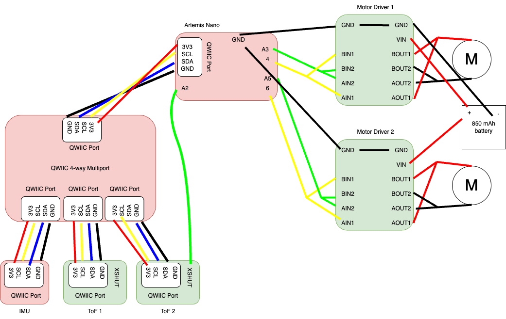

# Lab 4 Report

In this lab, we hooked up the two dual motor drivers, demonstrated that we can control them from the Artemis, stripped down our RC car, and mounted / connected our kit components to the car. Furthermore, we demonstrated the RC car moving under open-loop control.

## Prelab

Below is a wiring diagram of the setup, with everything attached:



We want to power the Artemis and the motor drivers/motors from separate batteries because the motors consume high current (and can be pulsed too). This may cause issues with the power supply on the Artemis, which is sensitive and needs to be more precise. Also, this means that the high-current-carrying wires coming from the motor battery to the motors will not be running near the Artemis. If they did, they may emit EMI and interfere with the proper operation of the signals coming out of the Artemis.

## Lab Tasks

### PWM Outputs for Motor Drivers (_Tasks 1 and 2_)

In the first step, we soldered our motor drivers together according to the wiring diagram and connected each motor driver to a power supply. The battery provides 3.7 V, so to mimic the battery, we set the power supply to output 3.7 V. Since aren't driving any motors yet, the motor drivers should not draw much current at all, so we can set the current limit for the driver to 30 or 40 mA. 

Then, we uploaded this simple Arduino code to the Artemis and probed the two output wires of each motor driver to verify that it is outputting a PWM signal:

```cpp
#include <Arduino.h>

#define MTR1_IN1 A3
#define MTR1_IN2 4
#define MTR2_IN1 A5
#define MTR2_IN2 6

int speed = 0;
int up = 1; // up = |speed| increasing
int direction = 1; // 1 = forward, -1 = backward

void setup() {
  pinMode(MTR1_IN1, OUTPUT);
  pinMode(MTR1_IN2, OUTPUT);
  pinMode(MTR2_IN1, OUTPUT);
  pinMode(MTR2_IN2, OUTPUT);
}

void loop() {
  if (direction == 1 && up == 1) {
    analogWrite(MTR1_IN1, speed);
    analogWrite(MTR1_IN2, 0);

    analogWrite(MTR2_IN1, speed);
    analogWrite(MTR2_IN2, 0);

    speed++;
    
    if (speed == 255) {
      up = 0;
    } 
  } else if (direction == 1 && up == 0) {
      analogWrite(MTR1_IN1, speed);
      analogWrite(MTR1_IN2, 0);

      analogWrite(MTR2_IN1, speed);
      analogWrite(MTR2_IN2, 0);

      speed--;

    if (speed == 0) {
      up = 1;
      direction = -1;
    }
  } else if (direction == -1 && up == 1) {
    analogWrite(MTR1_IN1, 0);
    analogWrite(MTR1_IN2, speed);

    analogWrite(MTR2_IN1, 0);
    analogWrite(MTR2_IN2, speed);

    speed++;

    if (speed == 255) {
      up = 0;
    }
  } else {
    analogWrite(MTR1_IN1, 0);
    analogWrite(MTR1_IN2, speed);

    analogWrite(MTR2_IN1, 0);
    analogWrite(MTR2_IN2, speed);

    speed--;

    if (speed == 0) {
      up = 1;
      direction = 1;
    }
    
    delay(50);
  }
}
```

This code sweeps the PWM output from 0 to 255 on one of the control pins for both motors (forward), and then sweeps the PWM output from 0 to 255 on the other control pin for both motors (backward). Here is a video showing the PWM output. Note: it doesn't seem to be possible to set the trigger on both channel 1 and channel 2, so when the wire being probed on channel 2 is being PWM'ed, the oscilloscope is not triggering, but you can still clearly see the duty ratio changing:

<iframe width="560" height="315" src="https://www.youtube.com/embed/-uKx-hrZJuY?si=4w3niAX3Uq5QAM6B" title="YouTube video player" frameborder="0" allow="accelerometer; autoplay; clipboard-write; encrypted-media; gyroscope; picture-in-picture; web-share" referrerpolicy="strict-origin-when-cross-origin" allowfullscreen></iframe>

Here is an oscilloscope screen capture of the waveform generated at a fixed PWM value of `128`, which is a 50% duty cycle for one of the motor drivers:


And here is the same waveform for the other motor driver:


For both waveforms, channel 1 is probing between the `xOUT1` pins and ground, and channel 2 is probing between the `xOUT2` pins and ground. The first picture is when channel 1 is outputting a PWM signal (motor is running forwards), and the second picture is when channel 2 is outputting a PWM signal (motor is running backwards).

### Motors Running from Power Supply (_Task 4_)

Next, we attached the motors to the outputs of the motor drivers as shown in the wiring diagram. Here are videos of one motor running:

<iframe width="560" height="315" src="https://www.youtube.com/embed/K5XxjD31BE4?si=Ylbt2Y_srBxgz9K6" title="YouTube video player" frameborder="0" allow="accelerometer; autoplay; clipboard-write; encrypted-media; gyroscope; picture-in-picture; web-share" referrerpolicy="strict-origin-when-cross-origin" allowfullscreen></iframe>

And here is a video of the other motor running:

<iframe width="560" height="315" src="https://www.youtube.com/embed/dCBaGB0QXzA?si=7Ti_v6UXNcEmgkT_" title="YouTube video player" frameborder="0" allow="accelerometer; autoplay; clipboard-write; encrypted-media; gyroscope; picture-in-picture; web-share" referrerpolicy="strict-origin-when-cross-origin" allowfullscreen></iframe>

### Motors Running from Battery (_Task 5_)

Next, we attached the power supply wires for the motor drivers to the battery connector cables, plugged in the battery, and tested that both motors can run off of battery power. Here is the video showing this test:

<iframe width="560" height="315" src="https://www.youtube.com/embed/nKhDnwe5_Yo?si=eMhgstjiHxaJGjcB" title="YouTube video player" frameborder="0" allow="accelerometer; autoplay; clipboard-write; encrypted-media; gyroscope; picture-in-picture; web-share" referrerpolicy="strict-origin-when-cross-origin" allowfullscreen></iframe>

### Mounting Hardware Inside Car (_Task 7_)

Next, we mounted everything inside the car. Double sided tape wasn't cutting it for me, so I ended up using electrical tape and duct tape to secure everything down. I refrained from using glue since glue is difficult to remove, in case repairs on the car are needed. Below is a picture of my finished car, with indicators pointing out relevant components:


Below is a video of the car on battery power running on the ground:

<iframe width="560" height="315" src="https://www.youtube.com/embed/oxY-0UJoXcM?si=p4VIhvWyf_7M03X2" title="YouTube video player" frameborder="0" allow="accelerometer; autoplay; clipboard-write; encrypted-media; gyroscope; picture-in-picture; web-share" referrerpolicy="strict-origin-when-cross-origin" allowfullscreen></iframe>

### Open Loop Drive Straight (_Task 9_)

Next, we added a calibration factor into the code so that the robot purposely sends a smaller duty cycle to one motor relative to the other. This is since the motors are intrinsically not exactly the same (and the motor drivers are also not exactly the same). This calibration factor tries to correct for that. Here the code on the Arduino side which implements the calibration factor:

```cpp
#include <Arduino.h>

#define MTR1_IN1 A3
#define MTR1_IN2 4
#define MTR2_IN1 A5
#define MTR2_IN2 6

#define SPEED 150
#define CALIB_FACTOR 0.7
#define GOTIME 800
#define STOPTIME 5000

void setup() {
  pinMode(MTR1_IN1, OUTPUT);
  pinMode(MTR1_IN2, OUTPUT);
  pinMode(MTR2_IN1, OUTPUT);
  pinMode(MTR2_IN2, OUTPUT);
}

void loop() {
  analogWrite(MTR1_IN1, SPEED * CALIB_FACTOR);
  analogWrite(MTR1_IN2, 0);
  analogWrite(MTR2_IN1, 0);
  analogWrite(MTR2_IN2, SPEED);

  delay(GOTIME);
  
  analogWrite(MTR1_IN1, 0);
  analogWrite(MTR1_IN2, 0);
  analogWrite(MTR2_IN1, 0);
  analogWrite(MTR2_IN2, 0);

  delay(STOPTIME);

  analogWrite(MTR1_IN1, 0);
  analogWrite(MTR1_IN2, SPEED * CALIB_FACTOR);
  analogWrite(MTR2_IN1, SPEED);
  analogWrite(MTR2_IN2, 0);

  delay(GOTIME);

  analogWrite(MTR1_IN1, 0);
  analogWrite(MTR1_IN2, 0);
  analogWrite(MTR2_IN1, 0);
  analogWrite(MTR2_IN2, 0);

  delay(STOPTIME);
}
```

Here is a video demonstrating that the robot can drive in an approximately straight line for 6 feet:

**ADD VIDEO TOMORROW**

You can see that the car is very inconsistent! I didn't change the signals sent to the motors between the first forward-and-back movement, and the second forward-and-back movement. Yet, the car exhibits very different behavior on the two runs, as is typical for open-loop control and relatively inexpensive / imprecise hardware. On the second forward movement, the car went approximately straight for 6 feet.

### Open Loop Control (_Task 10_)

Finally, we add some turns to the video from the previous task to complete our demonstration of open-loop, untethered control of the robot:

**ADD VIDEO TOMORROW**

### Lower Limit PWM (_Task 8, Task 12_)

To find the lower PWM limit for straight movements, I first found the lowest PWM value that keep the car moving forward consisently when I push it. This value is `GOSPEED` in the code below, which turned out to be `45`. Then, I found the lowest PWM value that would start the car from a dead stop consistently. This value is `STARTSPEED` in the code below, which turned out to be `70`.

```cpp
#include <Arduino.h>

#define MTR1_IN1 A3
#define MTR1_IN2 4
#define MTR2_IN1 A5
#define MTR2_IN2 6

#define STARTSPEED 70
#define GOSPEED 45
#define CALIB_FACTOR 0.7
#define STARTTIME 300
#define GOTIME 800
#define STOPTIME 5000

void setup() {
  pinMode(MTR1_IN1, OUTPUT);
  pinMode(MTR1_IN2, OUTPUT);
  pinMode(MTR2_IN1, OUTPUT);
  pinMode(MTR2_IN2, OUTPUT);
}

void loop() {
  analogWrite(MTR1_IN1, STARTSPEED * CALIB_FACTOR);
  analogWrite(MTR1_IN2, 0);
  analogWrite(MTR2_IN1, 0);
  analogWrite(MTR2_IN2, STARTSPEED);

  delay(STARTTIME);

  analogWrite(MTR1_IN1, GOSPEED * CALIB_FACTOR);
  analogWrite(MTR1_IN2, 0);
  analogWrite(MTR2_IN1, 0);
  analogWrite(MTR2_IN2, GOSPEED);

  delay(GOTIME);

  analogWrite(MTR1_IN1, 0);
  analogWrite(MTR1_IN2, 0);
  analogWrite(MTR2_IN1, 0);
  analogWrite(MTR2_IN2, 0);

  delay(STOPTIME);
}
```

Below is a video of the slowest forward movement. You can see the difference between the first/second and third forward movements. I didn't change the PWM commands to the car between those three movements, but the third one barely moved. Any lower and the robot does not move forward consistently. So even though the first two movements seem a little fast, or there might be some room to go lower, there really isn't.

<iframe width="560" height="315" src="https://www.youtube.com/embed/hbwsbrbsx4M?si=lI_qdilRLihQBfug" title="YouTube video player" frameborder="0" allow="accelerometer; autoplay; clipboard-write; encrypted-media; gyroscope; picture-in-picture; web-share" referrerpolicy="strict-origin-when-cross-origin" allowfullscreen></iframe>

Using the same procedure, I found lowest PWM `GOSPEED`s and `STARTSPEED`s for an on-axis turn. Here are the values that I found:

```cpp
#define STARTSPEED 125
#define GOSPEED 110
#define CALIB_FACTOR 0.85
#define STARTTIME 300
#define GOTIME 800
#define STOPTIME 5000
```

Notice that I had to change the calibration factor for the spins. I also realized that these values are heavily dependent on battery charge as well; I used a fully charged battery to get these values. Below is a video of the slowest turn possible. You can again see the difference between the first/second/fourth turns and the third turn. The third turn is really choppy and slow, but the signals I'm sending to the motors are the same. So even though it may seem like the first, second, and fourth movements are a bit fast and there is some room to go lower, there really isn't.

<iframe width="560" height="315" src="https://www.youtube.com/embed/tMGkvIxV95k?si=6orx_eqkPdRV1j0T" title="YouTube video player" frameborder="0" allow="accelerometer; autoplay; clipboard-write; encrypted-media; gyroscope; picture-in-picture; web-share" referrerpolicy="strict-origin-when-cross-origin" allowfullscreen></iframe>


### `analogWrite()` Frequency Discussion (_Task 11_)

We can figure out the frequency of of the `analogWrite()` PWM by looking at the oscilloscope screenshot from task 2:


It looks like it has a period of about 5.5 ms, which gives a frequency of 182 Hz.

It would be beneficial to make this PWM frequency faster so that the motor can respond to control inputs faster. Since the car is the plant and the duty cycle of the motors is the control handle, if we can get the plant to respond faster to changes in our control handle, the bandwidth of our control loop will be higher and thus we will be able to perform tighter / more aggressive control on our plant.

As for whether or not this is adequately fast to control the motors, we know that we cannot give our motors control inputs faster than their 3 dB frequency. Normally, you would be able to find this sort of information in a motor datasheet, but since our motors came with the car and there is no datasheet available for the car, the best we can do is do some imprecise math and estimate this frequency for the motors on our car.

If we assume that the frequency response of this motor can be approximated as a single-pole system, then the cutoff frequency is approximately 1/tau, where tau is the time constant of the step response of the motor while on the ground. We can try to estimate this frequency by listening to the video of the car on the ground:

**attach open loop drive straight video here**

From the sound that the motors are making, it seems like the car takes about 0.25 seconds to get up to speed. Let's further estimate that the rise time of the system is about 0.2 seconds. Then, the time constant is given by tr = 2.197 * tau, so tau is about 0.09 seconds. This gives a 3 dB frequency of 1/tau = 11 Hz, meaning that the motor cannot respond to control inputs well faster than this. That means that our PWM frequency of 182 Hz is more than sufficient to control this motor. Of course, this math was extremely hand-wavy, but if the PWM frequency is more than order of magnitude above our estimate of 3 dB frequency for this motor, it's probably safe to assume that PWM frequency is high enough that pushing it higher won't make much of a difference in the controllability of the motor.

## Acknowledgements

* Sophia Lin (Lab Partner)
* Chenyu Zhang (helping me in office hours with debugging and giving hints)
* Harry Gao (answering questions I had about task 11)
