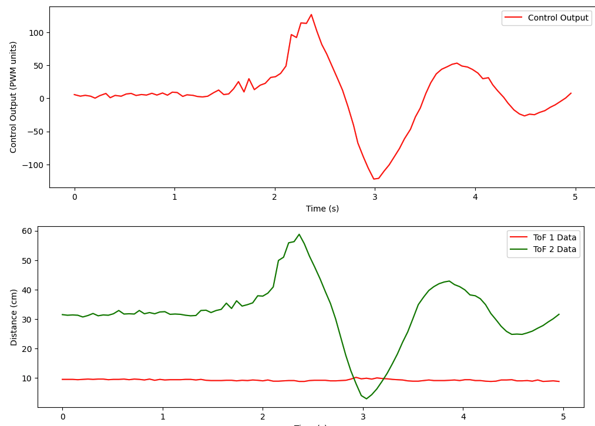
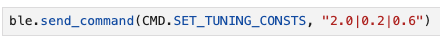
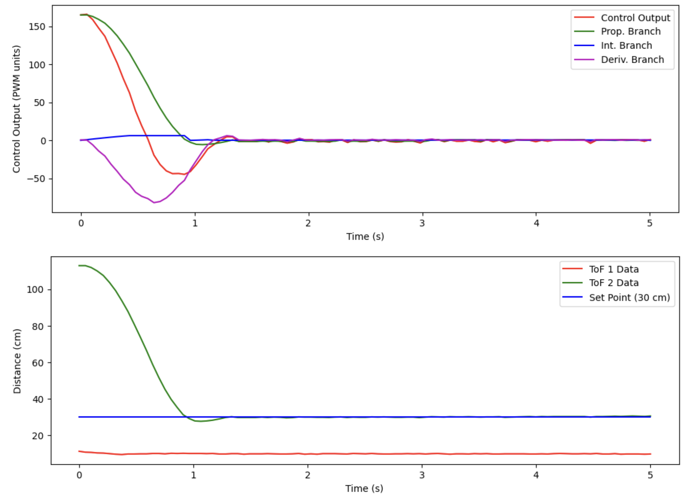
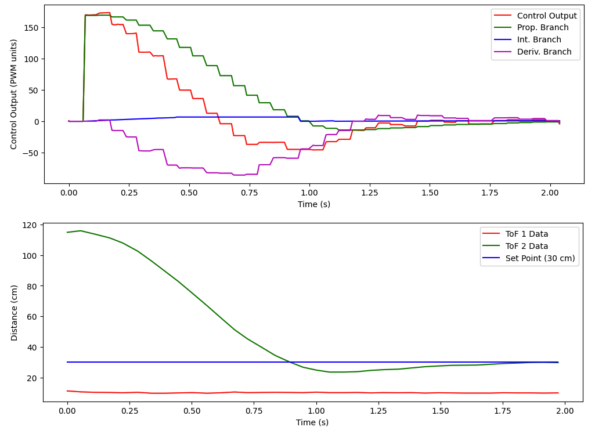
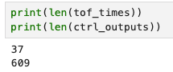
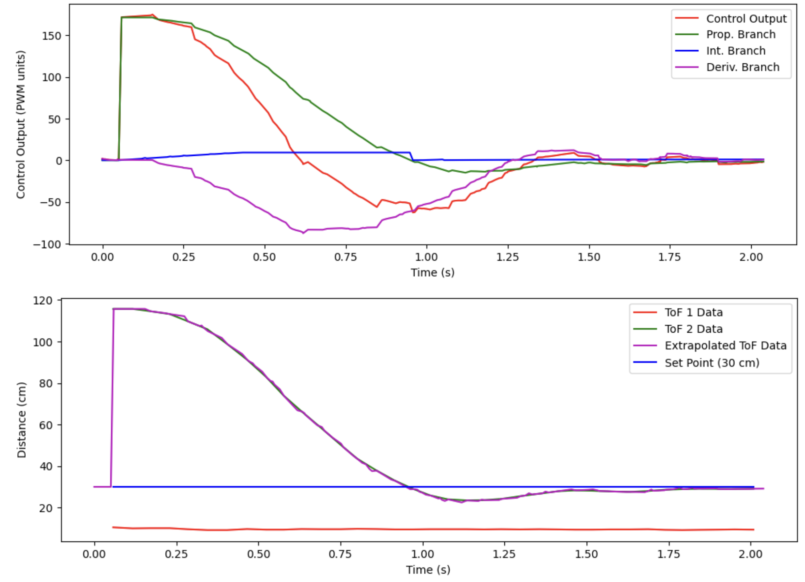
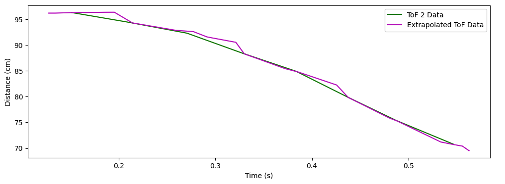

# Lab 5 Report

In this lab, we implemented a PID control loop to control the robot's distance to a wall. We also tried to improve on the refresh rate of the ToF sensors by linearly interpolating the sensor readings between two samples.

## Prelab

### Logging Mechanism for PID Tuning

In this prelab, we were asked to implement a logging mechanism that will be useful for visualizing the performance of our PID controller on the computer. To do this, I implemented it very similarly to Labs 2 and 3 when I was doing sensor characterizations. I made three commands: `START_PID_MVMT`, `STOP_PID_MVMT`, and `SEND_PID_LOGS`. The first two simply set a flag to run the PID controller loop to be `true` or `false`, as well as a couple additional small initialization and ending procedures. The third command sends back all of the log data over Bluetooth to the computer for processing and visualization. To execute PID for a fixed time, I simply waited a certain number of seconds between calling `START_PID_MVMT` and `STOP_PID_MVMT` in the Python code.

On the Arduino side, I added these logging arrays and associated global variables:

```cpp
const int ctrl_log_size = 500;
float ctrl_output[ctrl_log_size];
unsigned long ctrl_times[ctrl_log_size];
int ctrl_arr_ix = 0;
unsigned long ctrl_start_time = 0;
```

In `handle_command()`, I added these `case` sections:

```cpp
/*
 * This command tells the Artemis to start running PID loop
 */
case START_PID_MVMT:
    run_pid_loop = true;
    ctrl_start_time = millis();
    integral = 0;

    break;

/*
 * This command tells the Artemis to stop running PID loop
 */
case STOP_PID_MVMT:
    run_pid_loop = false;

    analogWrite(MTR1_IN1, 0);
    analogWrite(MTR1_IN2, 0);
    analogWrite(MTR2_IN1, 0);
    analogWrite(MTR2_IN2, 0);

    break;

/*
 * This command tells the Artemis to send back all data and reset logging arrays from most recent PID loop run
 */
case SEND_PID_LOGS:
      // construct string to send back TOF data (data set 1)
      for (int i = 0; i < tof_arr_ix; i++) {
          sprintf(char_arr, "1|%u|%d.%02d|%d.%02d", tof_times[i],
                                        (int) tof_data_one[i], abs((int) (tof_data_one[i] * 100.0) % 100),
                                        (int) tof_data_two[i], abs((int) (tof_data_two[i] * 100.0) % 100));

          tx_estring_value.clear();
          tx_estring_value.append(char_arr);
          tx_characteristic_string.writeValue(tx_estring_value.c_str());
      }

      // reset the TOF array index
      tof_arr_ix = -1;

      // construct string to send back control output data (data set 2)
      for (int i = 0; i < ctrl_arr_ix; i++) {
          sprintf(char_arr, "2|%u|%d.%02d", ctrl_times[i],
                                        (int) ctrl_output[i], abs((int) (ctrl_output[i] * 100.0) % 100));

          tx_estring_value.clear();
          tx_estring_value.append(char_arr);
          tx_characteristic_string.writeValue(tx_estring_value.c_str());
      }

      // reset the control array index
      ctrl_arr_ix = 0;

      break;
```

Notice that the `START_PID_MVMT` command has a line of code which notes the start time of the movement (to be used during the PID movement to drive forward blindly until we are within sensing distance of the wall), and another line of code that resets the integral value for the PID controller. Additionally, the `STOP_PID_MVMT` stops the motors at the end of the movement so that the robot doesn't continue to move once the PID movement has ended.

The `SEND_PID_LOGS` command sends back the ToF sensor readings as well as the output of the PID control loop. This is **NOT** the PWM signal sent to the motors, as there is some extra processing needed for that. This is simply the output of the PID control loop.

The Python side is implemented in almost exactly the same way as in Labs 2 and 3: write a notification handler, call the `START_PID_MVMT` command, wait a certain number of seconds for the movement to finish, call the `STOP_PID_MVMT` command, then call the `SEND_PID_LOGS` command to receive the data. Finally, generate plots of the data to visualize the controller performance. Below is the code:

```python
tof_one = list()
tof_two = list()
tof_times = list()

ctrl_outputs = list()
ctrl_times = list()

# define notification handler
def pid_log_notification_handler(uuid, characteristic):
    s = ble.bytearray_to_string(characteristic)
    strs = s.split('|')

    if (strs[0] == '1'):
        tof_times.append(int(strs[1]))
        tof_one.append(float(strs[2]))
        tof_two.append(float(strs[3]))
    else:
        ctrl_times.append(int(strs[1]))
        ctrl_outputs.append(float(strs[2]))
        
ble.start_notify(ble.uuid['RX_STRING'], pid_log_notification_handler)

# run pid loop for some number of seconds
run_pid_for_time = 5;

ble.send_command(CMD.START_PID_MVMT, "");
time.sleep(run_pid_for_time);
ble.send_command(CMD.STOP_PID_MVMT, "");

# clear the lists, then send command to get data back
tof_one.clear()
tof_two.clear()
tof_times.clear()
ctrl_outputs.clear()
ctrl_times.clear()

ble.send_command(CMD.SEND_PID_LOGS, "");

# Subtract first time from times to get 0-indexed time for both arrays
first_time = int(tof_times[0])

for i in range(len(tof_times)):
    tof_times[i] -= first_time
    tof_times[i] /= 1000.0 # convert to seconds

first_time = int(ctrl_times[0])

for i in range(len(ctrl_times)):
    ctrl_times[i] -= first_time
    ctrl_times[i] /= 1000.0 # convert to seconds

# Make a plot of control data
plt.figure(figsize = (12, 4))
plt.plot(ctrl_times, ctrl_outputs, 'r', label = "Control Output")
plt.xlabel('Time (s)')
plt.ylabel('Control Output (PWM units)')
plt.legend()
plt.show()

# Make a plot of ToF data
plt.figure(figsize = (12, 4))
plt.plot(tof_times, tof_one, 'r', label = "ToF 1 Data")
plt.plot(tof_times, tof_two, 'g', label = "ToF 2 Data")
plt.xlabel('Time (s)')
plt.ylabel('Distance (cm)')
plt.legend()
plt.show()
```

Here is an example plot of the control data from a run that I did:



### Setting Tuning Constants

To be able to update the tuning constants over Bluetooth (instead of re-programming the Artemis each time), I implemented a new command `SET_TUNING_CONSTS`, which is very similar to the `SEND_THREE_FLOATS` command implemented in Lab 1. On the Arduino side:

```cpp
/*
 * Set the tuning constants of the PID controller
 */
case SET_TUNING_CONSTS:

    // Extract the next value from the command string as a float
    success = robot_cmd.get_next_value(KP);
    if (!success)
        return;

    // Extract the next value from the command string as a float
    success = robot_cmd.get_next_value(KI);
    if (!success)
        return;

    // Extract the next value from the command string as a float
    success = robot_cmd.get_next_value(KD);
    if (!success)
        return;
        
    break;
```

On the Python side, this is called like so:

```python
ble.send_command(CMD.SET_TUNING_CONSTS, "4.0|0.3|2.0")
```

## Lab Tasks

### PID Control Update Insertion

The PID algorithm was implemented in a function called `run_pid()` (the implementation details will be discussed later in the report): 

```cpp
void run_pid() {
    // PID algorithm implementation ...
}
```

This function is called in the main loop each time we update the ToF sensor data:

```cpp
// While central is connected
while (central.connected()) {
    
    // if want to run pid loop
    if (run_pid_loop) {

        // if space in the TOF sensor array
        if (tof_arr_ix < tof_log_size) {
            // if first measurement, simply start a measurement
            // else, if sensor(s) has/have data ready, take measurement(s) and record, and start a new measurement(s)
            if (tof_arr_ix == -1) {
                // same as Lab 4; see that report for details
                tof_arr_ix++;
            } else if (myTOF1.checkForDataReady() && myTOF2.checkForDataReady()) {
                // same as Lab 4; see that report for details

                tof_arr_ix++;

                // run the PID controller / send new pwms to the robot <------ CODE ADDED HERE --------
                run_pid();
            }
        }
    }
}
```

### Implementation of `straight()`

The PID control loop outputs a continuous number which should translate to a desired speed of the robot, in "PWM units". However, the output of the controller cannot be directly applied to the PWM pins of the motors! First, the controller output is a floating-point number; `analogWrite()` takes integers only. We also want to offset the controller output by the `DEADBAND` so that the PID control output actually drives the robot forward and backward (instead of being unable to overcome static friction and probably having to use a large `KI` value to compensate -- thus increasing overshoot). Finally, the output of the controller is both positive and negative, so we need to translate the sign of the output into which control pins we actually drive our motors with. Below is the implementation of a function called `straight()` that translates the control loop output into actual PWM signals for the pins that drive the motors, and which accounts for all of the aforementioned issues:

```cpp
/*
 * Sends the requested speed in pwm units to the motors, 
 * with an offset of the DEADBAND defined above
 */
void straight(float pwm) {
    const float stoprange = 3.0;
    int adjusted_pwm_one = 0;
    int adjusted_pwm_two = 0;

    if (abs(pwm) < stoprange) {
        analogWrite(MTR1_IN1, 0);
        analogWrite(MTR1_IN2, 0);
        analogWrite(MTR2_IN1, 0);
        analogWrite(MTR2_IN2, 0);
    } else if (pwm >= stoprange) {
        adjusted_pwm_one = (int) (pwm * CALIB_FAC + DEADBAND + 0.5);
        adjusted_pwm_two = (int) (pwm + DEADBAND + 0.5);

        analogWrite(MTR1_IN1, adjusted_pwm_one);
        analogWrite(MTR1_IN2, 0);
        analogWrite(MTR2_IN1, 0);
        analogWrite(MTR2_IN2, adjusted_pwm_two);
    } else {
        adjusted_pwm_one = (int) (pwm * -1.0 * CALIB_FAC + DEADBAND + 0.5);
        adjusted_pwm_two = (int) (pwm * -1.0 + DEADBAND + 0.5);

        analogWrite(MTR1_IN1, 0);
        analogWrite(MTR1_IN2, adjusted_pwm_one);
        analogWrite(MTR2_IN1, adjusted_pwm_two);
        analogWrite(MTR2_IN2, 0);
    }   
}
```
`DEADBAND` and `CALIB_FAC` were found in Lab 4.

### PID Controller Implementation and Tuning

I went about this in two steps. First, I tuned the PID controller so that the robot would settle as fast as possible without running into the wall with the robot starting within range of the ToF sensor. Then, I came up with a way to drive the robot blindly forward until the ToF sensor data is valid so that I can start the robot farther than the ToF sensor's short range can detect and still get the desired behavior.

Since I want the PID controller to kick in at around the limit of the ToF sensor's short range (around 100 cm) and our goal is to stop 30 cm away from the wall, the error is around 70 cm, and I want the car's motors to have a PWM of about 200 at this point. Considering that our deadband is 40, the control output should be 200 - 40 = 160 in this condition. Thus, if control output = KP * error, then KP = (control output) / error, which is approximately 2.3. 

I went about tuning the controller as follows:

1. Start with all three tuning constants equal to 0
2. Increase KP until I see a couple of oscillations
3. Set KP to half of the value from step 1
4. Increase KI until the steady-state error is gone and there are again a couple of oscillations
5. Increase KD until the oscillations are smoothed out

I also tried to emulate the following animation of my response when tuning to get that nice critically damped response that we want to see:


I ended up using all 3 branches of the PID controller: P to do bulk correction, I to compensate for steady-state error, and D to remove oscillations. The values I arrived at are shown in the screenshot below:



Here is a video of the robot driving towards the wall with these gains:

<iframe width="560" height="315" src="https://www.youtube.com/embed/H6YxkUAzsO4?si=z6nAZ2FhHusqAKt4" title="YouTube video player" frameborder="0" allow="accelerometer; autoplay; clipboard-write; encrypted-media; gyroscope; picture-in-picture; web-share" referrerpolicy="strict-origin-when-cross-origin" allowfullscreen></iframe>

Here is the plot of the associated data from the run shown in the video:



Note that there is no steady-state error, and that there are no oscillations about the reference. From the video and from the plot, you can see that the settling time for a starting position of around 120 cm is a little over 1 second -- pretty good!

I implemented the following features in my PID controller in order to get this behavior:

* Integral Windup Protection
* Derivative Low-Pass Filter (protect against derivative kick, and to smooth out the highly-noise-susceptible derivative term)
* Normalized derivative and integral calculations to time (integral in units of cm*s and derivative in units of cm/s), so that I don't need to re-tune the controller when the control loop frequency is increased in the later portions of the lab

These were implemented as follows:

```cpp
// ************************ GLOBAL VARIABLES *********************** //

// tuning constants
float KP = 0.0;
float KI = 0.0;
float KD = 0.0;

#define CALIB_FAC 0.7
#define DEADBAND 40
#define SETPOINT 30.5
#define MAX_INTEGRAL 30.0

float integral = 0.0;
float prev_err = 0.0;
float deriv = 0.0;
float deriv_lpf_alpha = 0.5; // derivative low-pass-filter alpha

// ************************* PID ALGORITHM ************************ //

void run_pid() {
    // calculate error
    float err = (tof_arr_ix == 0) ? 0.0 : tof_data_two[tof_arr_ix - 1] - SETPOINT;
    float p = 0.0, i = 0.0, d = 0.0, tot = 0.0;
    float curr_deriv = 0.0;
    unsigned long curr_time = millis();
    // time step between this control update and previous one, in seconds
    float dt = (ctrl_arr_ix == 0) ? 0.0 : (float)(curr_time - ctrl_times[ctrl_arr_ix - 1]) / 1000.0;

    // calculate p term
    p = KP * err;

    // calculate i term (rectangular riemann sum)
    // skip if integral is over max integral and we are adding on more with the same sign
    if (!(integral > MAX_INTEGRAL && abs(integral) < abs(integral + err))) {
        integral += err * dt;
    }
    // reset the integral on the zero crossing to get rid of windup
    if (prev_err * err < 0.0) {
        integral = 0.0;
    }
    i = KI * integral;

    // calculate d term
    curr_deriv = (ctrl_arr_ix == 0) ? 0.0 : (err - prev_err) / dt;
    deriv = (deriv_lpf_alpha) * curr_deriv + (1.0 - deriv_lpf_alpha) * deriv; // low-pass filter implementation
    d = KD * deriv;
    prev_err = err;

    // sum the three to get the total input
    tot = p + i + d;

    // send the control action to the wheels
    straight(tot);

    // log the control output if space in array
    if (ctrl_arr_ix < ctrl_log_size) {
        ctrl_output[ctrl_arr_ix] = tot;
        p_output[ctrl_arr_ix] = p;
        i_output[ctrl_arr_ix] = i;
        d_output[ctrl_arr_ix] = d;
        ctrl_times[ctrl_arr_ix] = curr_time;
        ctrl_arr_ix++;
    }
}
```

### Increasing Control Loop Frequency

To increase the control loop frequency, we have to decouple the call to `read_pid()` and the updates to the ToF sensors. We can do this by moving the call to `read_pid()` out of the `if` statement that checks for whether the ToF sensors has new data:

```cpp
// While central is connected
while (central.connected()) {
    
    // if want to run pid loop
    if (run_pid_loop) {

        // if space in the TOF sensor array
        if (tof_arr_ix < tof_log_size) {
            // if first measurement, simply start a measurement
            // else, if sensor(s) has/have data ready, take measurement(s) and record, and start a new measurement(s)
            if (tof_arr_ix == -1) {
                // same as Lab 4; see that report for details
                tof_arr_ix++;
            } else if (myTOF1.checkForDataReady() && myTOF2.checkForDataReady()) {
                // same as Lab 4; see that report for details

                tof_arr_ix++;
                // <--------- WAS HERE BEFORE --------
            }
        }
        // run the PID controller / send new pwms to the robot <------ MOVE CALL HERE --------
        run_pid();
    }
}
```

In the `read_pid()` function, we have to adjust a few lines of code to make sure we're still calculating the change in time for the derivative and integral, but otherwise, the code is basically the same:

```cpp
void run_pid() {
    // calculate error
    float err = (tof_arr_ix == 0) ? 0.0 : tof_data_two[tof_arr_ix - 1] - SETPOINT;
    float prev_err = (tof_arr_ix <= 1) ? 0.0 : tof_data_two[tof_arr_ix - 2] - SETPOINT; // <------ this line changed
    float p = 0.0, i = 0.0, d = 0.0, tot = 0.0;
    float curr_deriv = 0.0;
    unsigned long curr_time = millis();
    // time step between this control update and previous one, in seconds
    float integ_dt = (ctrl_arr_ix == 0) ? 0.0 : (float)(curr_time - ctrl_times[ctrl_arr_ix - 1]) / 1000.0; // <--- need separate dt for integral and derivative
    float deriv_dt = (tof_arr_ix == 0) ? 0.0 : (float)(tof_times[tof_arr_ix - 1] - tof_times[tof_arr_ix - 2]) / 1000.0;

    // the rest of the function is the same ...
}
```

Since the loop runs so much faster now, it also generates a lot more data, so I reduced the time that we are running the loop from 5 seconds to 2 seconds, especially now that the controller is tuned and we know it settles around 1 second. Using the same gains as in the previous part, here is a video of the robot driving towards the wall with the faster control loop:

<iframe width="560" height="315" src="https://www.youtube.com/embed/i8L1XjHiMtA?si=_ifcGJa7wazwAI2k" title="YouTube video player" frameborder="0" allow="accelerometer; autoplay; clipboard-write; encrypted-media; gyroscope; picture-in-picture; web-share" referrerpolicy="strict-origin-when-cross-origin" allowfullscreen></iframe>

Here is the plot of the associated data from the run shown in the video:



To see how much faster the control loop is running relative to the ToF sensor update, we print out the lengths of the arrays in Python:



Recall that the movement was 2 seconds long. Therefore, the ToF sensor was operating at around 20 Hz (as found in Lab 3), and the control loop was operating at around 300 Hz. This is a significant speedup!

**An important note:** Since the loop was sped up by 15x compared to before (20 Hz to 300 Hz), the alpha value for the derivative low-pass-filter also needed to be changed. Originally, alpha was 0.5, but since we are essentially applying the filter 15 times per ToF sensor update cycle, we choose a new alpha equal to the 15th root of 0.5, or about 0.955. 

### Data Extrapolation

To do data extrapolation, we write the following function on the Arduino side:

```cpp
float extrap_tof_data[ctrl_log_size]; // ADD THIS GLOBAL VARIABLE

void calculate_tof_data (unsigned long curr_time) {
    // take care of edge cases when we have no data points or one data point from ToF
    if (tof_arr_ix == 0) {
        // if we have received no data points yet, pretend we're reading the setpoint
        extrap_tof_data[ctrl_arr_ix] = SETPOINT;
    } else if (tof_arr_ix == 1) {
        // if we have only one data point, there is nothing to extrapolate, so just set them equal
        extrap_tof_data[ctrl_arr_ix] = tof_data_two[0];
    } else {
        // otherwise, we can calculate a slope and a time elapsed since the last update,
        // and use that to extrapolate
        float rise = tof_data_two[tof_arr_ix - 1] - tof_data_two[tof_arr_ix - 2];
        float run = ((float)(tof_times[tof_arr_ix - 1] - tof_times[tof_arr_ix - 2])) / 1000000.0; // in secs
        float slope = rise / run; // in cm/sec
        float elapsed_time = ((float)(curr_time - tof_times[tof_arr_ix - 1])) / 1000000.0; // in secs
        extrap_tof_data[ctrl_arr_ix] = tof_data_two[tof_arr_ix - 1] + (slope * elapsed_time);
    }
}
```

This function calculates and estimate for what the ToF sensor value would be at the current time using linear extrapolation, if there are more than two data points available. It also handles edge cases at the start of the movement.

The beginning of the PID algorithm function also needs to be modified slightly:

```cpp
void run_pid() {
    unsigned long curr_time = micros();

    // get extrapolated tof data
    calculate_tof_data(curr_time);

    // calculate error using extrapolated tof data
    float err = extrap_tof_data[ctrl_arr_ix] - SETPOINT;
    float p = 0.0, i = 0.0, d = 0.0, tot = 0.0;
    float curr_deriv = 0.0;
    // time step between this control update and previous one, in seconds
    float dt = (ctrl_arr_ix == 0) ? 0.0 : (float)(curr_time - ctrl_times[ctrl_arr_ix - 1]) / 1000000.0;

    // the rest of the function is the same ...
}
```

You'll notice that I had to divide the timestamps by 1,000,000 instead of 1,000. This is because I had to change all of the timestamps to microseconds instead of milliseconds; the loop was going so fast that the `dt` variable was zero, so when we tried to compute the derivative as `(err - prev_error) / dt`, the code would error. Using `micros()` instead of `millis()` allows us to gain some extra resolution and avoid getting a divide by zero error.

I also had to lower the alpha value for the derivative low-pass-filter by a significant amount, as each time the ToF sensor gave a new update, there would be a spike in the derivative. This is because the extrapolated ToF data had been drifting farther from the true value throughout the entire update period; when the sensor finally updates, the extrapolated ToF data value is suddenly "pulled back in" to the real sensor value, resulting in a large difference in sensor reading over a very short difference in time (i.e. high derivative).

However, I barely had to adjust the PID controller gains to get this to work as well. Here is the video of the robot driving towards the wall using the extrapolated sensor values:

<iframe width="560" height="315" src="https://www.youtube.com/embed/-F1KYKHTE6Y?si=nXpmYTcvyV7YcFz0" title="YouTube video player" frameborder="0" allow="accelerometer; autoplay; clipboard-write; encrypted-media; gyroscope; picture-in-picture; web-share" referrerpolicy="strict-origin-when-cross-origin" allowfullscreen></iframe>

Here is the plot of the associated data from the run shown in the video:

 

Notice that the extrapolated ToF sensor values line up well with the actual values. It's a bit hard to see the extrapolation working; here is a plot of just the first 0.5 seconds which shows the matchup better:



### Different Surfaces / Windup Protection


### Variable Starting Distance

Finally, to get the car to drive toward the wall from greater than the ToF sensor's "short" range, I put the ToF sensor in "long" range mode and drove the robot forward quickly until the "long" range gave me a reading that is just on the border of the "short" range (around 150 cm). Then, I switched the ToF sensor from "long" to "short" range, and then started the PID control loop as before. Another way to look at it is that I implemented a coarse control algorithm (essentially bang-bang control) when the robot is far from the desired setpoint, followed by a much more precise algorithm (the PID controller) to get the robot exactly to the setpoint once we are close.

## Acknowledgements

XD