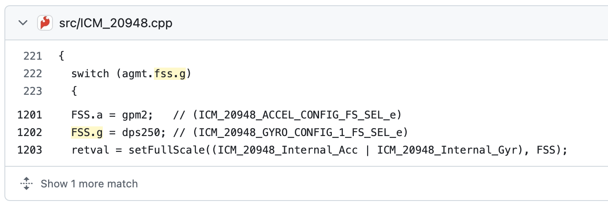
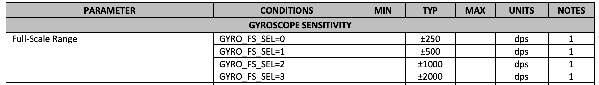

# Lab 6 Report

In this lab, we implemented a PID controller for the orientation (theta) of the robot.

## Prelab

The requirements for the prelab are identical to Lab 5, and I have implemented it in the same way. So for the sake of brevity, I will not be copying the same text over; please refer to Lab 5 for my Prelab for Lab 6.

## Lab Tasks

### PID Input Signal Discussion Questions

1. **Are there problems that digital integration may cause?** Integrating the gyroscope over time will cause issues, as the gyroscope exhibits drift. Since there isn't a way to simply fuse the data from the gyroscope with the accelerometer in the yaw direction (which is what we want), this error will accumulate over time and cause significant problems (probably the robot will turn slowly over time).
2. **Are there ways to minimize these problems?** Perhaps doing some more complicated sensor fusion (for example, using the centripetal force experienced by the accelerometer when the robot turns about its yaw axis) or incorporating the magnetometer data (which should also detect when the robot turns about the yaw axis) would help to stabilize the integration of the gyroscope data. 
3. **Does sensor have any bias?** Yes, as mentioned above, the gyroscope exhibits some constant bias (i.e. when the IMU is not moving, the gyroscope still says that the robot is rotating).
4. **How fast does the error grow as a result of the bias?** The gyroscope's constant yaw bias is around 6 degress/sec, as can be seen in my Lab 2 report. When integrating, this is also the rate at which the error grows (around 6 degrees/sec). **I will use the onboard Digital Motion Processor (DMP) to counteract this drift!**
5. **Are there limitations to the sensor to be aware of?** The gyroscope is by default set to have a maximum spin rate of 250 degrees/sec (dps), as shown in this code snippet from the Arduino library Github:

Here is a screenshot of the datasheet confirming that there are indeed four different ranges that you can set it to:

6. **Is this maximum spin rate sufficient for our applications?** 250 dps is around 70% of a full rotation per second. This robot can spin much faster than that, so it may not be enough for our applications.
7. **Are there ways to configure this parameters?** Looking at the code and datasheet, it looks like we can set the `GYRO_FS_SEL` register of the gyroscope to `1`, `2`, or `3`, for a dps of `500`, `1000`, or `2000` dps, respectively.

### Derivative Term Questions

1. **Does it make sense to take the derivative of an integral?** From a calculus / math perspective, it's perfectly valid to take the derivative of an integral; you just get the original signal back. In our case, if we are using the onboard DMP, the integrated signal is going to be a calculated signal which is the result of accelerometer, gyroscope, and magnetometer sensor signals. It won't be simply the integral of any one sensor signal. So, though the measured yaw angle will be, to a first order, the integral of the gyroscope measured spin rate about a particular axis, the integrated yaw angle will be its own signal, which means taking the derivative of it makes perfect sense.
2. **Does changing the setpoint while robot is running cause problems?** Yes, there will be a deriviative kick whenever you change the setpoint. This will cause a large change in the output whenever you change the setpoint.
3. **Is a low-pass filter needed before your derivative term?** Yes, we will need a low-pass filter on the derivative term to smooth out any derivative kicks.

### Programming Implementation

1. **Can you process Bluetooth commands while controller is running?** Yes. Nothing in the PID Control function hangs (waits for sensor values or delays), and it is called in the `while` loop that runs when the Bluetooth is connected. My PID control algorithm is written and called in exactly the same way as Lab 5, so I won't repeat it for the sake of brevity here.
2. **Think about future applications with navigation or stunts. Will you need to be able to update setpoint in real time?** Yes, I will need to be able to update the setpoint in real time. As the robot drives and plans its actions, it'll need to be able to set its desired orientation internally, and the PID control loop will have to execute to get the robot to actually obtain the desired state.
3. **Can you control the robot's orientation will driving forward and backward?** Yes, I can do this by running the PID control loop for driving straight (Lab 5) simultaneously with the PID control loop for controlling the orientation (Lab 6), and combining the two outputs for the motor directions. 