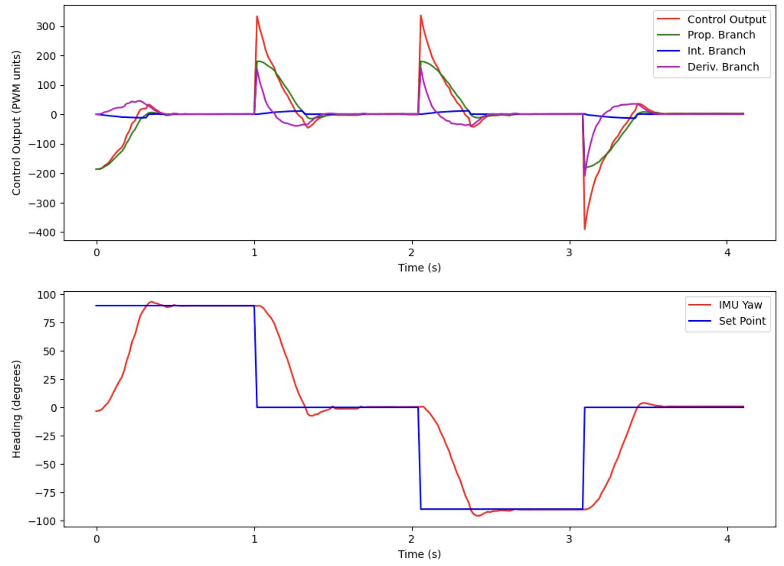
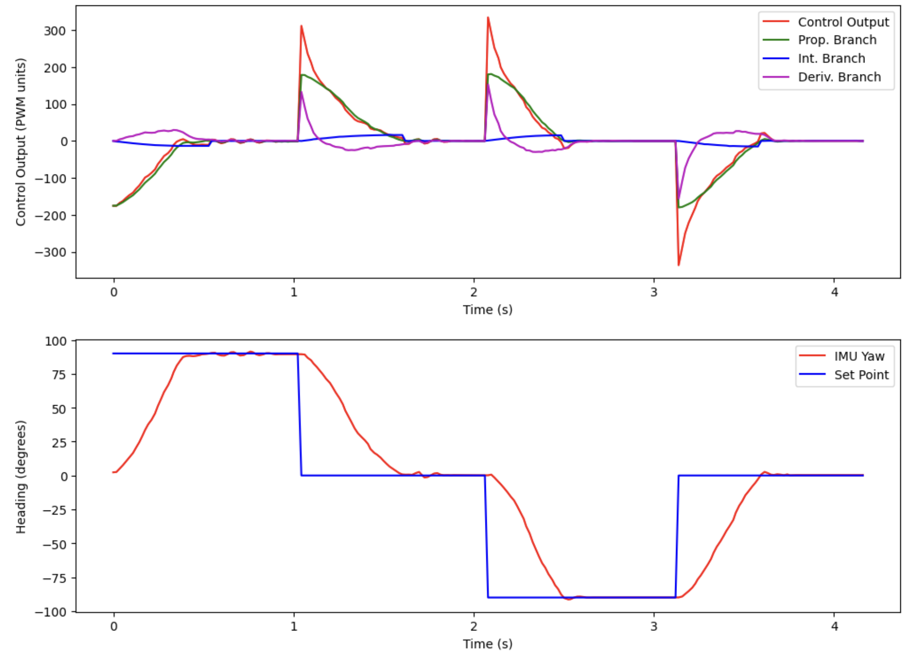
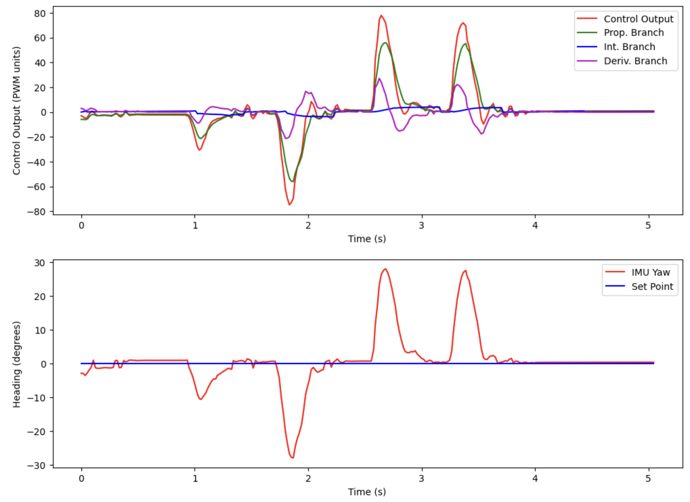
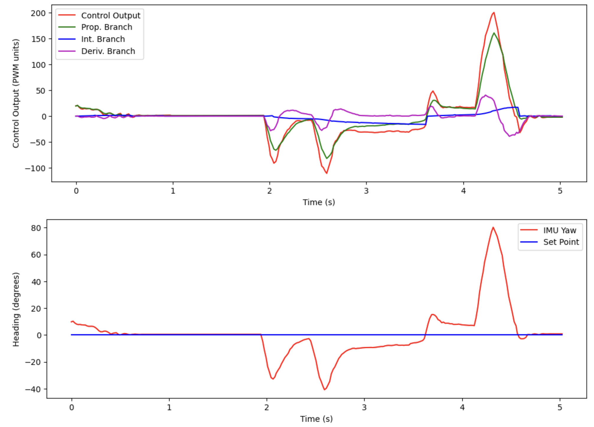

# Lab 6 Report

In this lab, we implemented a PID controller for the orientation (theta) of the robot.

## Prelab

The requirements for the prelab are identical to Lab 5, and I have implemented it in the same way. So for the sake of brevity, I will not be copying the same text over; please refer to Lab 5 for my Prelab for Lab 6.

## Lab Tasks

### PID Input Signal Discussion Questions

1. **Are there problems that digital integration may cause?** Integrating the gyroscope over time will cause issues, as the gyroscope exhibits drift. Since there isn't a way to simply fuse the data from the gyroscope with the accelerometer in the yaw direction (which is what we want), this error will accumulate over time and cause significant problems (probably the robot will turn slowly over time).
2. **Are there ways to minimize these problems?** Perhaps doing some more complicated sensor fusion (for example, using the centripetal force experienced by the accelerometer when the robot turns about its yaw axis) or incorporating the magnetometer data (which should also detect when the robot turns about the yaw axis) would help to stabilize the integration of the gyroscope data. 
3. **Does sensor have any bias?** Yes, as mentioned above, the gyroscope exhibits some constant bias (i.e. when the IMU is not moving, the gyroscope still says that the robot is rotating).
4. **How fast does the error grow as a result of the bias?** The gyroscope's constant yaw bias is around 6 degress/sec, as can be seen in my Lab 2 report. When integrating, this is also the rate at which the error grows (around 6 degrees/sec). **I will use the onboard Digital Motion Processor (DMP) to counteract this drift!**
5. **Are there limitations to the sensor to be aware of?** The gyroscope is by default set to have a maximum spin rate of 250 degrees/sec (dps), as shown in this code snippet from the Arduino library Github:


Here is a screenshot of the datasheet confirming that there are indeed four different ranges that you can set it to:


6. **Is this maximum spin rate sufficient for our applications?** 250 dps is around 70% of a full rotation per second. This robot can spin much faster than that, so it may not be enough for our applications.
7. **Are there ways to configure this parameters?** Looking at the code and datasheet, it looks like we can set the `GYRO_FS_SEL` register of the gyroscope to `1`, `2`, or `3`, for a dps of `500`, `1000`, or `2000` dps, respectively.

### Derivative Term Questions

1. **Does it make sense to take the derivative of an integral?** From a calculus / math perspective, it's perfectly valid to take the derivative of an integral; you just get the original signal back. In our case, if we are using the onboard DMP, the integrated signal is going to be a calculated signal which is the result of accelerometer, gyroscope, and magnetometer sensor signals. It won't be simply the integral of any one sensor signal. So, though the measured yaw angle will be, to a first order, the integral of the gyroscope measured spin rate about a particular axis, the integrated yaw angle will be its own signal, which means taking the derivative of it makes perfect sense.
2. **Does changing the setpoint while robot is running cause problems?** Yes, there will be a deriviative kick whenever you change the setpoint. This will cause a large change in the output whenever you change the setpoint.
3. **Is a low-pass filter needed before your derivative term?** Yes, we will need a low-pass filter on the derivative term to smooth out any derivative kicks.

### Programming Implementation

1. **Can you process Bluetooth commands while controller is running?** Yes. Nothing in the PID Control function hangs (waits for sensor values or delays), and it is called in the `while` loop that runs when the Bluetooth is connected. My PID control algorithm is written and called in exactly the same way as Lab 5, so I won't repeat it for the sake of brevity here.
2. **Think about future applications with navigation or stunts. Will you need to be able to update setpoint in real time?** Yes, I will need to be able to update the setpoint in real time. As the robot drives and plans its actions, it'll need to be able to set its desired orientation internally, and the PID control loop will have to execute to get the robot to actually obtain the desired state.
3. **Can you control the robot's orientation will driving forward and backward?** Yes, I can do this by running the PID control loop for driving straight (Lab 5) simultaneously with the PID control loop for controlling the orientation (Lab 6), and combining the two outputs for the motor directions. 

### Orientation PID Control

I used DMP and followed the instructions on the link on the lab manual to set it up. Here is the code in the `setup()` function that I added:

```cpp
bool success = true;

// Initialize the DMP
success &= (myICM.initializeDMP() == ICM_20948_Stat_Ok);

// Enable the DMP Game Rotation Vector sensor
success &= (myICM.enableDMPSensor(INV_ICM20948_SENSOR_GAME_ROTATION_VECTOR) == ICM_20948_Stat_Ok);

// Set the DMP output data rate (ODR): value = (DMP running rate / ODR ) - 1
// E.g. for a 5Hz ODR rate when DMP is running at 55Hz, value = (55/5) - 1 = 10.
success &= (myICM.setDMPODRrate(DMP_ODR_Reg_Quat6, 0) == ICM_20948_Stat_Ok); // Set to the maximum

// Enable the FIFO queue
success &= (myICM.enableFIFO() == ICM_20948_Stat_Ok);

// Enable the DMP
success &= (myICM.enableDMP() == ICM_20948_Stat_Ok);

// Reset DMP
success &= (myICM.resetDMP() == ICM_20948_Stat_Ok);

// Reset FIFO
success &= (myICM.resetFIFO() == ICM_20948_Stat_Ok);

// Check success
if (!success) {
    Serial.println("Enabling DMP failed!");
    while (1) {
        // Freeze
    }
}
```

In my `loop()`, I make sure that regardless of if the PID loop is running, that I am constantly reading data from the FIFO from the DMP, to prevent the IMU from crashing. If my PID loop is running, I get the data and calculate the yaw angle, as per the example DMP code. Here is the `loop()` code pertaining to the IMU:

```cpp
// While central is connected
while (central.connected()) {
    
    // read data from the FIFO no matter what
    myICM.readDMPdataFromFIFO(&data);
    
    // if want to run pid loop
    if (run_pid_loop) {

        // Is valid data available and space in array?
        if ((imu_arr_ix < imu_log_size) && ((myICM.status == ICM_20948_Stat_Ok) || (myICM.status == ICM_20948_Stat_FIFOMoreDataAvail))) {
            // We have asked for GRV data so we should receive Quat6
            if ((data.header & DMP_header_bitmap_Quat6) > 0) {
                q1 = ((double)data.Quat6.Data.Q1) / 1073741824.0; // Convert to double. Divide by 2^30
                q2 = ((double)data.Quat6.Data.Q2) / 1073741824.0; // Convert to double. Divide by 2^30
                q3 = ((double)data.Quat6.Data.Q3) / 1073741824.0; // Convert to double. Divide by 2^30

                // calculate yaw (copied from the example code)
                q0 = sqrt(1.0 - ((q1 * q1) + (q2 * q2) + (q3 * q3)));

                qw = q0;
                qx = q2;
                qy = q1;
                qz = -q3;

                // yaw (z-axis rotation)
                t3 = +2.0 * (qw * qz + qx * qy);
                t4 = +1.0 - 2.0 * (qy * qy + qz * qz);
                yaw = atan2(t3, t4) * 180.0 / PI;  

                // put the calculated value into the array
                imu_yaw[imu_arr_ix] = yaw;
                imu_times[imu_arr_ix] = micros();
                imu_arr_ix++;

                // send new pwms to the robot
                run_pid();
            }
        }
    }

    // Send data
    write_data();

    // Read data
    read_data();
}
```

Since the IMU generates data at a much faster rate than the ToF sensor, I didn't notice much of a difference in performance between decoupling and coupling the two loop rates. So I left them coupled, as it simplifies the code significantly and makes debugging much easier (decoupling the loops made the control loop run at more than 1000 Hz, which took an extremely long time to send over to the computer).

The PID algorithm is implemented the exact same way as in Lab 5. See that lab for more details; I simply replaced the line to calculate the error from:

```cpp
float err = (tof_arr_ix == 0) ? 0.0 : tof_data_two[tof_arr_ix - 1] - SETPOINT;
```

to

```cpp
float err = imu_yaw[imu_arr_ix - 1] - SETPOINT;
```

I kept the low-pass-filter implementation for the derivative term, in order to account for derivative kick when changing the setpoint.

I slightly modified my `straight()` function from Lab 5 to come up with a `spin` function for Lab 6, which is shown here. For an explanation for why this is useful / necessary, see my Lab 5 report:

```cpp
/*
 * Sends the requested speed in pwm units to the motors, 
 * with an offset of the DEADBAND defined above
 */
void spin(float pwm) {
    const float stoprange = 3.0;
    int adjusted_pwm_one = 0;
    int adjusted_pwm_two = 0;

    if (abs(pwm) < stoprange) {
        analogWrite(MTR1_IN1, 0);
        analogWrite(MTR1_IN2, 0);
        analogWrite(MTR2_IN1, 0);
        analogWrite(MTR2_IN2, 0);
    } else if (pwm >= stoprange) {
        adjusted_pwm_one = (int) (pwm * CALIB_FAC + DEADBAND + 0.5);
        adjusted_pwm_two = (int) (pwm + DEADBAND + 0.5);

        analogWrite(MTR1_IN1, adjusted_pwm_one);
        analogWrite(MTR1_IN2, 0);
        analogWrite(MTR2_IN1, adjusted_pwm_two);
        analogWrite(MTR2_IN2, 0);
    } else {
        adjusted_pwm_one = (int) (pwm * -1.0 * CALIB_FAC + DEADBAND + 0.5);
        adjusted_pwm_two = (int) (pwm * -1.0 + DEADBAND + 0.5);

        analogWrite(MTR1_IN1, 0);
        analogWrite(MTR1_IN2, adjusted_pwm_one);
        analogWrite(MTR2_IN1, 0);
        analogWrite(MTR2_IN2, adjusted_pwm_two);
    }
}
```

I also added another command to change the setpoint of the controller, `SET_SETPOINT`, which is implemented as follows on the Arduino side:

```cpp
/*
 * Set the setpoint for the PID controller
 */
case SET_SETPOINT:

    // Extract the next value from the command string as a float
    success = robot_cmd.get_next_value(SETPOINT);
    if (!success)
        return;

    break;
```

To test and tune my PID controller on the Python side, I wrote this test:

```python
imu_yaw = list()
imu_times = list()

ctrl_outputs = list()
setpoint_arr = list()
p_outputs = list()
i_outputs = list()
d_outputs = list()
ctrl_times = list()

def pid_log_notification_handler(uuid, characteristic):
    s = ble.bytearray_to_string(characteristic)
    strs = s.split('|')

    if (strs[0] == '1'):
        imu_times.append(int(strs[1]))
        imu_yaw.append(float(strs[2]))
    else:
        ctrl_times.append(int(strs[1]))
        ctrl_outputs.append(float(strs[2]))
        setpoint_arr.append(float(strs[3]))
        p_outputs.append(float(strs[4]))
        i_outputs.append(float(strs[5]))
        d_outputs.append(float(strs[6]))
        
ble.start_notify(ble.uuid['RX_STRING'], pid_log_notification_handler)

# run pid loop for some number of seconds
time_between_turns = 1;

ble.send_command(CMD.SET_SETPOINT, 90.0);
ble.send_command(CMD.START_PID_MVMT, "");
time.sleep(time_between_turns);
ble.send_command(CMD.SET_SETPOINT, 0.0);
time.sleep(time_between_turns);
ble.send_command(CMD.SET_SETPOINT, -90.0);
time.sleep(time_between_turns);
ble.send_command(CMD.SET_SETPOINT, 0.0);
time.sleep(time_between_turns);
ble.send_command(CMD.STOP_PID_MVMT, "");

# clear the lists, then send command to get data back
imu_yaw.clear()
imu_times.clear()
ctrl_outputs.clear()
setpoint_arr.clear()
p_outputs.clear()
i_outputs.clear()
d_outputs.clear()
ctrl_times.clear()

ble.send_command(CMD.SEND_PID_LOGS, "");

# Subtract first time from times to get 0-indexed time for both arrays
first_time = int(ctrl_times[0])

for i in range(len(imu_times)):
    imu_times[i] -= first_time
    imu_times[i] /= 1000000.0 # convert to seconds

for i in range(len(ctrl_times)):
    ctrl_times[i] -= first_time
    ctrl_times[i] /= 1000000.0 # convert to seconds

# Make a plot of control data
plt.figure(figsize = (12, 4))
plt.plot(ctrl_times, ctrl_outputs, 'r', label = "Control Output")
plt.plot(ctrl_times, p_outputs, 'g', label = "Prop. Branch")
plt.plot(ctrl_times, i_outputs, 'b', label = "Int. Branch")
plt.plot(ctrl_times, d_outputs, 'm', label = "Deriv. Branch")
plt.xlabel('Time (s)')
plt.ylabel('Control Output (PWM units)')
plt.legend()
plt.show()

# Make a plot of IMU datahttps://cdn.sparkfun.com/assets/learn_tutorials/8/9/3/DS-000189-ICM-20948-v1.3.pdf
plt.figure(figsize = (12, 4))
plt.plot(imu_times, imu_yaw, 'r', label = "IMU Yaw")
plt.plot(imu_times, setpoint_arr, 'b', label = "Set Point")
plt.xlabel('Time (s)')
plt.ylabel('Heading (degrees)')
plt.legend()
plt.show()
```

This code runs a test starting at a heading of 0 degrees. It turns the robot 90 degrees to the right and back, and then 90 degrees to the left and back. After tuning, the values the I settled on were as follows:

* Kp = 2.0
* Ki = 0.7
* Kd = 0.1
* Derivative LPF alpha = 0.3

Below is a video of the robot executing the test on a smooth surface:

<iframe width="560" height="315" src="https://www.youtube.com/embed/OOBmI9R1VLA?si=7r3ptEpNdK72CTl0" title="YouTube video player" frameborder="0" allow="accelerometer; autoplay; clipboard-write; encrypted-media; gyroscope; picture-in-picture; web-share" referrerpolicy="strict-origin-when-cross-origin" allowfullscreen></iframe>

And here is the plot associated with this movement:



Below is a video of the same test being executed on a carpeted surface:

<iframe width="560" height="315" src="https://www.youtube.com/embed/M85Xf2ECELU?si=oCVkxOWkx7kfCFOB" title="YouTube video player" frameborder="0" allow="accelerometer; autoplay; clipboard-write; encrypted-media; gyroscope; picture-in-picture; web-share" referrerpolicy="strict-origin-when-cross-origin" allowfullscreen></iframe>

And here is the plot associated with this movement:



Below is a video of the robot responding to external disturbances on a smooth surface:

<iframe width="560" height="315" src="https://www.youtube.com/embed/AfhDWd7kpUY?si=TJjYCKonFMK75xyO" title="YouTube video player" frameborder="0" allow="accelerometer; autoplay; clipboard-write; encrypted-media; gyroscope; picture-in-picture; web-share" referrerpolicy="strict-origin-when-cross-origin" allowfullscreen></iframe>

And here is a plot associated with this movement:



Below is a video of the robot responding to external disturbances on a carpeted surface:

<iframe width="560" height="315" src="https://www.youtube.com/embed/1E8C0UOO3qk?si=Ti53uBIYoyFM0Qh2" title="YouTube video player" frameborder="0" allow="accelerometer; autoplay; clipboard-write; encrypted-media; gyroscope; picture-in-picture; web-share" referrerpolicy="strict-origin-when-cross-origin" allowfullscreen></iframe>

And here is a plot associated with this movement:



Some notable observations and comments from these results:

* The controller generally performs better (fewer oscillations, faster settling time) on the hardwood floor, compared to the carpeted floor. This is because the carpeted floor is more difficult for the robot to turn on (the wheels don't scrub as easily)
* Since it is more difficult to successfully control the robot on the carpet, the PID gains were first tuned on the carpeted surface, and then run on the hardwood surface to see if the performance was the same (in both tests, this was the case). As soon as I found the gains mentioned previously which worked on the carpet, those same gains gave (even better) results on the hardwood surface.
* The robot can have the same performance with much less aggressive gains on the hardwood surface, compared to the carpet.
* The integral gain Ki is very important to maintain good performance on the carpet. For small errors, the proportional term (Kp * error) is not going to be large enough to overcome the static friction presented by the carpet. Thus, for small errors, we need to have a quickly accumulating integral term to help push the robot all the way to the setpoint.
* However, on the hardwood, having a large integral gain to push the robot all the way to the setpoint becomes a huge problem, since the robot easily overshoots the setpoint on hardwood. We need to add integral windup protection to maintain good performance on the hardwood surface as well. This caps the integral branch to a maximum value, and allows the robot to recover quickly if it has overshot the setpoint.
* Notice that there is no derivative kick; that is the low-pass-filter on the derivative term in action!

One last note on the code is that we ended up needing to increase the maximum deg/sec that the gyroscope can sense. We did this by adding the following code before the DMP setup in the `setup()` function:

```cpp
// increase the maximum deg/sec gyroscope can sense
ICM_20948_fss_t myFSS; // This uses a "Full Scale Settings" structure that can contain values for all configurable sensors
myFSS.g = dps1000; // (ICM_20948_GYRO_CONFIG_1_FS_SEL_e)
myICM.setFullScale(ICM_20948_Internal_Gyr, myFSS);
```

This allowed the robot to accurately spin at full speed while traversing from one setpoint to another. 

## Acknowledgements

* Sophia Lin (lab partner, helping me record videos)
* [Datasheet for the IMU](https://cdn.sparkfun.com/assets/learn_tutorials/8/9/3/DS-000189-ICM-20948-v1.3.pdf) 
* [Sparkfun IMU Breakout Board Arduino Library Github Page](https://github.com/sparkfun/SparkFun_ICM-20948_ArduinoLibrary)