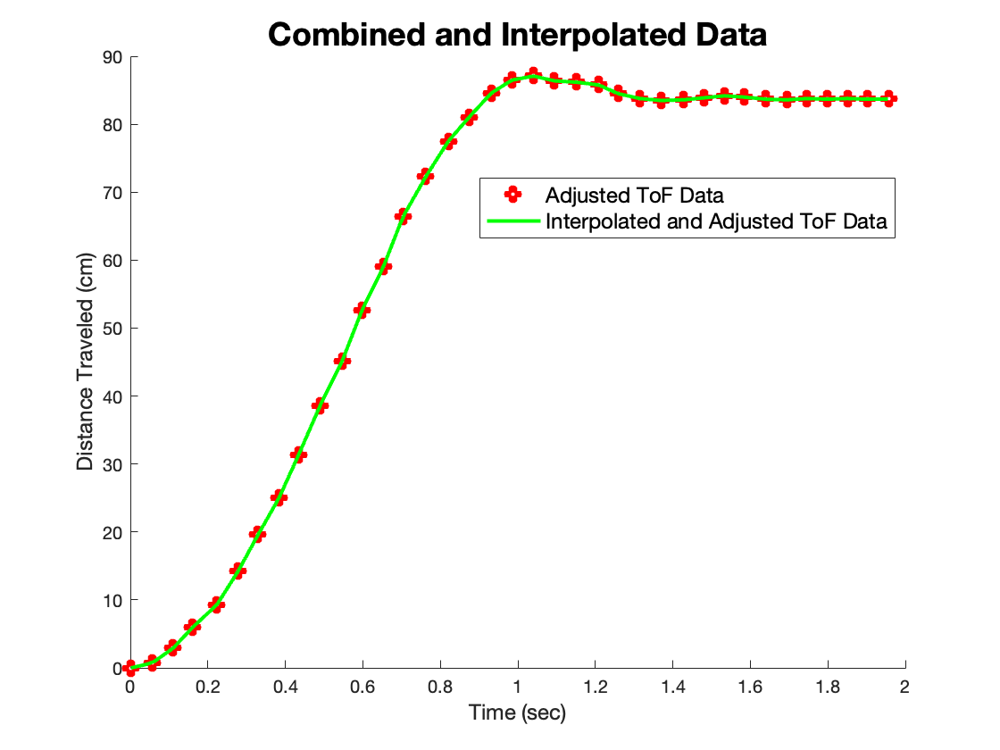
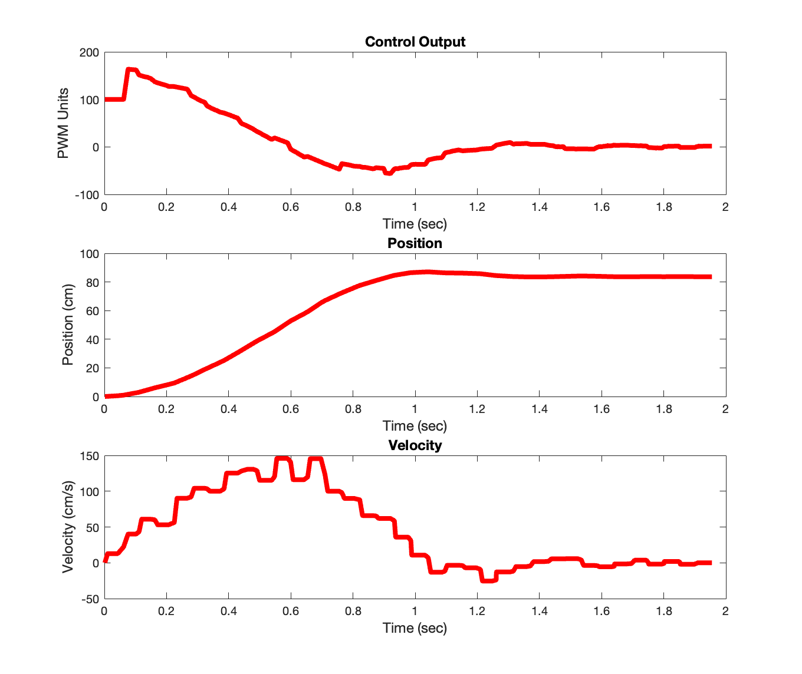
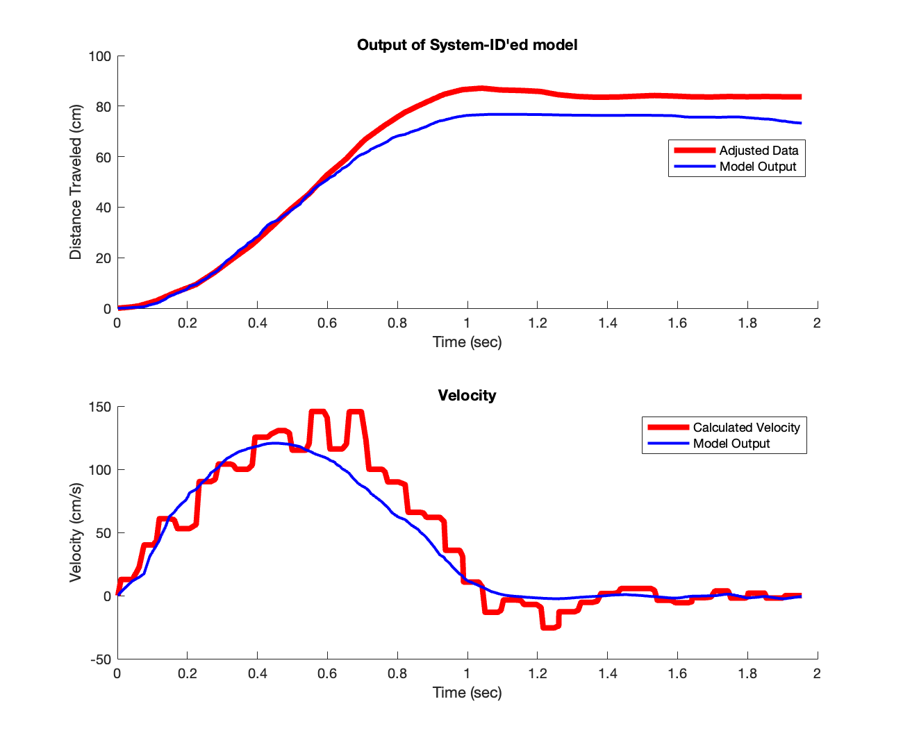

# Lab 7 Report

In this lab, we implemented a Kalman filter on our ToF sensor data in an attempt to improve the accuracy and speed of the movements in Lab 5.

## Lab Tasks

### System Identification

Our first task is to identify A and B matrices for our plant (the robot). **My approach to this problem differed significantly from the suggested method in the lab manual.** I go through the lab manual method and my results using this method, but I do not go through it in great detail for the sake of brevity. I go through the method I used in great detail, to show that my method is equivalent and deserves equivalent credit for this lab.

The method in the lab manual was as follows:

- Record a step response on the robot up to a speed in the ballpark of the speed at which the robot would be moving during the movement
- Crudely estimate the maximum speed of the robot, and use it to calculate drag `d`
- Crudely estimate the 90% rise time of the step response, and use it to calculate momentum `m`
- Formulate the continuous-time A and B matrices using the following equation from lecture slides:


- Finally, discretize these matrices using the following equations to get the discrete-time A and B matrices `Ad` and `Bd`:


I followed this method to the best of my ability, but was unable to get a good system identification. This image shows the best result I was able to obtain in my Python implementation using this method. It is clear the the Kalman filter is not accurately estimating the trajectory of the plant given the ToF sensor readings, even after adjusting the initial covariance matrix values, `d`, and `m` extensively.

I instead use a more math-heavy method to directly estimate the `Ad` and `Bd` matrices. First, I collected ToF and control output data from a run of Lab 5 and imported it into MATLAB. After choppping off some extraneous data points close to the beginning and end of the run, I interpolated the ToF data so that there were the same number of elements in the ToF data array as there as there were control loops. I also adjusted the ToF sensor measurements such that that the robot's starting position corresponded to x = 0, so that my "distance" was no longer a distance to the wall, but a distance from the starting point. This was just so that an input of zero corresponded to a distance of zero initially, and that a positive input corresponded to a positive increase in **x** (distance from starting point) and velocity. After doing this, here is the plot:



I then calculated the velocity at each time step, and plotted the adjusted **x**, **u**, and **xdot** simulataneously:



We are now ready to perform system identification. We are trying to find six numbers: the four elements in our A matrix, and the two elements of our B matrix, which we will label as follows:


For each time step, writing out the top row and bottom row of this matrix equation gives us linear equations for our unknowns (the elements of the A and B matrices), which we can write out as a giant system of equations like so:


This is an overdefined system, as we have many more than six equations for our six unknowns. Thus, we can use Least Squares to find the vector of unknowns that best solves this equation. Once we have this solution, we can simply construct our **Ad** and **Bd** matrices:


To check the accuracy of our system, we can plot the response given the vector of motor inputs that we used to perform the system ID, resulting in the following plot:



We see that the system ID fits the provided data quite well, as expected. **This completes the system identification.**

Below are some relevant MATLAB code snippets. This is the code to construct the least squares matrix. `A_lsqr` and `b_lsqr` are named as such to distinguish them from the `A` and `B` matrices of the state space model. `x`, `xdot`, and `u` are the interpolated and adjusted ToF sensor values, calculated velocity values, and control signal values, respectively.

```matlab
% Construct A matrix for least squares
A_lsqr = zeros((size(x, 1) - 1) * 2, 6);
for i = 1:(size(x, 1) - 1)
    A_lsqr(2*i - 1, :) = [x(i) xdot(i) u(i) 0 0 0];
    A_lsqr(2*i, :) = [0 0 0 x(i) xdot(i) u(i)];
end

% construct b vector for least squares
b_lsqr = zeros((size(x, 1) - 1) * 2, 1);
for i = 1:(size(x, 1) - 1)
    b_lsqr(2*i - 1) = x(i+1);
    b_lsqr(2*i) = xdot(i+1);
end

result = lsqr(A_lsqr, b_lsqr);
```

This code snippet calculates the `x`, `xdot`, and `u` vectors as described above. `ctrl_outputs` holds the control signal output values, and `tof_values` holds the interpolated and adjusted ToF sensor values:

```matlab
u = ctrl_outputs';
x = tof_values';
xdot = zeros(size(x));

n = size(x, 1);

for i = 2:n
    xdot(i) = (x(i) - x(i-1)) / (ctrl_times(i) - ctrl_times(i-1));
end
```

This code snippet interpolates the incoming raw ToF data to the length of the control signal output array, and adjusts it so that the position is measured from the distance from the start, instead of distance from the wall:

```matlab
temp = interp1(tof_times, tof_values_raw, ctrl_times);
temp = temp * -1;
first = temp(1);
tof_values = temp - first;

temp = tof_values_raw * -1;
first = temp(1);
tof_values_raw_adjust = temp - first;
```


## Acknowledgements

* A
