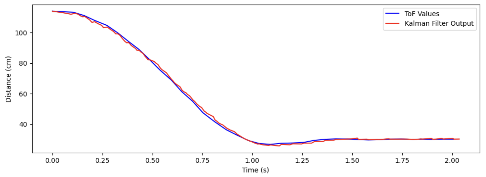

# Lab 7 Report

In this lab, we implemented a Kalman filter on our ToF sensor data in an attempt to improve the accuracy and speed of the movements in Lab 5.

## Lab Tasks

### System Identification (_Task 1_)

Our first task is to identify A and B matrices for our plant (the robot). **My approach to this problem differed significantly from the suggested method in the lab manual.** I go through the lab manual method and my results using this method, but I do not go through it in great detail for the sake of brevity. I go through the method I used in great detail, to show that my method is equivalent and deserves equivalent credit for this lab.

The method in the lab manual was as follows:

- Record a step response on the robot up to a speed in the ballpark of the speed at which the robot would be moving during the movement
- Crudely estimate the maximum speed of the robot, and use it to calculate drag `d`
- Crudely estimate the 90% rise time of the step response, and use it to calculate momentum `m`
- Formulate the continuous-time A and B matrices using the following equation from lecture slides:


- Finally, discretize these matrices using the following equations to get the discrete-time A and B matrices `Ad` and `Bd`:


I followed this method to the best of my ability, but was unable to get a good system identification. This image shows the best result I was able to obtain in my Python implementation using this method. It is clear the the Kalman filter is not accurately estimating the trajectory of the plant given the ToF sensor readings, even after adjusting the initial covariance matrix values, `d`, and `m` extensively.

I instead use a more math-heavy method to directly estimate the `Ad` and `Bd` matrices. First, I collected ToF and control output data from a run of Lab 5 and imported it into MATLAB. After choppping off some extraneous data points close to the beginning and end of the run, I interpolated the ToF data so that there were the same number of elements in the ToF data array as there as there were control loops. I also adjusted the ToF sensor measurements such that that the robot's starting position corresponded to x = 0, so that my "distance" was no longer a distance to the wall, but a distance from the starting point. This was just so that an input of zero corresponded to a distance of zero initially, and that a positive input corresponded to a positive increase in **x** (distance from starting point) and velocity. After doing this, here is the plot:


I then calculated the velocity at each time step, and plotted the adjusted **x**, **u**, and **xdot** simulataneously:


We are now ready to perform system identification. We are trying to find six numbers: the four elements in our A matrix, and the two elements of our B matrix, which we will label as follows:


For each time step, writing out the top row and bottom row of this matrix equation gives us linear equations for our unknowns (the elements of the A and B matrices), which we can write out as a giant system of equations like so:


This is an overdefined system, as we have many more than six equations for our six unknowns. Thus, we can use Least Squares to find the vector of unknowns that best solves this equation. Once we have this solution, we can simply construct our **Ad** and **Bd** matrices:


To check the accuracy of our system, we can plot the response given the vector of motor inputs that we used to perform the system ID, resulting in the following plot:


We see that the system ID fits the provided data quite well, as expected. **This completes the system identification.**

Below are some relevant MATLAB code snippets. This is the code to construct the least squares matrix. `A_lsqr` and `b_lsqr` are named as such to distinguish them from the `A` and `B` matrices of the state space model. `x`, `xdot`, and `u` are the interpolated and adjusted ToF sensor values, calculated velocity values, and control signal values, respectively.

```matlab
% Construct A matrix for least squares
A_lsqr = zeros((size(x, 1) - 1) * 2, 6);
for i = 1:(size(x, 1) - 1)
    A_lsqr(2*i - 1, :) = [x(i) xdot(i) u(i) 0 0 0];
    A_lsqr(2*i, :) = [0 0 0 x(i) xdot(i) u(i)];
end

% construct b vector for least squares
b_lsqr = zeros((size(x, 1) - 1) * 2, 1);
for i = 1:(size(x, 1) - 1)
    b_lsqr(2*i - 1) = x(i+1);
    b_lsqr(2*i) = xdot(i+1);
end

result = lsqr(A_lsqr, b_lsqr);
```

This code snippet calculates the `x`, `xdot`, and `u` vectors as described above. `ctrl_outputs` holds the control signal output values, and `tof_values` holds the interpolated and adjusted ToF sensor values:

```matlab
u = ctrl_outputs';
x = tof_values';
xdot = zeros(size(x));

n = size(x, 1);

for i = 2:n
    xdot(i) = (x(i) - x(i-1)) / (ctrl_times(i) - ctrl_times(i-1));
end
```

This code snippet interpolates the incoming raw ToF data to the length of the control signal output array, and adjusts it so that the position is measured from the distance from the start, instead of distance from the wall:

```matlab
temp = interp1(tof_times, tof_values_raw, ctrl_times);
temp = temp * -1;
first = temp(1);
tof_values = temp - first;

temp = tof_values_raw * -1;
first = temp(1);
tof_values_raw_adjust = temp - first;
```

### Python Implementation (_Tasks 2, 3_)

Armed with our System Identification, we proceed to implement the Kalman Filter in Python to make sure that it works in "simulation" before implementing it on the physical hardware (the robot).

Below is the Kalman Filter function in Python, copying the algorithm from lecture slides:

```python
def kf(mu, sigma, u, y, A, B, C, sig_u, sig_z, update):
    mu_pred = A.dot(mu) + B.dot(u)
    sigma_pred = A.dot(sigma.dot(A.T)) + sig_u

    if update:
        sigma_m = C.dot(sigma_pred.dot(C.T)) + sig_z
        kkf_gain = sigma_pred.dot(C.T.dot(np.linalg.inv(sigma_m)))
        y_m = y - C.dot(mu_pred)

        mu = mu_pred + kkf_gain.dot(y_m)
        sigma = (np.eye(2) - kkf_gain.dot(C)).dot(sigma_pred)

        return mu, sigma
    else:
        return mu_pred, sigma_pred
```

Next, we run the Kalman filter on the data that we got from our Lab 5 run, to ensure that the Kalman Filter successfully follows the ToF data as it comes in, while also predicting the evolution of the state of the system between ToF updates. Here is the Python code to do this:

```python
end_time = ctrl_times[-1]
kf_times = list()
kf_output = list()
kf_output_vel = list()
curr_time = 0
tof_arr_ix = 0
ctrl_arr_ix = 0
update = True

# initial values
sigma = np.array([[2**2, 0], [0, 5**2]])
x = np.array([[0], [0]])

tof_times[0] = 0 # set this so that the initial values will work correctly

while curr_time < end_time:
    # if we have a new ToF sensor value
    if tof_arr_ix < len(tof_times) and tof_times[tof_arr_ix] <= curr_time:
        update = True
        tof_arr_ix += 1
    else:
        update = False

    # calculate what the adjusted y-value should be
    y_adjust = tof_initial - tof_values[tof_arr_ix - 1]
    
    # call kalman filter
    x, sigma = kf(x, sigma, ctrl_outputs[ctrl_arr_ix], y_adjust, A, B, C, sig_u, sig_z, update)

    # store values
    kf_output.append(tof_initial - x[0][0])
    kf_output_vel.append(0.0 - x[1][0])
    kf_times.append(curr_time)

    # increment time
    curr_time = ctrl_times[ctrl_arr_ix]
    ctrl_arr_ix += 1
```

Notice that because the Kalman filter belives that the state (mu) is in terms of distance from the start, we need to perform the transformation `y_adjust = tof_initial - tof_values[tof_arr_ix - 1]` and pass `y_adjust` into the `kf()` function. Later, when we store the output of the Kalman Filter, we need to transform it back by appending `tof_initial - x[0][0]` to the `kf_output` array. Running this code results in the following plot:



This shows quite good agreement between the ToF sensor values and the Kalman Filter output. We see that between ToF sensor updates, the Kalman Filter output is, for the most part, predicting the evolution of the state with decent accuracy. This shows that our system ID and initial covariance matrices are working as expected.

#### Discussion of Initial Covariance Matrices

To initialize the Kalman Filter, we need to set some initial covariance matrices. I defined them like so:

```python
sigma_1 = 2.0
sigma_2 = 10.0
sigma_3 = 7.0

sig_u = np.array([[sigma_1**2, 0],[0, sigma_2**2]])
sig_z = np.array([[sigma_3**2]])
```

`sigma_1` represents the square of the uncertainty (standard deviation) in the position at the start; I set it to 2 cm, which seemed reasonable to me because the ToF sensors are quite accurate and our model for the position of the robot is relatively accurate. `sigma_2` represents the square of the uncertainty in the velocity at the start. Though we are very certain that that velocity is 0 cm/s at the beginning, since the velocity is a calculated / derived variable, it is subject to a lot more noise, especially at the slow speeds the robot starts moving at. Therefore, I set this uncertainty to be quite high (10 cm/s), so that the Kalman Filter doesn't freak out when its velocity calculation yields a number far outside of its expected value. `sigma_3` is the square of the uncertainty of the sensor measurements as they come in. I started with a guess of 2 cm at first, and gradually increased it until I thought the prediction of the filter was smoothest and matched the incoming sensor data best. I didn't really have an intuitive explanation for why I chose 7 cm for this value.

### Robot Implementation (_Tasks 4, 5_)

To implement the code on the robot, I first added a global variable (`new_tof_data`) which would be set to `True` when new ToF data was received. This was added in the `if` statement in the `loop()` function where we acquire ToF sensor data. The `run_pid()` function is called outside of the ToF sensor update `if` statement, meaning that it is running as fast as possible (Task 5) and that the rate at which we run the control loop is faster than the rate at which we acquire the ToF sensor data:

```cpp
// if want to run PID loop
if (run_pid_loop) {

    // if space in the TOF sensor array
    if (tof_arr_ix < tof_log_size) {
        // if first measurement, simply start a measurement
        // else, if sensor(s) has/have data ready, take measurement(s) and record, and start a new measurement(s)
        if (tof_arr_ix == -1) {
            myTOF1.startRanging();
            myTOF2.startRanging();
            tof_arr_ix++;
        } else if (myTOF1.checkForDataReady() && myTOF2.checkForDataReady()) {
            tof_data_one[tof_arr_ix] = ((float) myTOF1.getDistance()) / 10.0;
            tof_data_two[tof_arr_ix] = ((float) myTOF2.getDistance()) / 10.0;
            tof_times[tof_arr_ix] = micros();

            new_tof_data = true;  // <-------------- ADDED LINE HERE -----------

            myTOF1.clearInterrupt();
            myTOF1.stopRanging();
            myTOF1.startRanging();

            myTOF2.clearInterrupt();
            myTOF2.stopRanging();
            myTOF2.startRanging();

            tof_arr_ix++;
        }
    }
    
    run_pid(new_tof_data); // <------------ CALLED WITH BOOLEAN ----------
}
```

In my `run_pid()` function, I added an argument to pass in when we have updated ToF data. In my calculation of the error, I now use the output of the Kalman Filter (stored in the `kf_tof_data` array) as my measured value. This changes the beginning of the function to the following:

```cpp
void run_pid(bool new_tof_data) {
    unsigned long curr_time = micros();

    // call kalman filter to get the predicted value of the tof sensor
    Matrix<1> u = (ctrl_arr_ix == 0) ? 0.0 : ctrl_output[ctrl_arr_ix - 1];
    Matrix<1> y = (tof_arr_ix == 0) ? 0.0: tof_data_two[tof_arr_ix - 1];
    kalman_filter(&glob_state, u, y, new_tof_data);

    // calculate error using kalman filter estimated data
    float err = kf_tof_data[ctrl_arr_ix] - SETPOINT;
    
    // the rest of the function is the same as in previous labs, see lab 5/6 for more information
    
    // ...
    
}
```

Finally, I implemented the Kalman Filter in Arduino:

```cpp
void kalman_filter (kf_state_t *state, Matrix<1> u, Matrix<1> y, bool update) {
    // take care of edge case when we have no data point from ToF
    if (tof_arr_ix == 0) {
      // pretend we're reading the set point
        kf_tof_data[ctrl_arr_ix] = SETPOINT;
        return;
    } else if (tof_arr_ix == 1) {
        // if first tof data point, set it to the initial distance we will use
        init_dist = tof_data_two[0];
    }

    // adjust the y to be distance traveled instaed of distance from wall
    y = init_dist - y;

    Matrix<2, 1> prev_mu = state->mu;
    Matrix<2, 2> prev_sigma = state->sigma;

    // Define constant matrices
    Matrix<2, 2> A = {0.99995, 0.0084844, -0.00033056, 0.98778};
    Matrix<2, 1> B = {0.00033969, 0.029691};
    Matrix<1, 2> C = {1, 0};
    Matrix<2, 2> sig_u = {4.0, 0, 0, 100.0};
    Matrix<1> sig_z = 49.0;
    Matrix<2, 2> id_2 = {1, 0, 0, 1}; // 2x2 identity matrix

    // Prediction step
    Matrix<2, 1> mu_pred = A * prev_mu + B * u;
    Matrix<2, 2> sigma_pred = A * (prev_sigma * ~A) + sig_u;

    // If not updating, stick these two results into here and return
    if (!update) {
        state->mu = mu_pred;
        state->sigma = sigma_pred;
        kf_tof_data[ctrl_arr_ix] = init_dist - state->mu(0, 0);
        return;
    }

    // If updating, we do this math and then return
    Matrix<1, 1> sigma_m = C * (sigma_pred * ~C) + sig_z;
    Matrix<2, 1> kkf_gain = sigma_pred * (~C * Inverse(sigma_m));
    Matrix<1, 1> y_m = y - C * mu_pred;
    state->mu = mu_pred + kkf_gain * y_m;
    state->sigma = (id_2 - kkf_gain * C) * sigma_pred;
    kf_tof_data[ctrl_arr_ix] = init_dist - state->mu(0, 0);
}
```

Again, since the Kalman Filter thinks that **x = 0** is the initial position of the robot, we need to perform a transformation of the ToF sensor data (`y = init_dist - y`) before feeding the sensor data into the Kalman Filter; likewise, we need to transform the output of the Kalman Filter (`state->mu(0, 0)`) into distance from the wall (`kf_tof_data[ctrl_arr_ix] = init_dist - state->mu(0, 0)`).

I added the following lines to the `START_PID_MVMT` command handler in the `handle_command()` function to initialize the Kalman Filter covariance matrices:

```cpp
case START_PID_MVMT:
    run_pid_loop = true;
    ctrl_start_time = micros();
    integral = 0.0;
    prev_err = 0.0;

    // initialize KF values
    glob_state.mu = {0, 0};
    glob_state.sigma = {4, 0, 0, 0.25};

    break;
```

To hold the Kalman Filter state, I defined a new `struct` and instantiated a global variable of this type called `glob_state`. This is the variable that I reference in `run_pid()` and in the `START_PID_MVMT` command handler:

```cpp
typedef struct {
    Matrix<2, 1> mu;
    Matrix<2, 2> sigma;
} kf_state_t;

kf_state_t glob_state;
```

We are finally ready to run the robot with the Kalman Filter implemented. The implementation of the notification handler and calling of the Python commands are ommitted here for brevity; for more information, please consult any of my previous lab reports. Here is a video demonstrating that the PID controller is able to run while using the Kalman Filter estimates to calculate the error:

**insert video here**

Below is a plot associated with this movement showing relevant data:

**insert graph here**

We can see that the Kalman Filter is following the incoming ToF sensor data throughout the test, and is also predicting the evolution of the states of the robot with decent accuracy between ToF sensor updates. The following screenshot shows that the control loop is being run at a frequency much higher than ToF sensor data is being acquired, yet the Kalman Filter is allowing us to relatively smoothly (more so than linear extrapolation) capture the evolution of the robot state in the absence of new ToF data.

## Acknowledgements

* Prof. Helbling (for helping me debug my Arduino code and fixing a really subtle but frustrating bug...)
* Katarina Duric (for offering some suggestions on how to proceed with the robot implementation / what to expect)
* Sophia Lin (lab partner)
