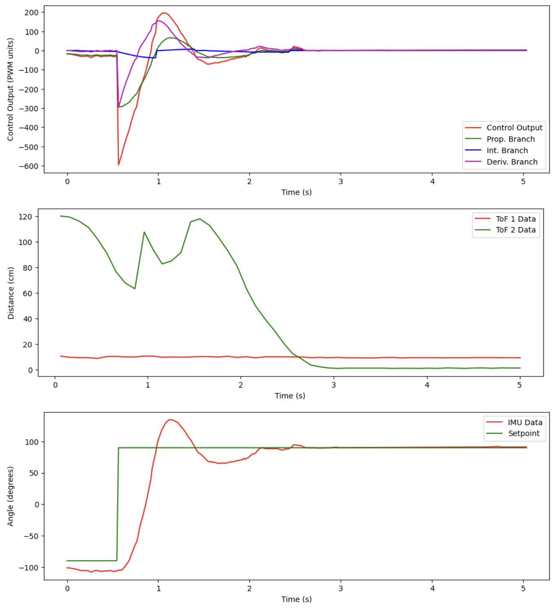

# Lab 8 Report

In this lab, we put our experiences in the past 7 labs and made the robot do a stunt; I made my car do a drift.

## Lab Tasks

### Implementation Details

To make the stunt as consistent as possible, I kept the orientation PID control engaged throughout the entire movement. The basic idea is as follows:

- Drive forward with the angular setpoint set at -90 degrees, adding the output of the orientation PID control on top of a constant forward speed in order to keep the robot moving in a straight line
- When the robot detects that it is 3 feet (90 cm) away from the wall, set the forward speed to zero and the angular setpoint to +90 degrees to initiate the drifting turn
- After a certain time has elapsed, set the forward speed to some constant value again so that the robot drives away from the wall
- After another certain time has elapsed, set the forward speed to zero so the robot no longer accelerates and coasts to a stop

The biggest change that I made to my code (besides parts of code from mostly labs 5 and 6 together) was a new "combined" version of the `straight()` (lab 5) and `spin()` (lab 6) functions I had previously; the new function is called `drive()`. It takes in a differential PWM signal as its argument, adds the global variable `forward_speed` on top of it, and sends the appropriate signals to the two motors, taking into account calibration factors and deadbands. Here is the function in full:

```cpp
void drive(float pwm) {
    const float stoprange = 3.0;
    int adjusted_pwm_one, adjusted_pwm_two, mtr_one_speed, mtr_two_speed;

    // if control action is small, just drive forward at the desired speed
    if (abs(pwm) < stoprange) {
        analogWrite(MTR1_IN1, forward_speed);
        analogWrite(MTR1_IN2, 0);
        analogWrite(MTR2_IN1, 0);
        analogWrite(MTR2_IN2, forward_speed);

        return;
    }

    // otherwise, take care of differential inputs
    // calculated motor one speed, accounting for desired forward speed
    mtr_one_speed = forward_speed + pwm;
    mtr_two_speed = forward_speed - pwm;

    // send command to motor one
    if (mtr_one_speed > 0) {
        adjusted_pwm_one = (int) ((float)mtr_one_speed * CALIB_FAC + DEADBAND + 0.5);

        analogWrite(MTR1_IN1, adjusted_pwm_one);
        analogWrite(MTR1_IN2, 0);
    } else {
        adjusted_pwm_one = (int) ((float)mtr_one_speed * -1.0 * CALIB_FAC + DEADBAND + 0.5);
        
        analogWrite(MTR1_IN1, 0);
        analogWrite(MTR1_IN2, adjusted_pwm_one);
    }

    // send command to motor two
    if (mtr_two_speed > 0) {
        adjusted_pwm_two = (int) ((float)mtr_two_speed * CALIB_FAC + DEADBAND + 0.5);

        analogWrite(MTR2_IN1, 0);
        analogWrite(MTR2_IN2, adjusted_pwm_two);
    } else {
        adjusted_pwm_two = (int) ((float)mtr_two_speed * -1.0 * CALIB_FAC + DEADBAND + 0.5);

        analogWrite(MTR2_IN1, adjusted_pwm_two);
        analogWrite(MTR2_IN2, 0);
    }
}
```

In the main `loop()` function, we have several `if` statements that advance the robot's state from one section of the stunt to the next. These states are defined in a new `enum` at the top of the program. Times to wait and speeds to drive are also hard-coded macros defined at the top of the program:

```cpp
// stunt state
int stunt_state = 0;

// timer for stunt state
unsigned long stunt_state_start_time = 0;

// speed at which robot goes in drive to and from wall
#define DRIVE_SPEED 100

// distance from wall from which we will start drift
#define DRIFT_DIST 91.4

// time allotted for drift (in milliseconds)
#define DRIFT_TIME 500

// time allotted for drive back (in milliseconds)
#define DRIVE_BACK_TIME 750

enum StuntStates {
    DRIVE_TO_WALL,
    DRIFT,
    DRIVE_BACK
};

// .... in main loop() ....

// if want to run pid loop
if (run_pid_loop) {

    // if space in the TOF sensor array
    if (tof_arr_ix < tof_log_size) {
        // get TOF data, see Labs 3, 5
    }

    // Is valid data available and space in array?
    if ((imu_arr_ix < imu_log_size) && ((myICM.status == ICM_20948_Stat_Ok) || (myICM.status == ICM_20948_Stat_FIFOMoreDataAvail))) {
        // get IMU data, see Labs 2, 6
    }

    // We have ToF data and ToF within certain distance from wall and driving towards wall, go to drift state
    if (stunt_state == DRIVE_TO_WALL && tof_arr_ix > 0 && tof_data_two[tof_arr_ix - 1] < DRIFT_DIST) {
        forward_speed = 0.0;
        angle_setpoint = 90.0;
        stunt_state_start_time = millis();
        stunt_state = DRIFT;
    }

    // if elapsed time for drift has passed, set forward speed back to the desired value
    if (stunt_state == DRIFT && millis() - stunt_state_start_time > DRIFT_TIME) {
        forward_speed = DRIVE_SPEED;
        stunt_state_start_time = millis();
        stunt_state = DRIVE_BACK;
    }

    // stop the stunt after a certain amount of time has passed
    if (stunt_state == DRIVE_BACK && millis() - stunt_state_start_time > DRIVE_BACK_TIME) {
        forward_speed = 0.0;
    }
}
```

Finally, in the `handle_command()` function, we add a few lines to the `START_PID_MVMT` command handler to initiate the stunt:

```cpp
case START_PID_MVMT:
    run_pid_loop = true;
    integral = 0.0;
    prev_err = 0.0;
    angle_setpoint = -90.0;
    forward_speed = DRIVE_SPEED; // set its forward speed
    stunt_state = DRIVE_TO_WALL; // start in the drive to wall state

    break;
```

### Results

Below are three runs of the stunt, with corresponding graphs of the control actions taken, the ToF data, and the IMU data.

**Run 1:**

<iframe width="560" height="315" src="https://www.youtube.com/embed/24MA9qyS-38?si=rh7-G4ozKEZuubf2" title="YouTube video player" frameborder="0" allow="accelerometer; autoplay; clipboard-write; encrypted-media; gyroscope; picture-in-picture; web-share" referrerpolicy="strict-origin-when-cross-origin" allowfullscreen></iframe>



**Run 2:**

<iframe width="560" height="315" src="https://www.youtube.com/embed/5miayNRYNEs?si=OjU-Tn2AHYO76LSK" title="YouTube video player" frameborder="0" allow="accelerometer; autoplay; clipboard-write; encrypted-media; gyroscope; picture-in-picture; web-share" referrerpolicy="strict-origin-when-cross-origin" allowfullscreen></iframe>


**Run 3:**

<iframe width="560" height="315" src="https://www.youtube.com/embed/QDtKUtR-37U?si=kSYu53x79BLUabGf" title="YouTube video player" frameborder="0" allow="accelerometer; autoplay; clipboard-write; encrypted-media; gyroscope; picture-in-picture; web-share" referrerpolicy="strict-origin-when-cross-origin" allowfullscreen></iframe>


Since I did this at home, and not in the lab, the time it takes for the stunt to complete may not be comparable to others in the class. However, on average across these three trials, the stunt took about 2.9 seconds to complete. I probably started it closer to the wall than most people did, however, since I was a bit short on space.

## Acknowledgements

* Sophia Lin (lab partner, helped me tune the hard-coded parameters and gains of the stunt)