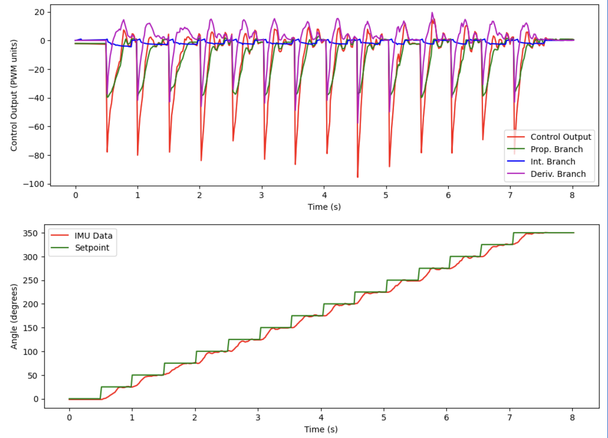

# Lab 9 Report

In this lab, we placed the robot in an environment and had it spin around to take measurements of its distance to the nearest obstacle. We then used this data to produce a map of the environment.

## Lab Tasks

### Small and Accurate Turns

First, we need to program the robot to do fourteen turns of 25 degrees each accurately. We use our Lab 6 orientation control to accomplish this.

One issue that I ran into was because the DMP I was using in Lab 6 only outputs data in the range (-180, 180], whenever I turned across the boundary (-180 to +180), the robot would freak out and start spinning non-stop. This happened because as it crosses the -180/+180-degree boundary, the PID controller has a huge discontinuity in its measured value and, therefore, it's error too, causing the control action to saturate and the robot to go unstable. To remedy the problem, I added some code in the main `loop()` function to count how many times the DMP output wrapped since the movement started, which is used to adjust the DMP output by an integer multiple of 360 degrees before being logged. Below is the Arduino code, along with the global variables used:

```cpp
// *************** ADDED GLOBAL VARIABLES (on top of existing DMP variables) *********** //
double q0, q1, q2, q3, qw, qx, qy, qz, t3, t4, yaw, prev_yaw = 0.0;
int multiplier = 0;

#define WRAP_BUF 30 // buffer for wrap detection

//...

// ******************************* IN handle_command() ******************************* //
case START_PID_MVMT:
    run_pid_loop = true;
    integral = 0.0;
    prev_err = 0.0;
    angle_setpoint = 0.0;
    forward_speed = 0.0;
    mvmt_state = MEASURE;
    mvmt_state_start_time = millis(); // start the time
    multiplier = 0; // <------------- NEW LINE HERE -----------

//...

// ******************** 
// if want to run pid loop
if (run_pid_loop) {

    // if space in the TOF sensor array
    if (tof_arr_ix < tof_log_size) {
        // get ToF sensor data, see Lab 3, 5
    }

    // Is valid data available and space in array?
    if ((imu_arr_ix < imu_log_size) && ((myICM.status == ICM_20948_Stat_Ok) || (myICM.status == ICM_20948_Stat_FIFOMoreDataAvail))) {
        // We have asked for GRV data so we should receive Quat6
        if ((data.header & DMP_header_bitmap_Quat6) > 0) {
            // quaternion calculation same as before to compute yaw, see Lab 6

            // yaw (z-axis rotation)
            t3 = +2.0 * (qw * qz + qx * qy);
            t4 = +1.0 - 2.0 * (qy * qy + qz * qz);
            yaw = atan2(t3, t4) * 180.0 / PI;  

            // detect wrapping and calculate the actual yaw value
            if (yaw < 0.0 && prev_yaw > (180.0 - WRAP_BUF)) {
                multiplier += 1; // increase the multiplier; we want the angle to keep going UP
            } else if (yaw > 0.0 && prev_yaw < (-180.0 + WRAP_BUF)) {
                multiplier -= 1; // decrease the multiplier; we want the angle to keep going DOWN
            }

            // put the calculated value into the array
            imu_yaw[imu_arr_ix] = yaw + (360.0 * multiplier);
            imu_times[imu_arr_ix] = micros();
            imu_arr_ix++;

            // save value of yaw
            prev_yaw = yaw;

            
            run_pid();
        }
    }
}
```

This code allowed me to use `imu_yaw[]` in my PID orientation controller as the measured value and not have to worry about the wrapping.

Next, we add code to make the robot alternate turning and stopping (to take a measurement). I added a state `enum` at the top of the code which enumerated the different states that the robot could be in when the scan was run: `TURN` (we are turning), `MEASURE` (we are stopped and reading the ToF sensor), and `End`, which prevents the robot from continuing once it has finished rotating the full (nearly) 360 degrees. The logic to switch between the two, as well as the global variables and macros that make that happen, are listed below:

```cpp

// ********************** GLOBAL VARIABLES ****************** //
// movement state
int mvmt_state = 0;

// timer for movement state
unsigned long mvmt_state_start_time = 0;

// degrees per turn
#define DEG_PER_TURN 25.0

// how long for each turn (ms)
#define TURN_TIME 500

// max. angle we're at at the end of our 14th turn
#define MAX_ANGLE 350.0

// number of data points
#define NUM_POINTS 15

enum MvmtStates {
    TURN,
    MEASURE,
    END
};

// ******************* 

// if want to run pid loop
if (run_pid_loop) {

    // if space in the TOF sensor array
    if (tof_arr_ix < tof_log_size) {
        // get ToF data, see Labs 3, 5
    }

    // Is valid data available and space in array?
    if ((imu_arr_ix < imu_log_size) && ((myICM.status == ICM_20948_Stat_Ok) || (myICM.status == ICM_20948_Stat_FIFOMoreDataAvail))) {
        // We have asked for GRV data so we should receive Quat6
        if ((data.header & DMP_header_bitmap_Quat6) > 0) {
            // quaternion calculation, wrapping calculations, as mentioned above

            // save value of yaw
            prev_yaw = yaw;
            
            // turn the robot OFF when not turning (do not run PID while measuring or after we've finished:
            if (mvmt_state == TURN) {
                run_pid();
            } else {
                analogWrite(MTR1_IN1, 0);
                analogWrite(MTR1_IN2, 0);
                analogWrite(MTR2_IN1, 0);
                analogWrite(MTR2_IN2, 0);
            }
        }
    }
    
    // ************************************** ADDITIONAL CODE TO SWITCH BETWEEN TURN AND MEASURE ************** //
    // if in measure state, take ToF data, store it, and then flip to turn state
    if (mvmt_state == MEASURE) {
        // take ToF data (will implement later)
        turn_counter++;

        // if we are at the max angle, we're done
        if (angle_setpoint == MAX_ANGLE) {
            mvmt_state = END;
        } else {
            mvmt_state = TURN;
        }
        mvmt_state_start_time = millis();
    }

    // if in turn state and the allotted time for a turn has passed, increment the setpoint and flip to measure state
    if (mvmt_state == TURN && millis() - mvmt_state_start_time > TURN_TIME) {
        angle_setpoint += DEG_PER_TURN;
        mvmt_state = MEASURE;
    }
}
``` 

Running this code from Python results in the following video:

<iframe width="560" height="315" src="https://www.youtube.com/embed/wx9G2EhJ9iU?si=utsKR_oQQqQtE9Ni" title="YouTube video player" frameborder="0" allow="accelerometer; autoplay; clipboard-write; encrypted-media; gyroscope; picture-in-picture; web-share" referrerpolicy="strict-origin-when-cross-origin" allowfullscreen></iframe>

The reason the robot does not really spin around the axis was because my deadbands needed to be adjusted (this video was taken when the battery was somewhat discharged). However, it still illustrates that the robot is performing the 14 spins at equal angles. The data returned is as follows:



It is clear that the robot is following the changing setpoint as it steps by 25 degrees every half a second!

### Measure Distances

Get the data

### Merge and Plot Readings

Transform data

### Convert to Line-Based Map

Draw some lines hooray

## Acknowledgements

