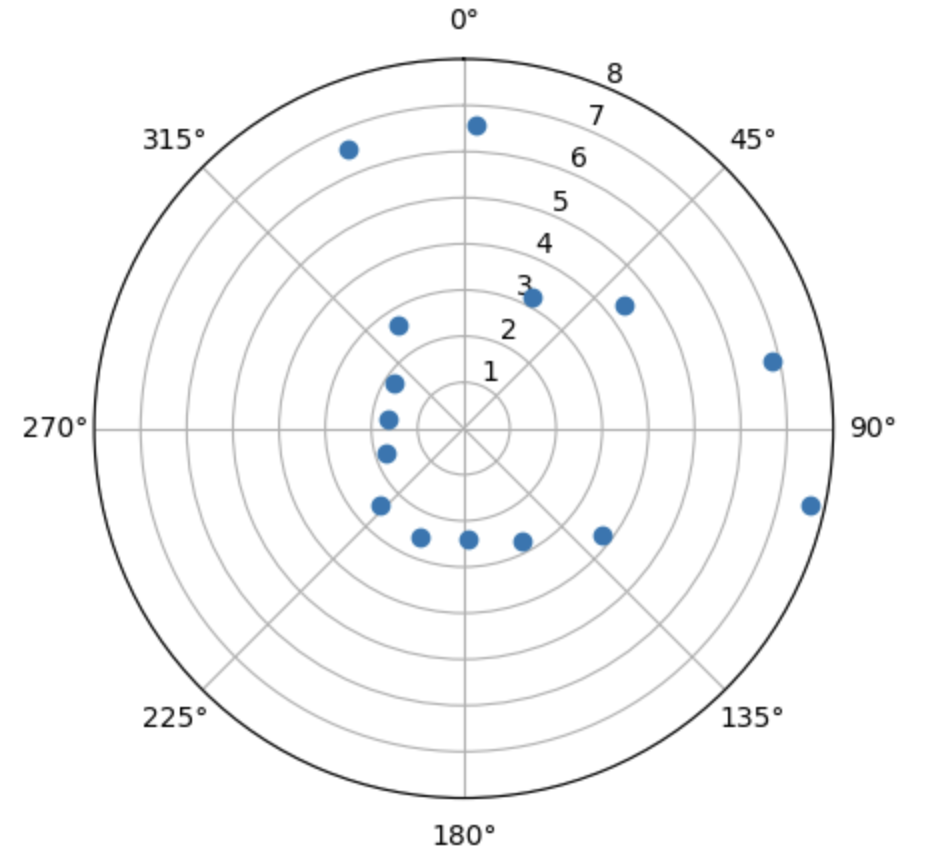
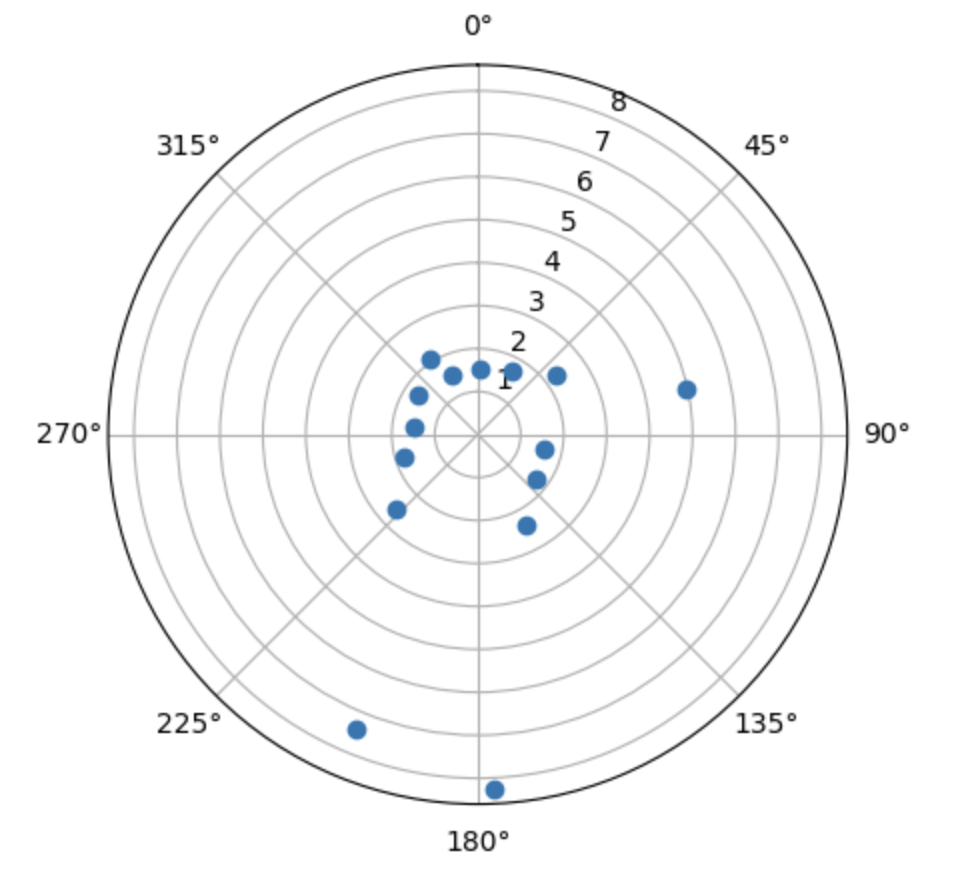
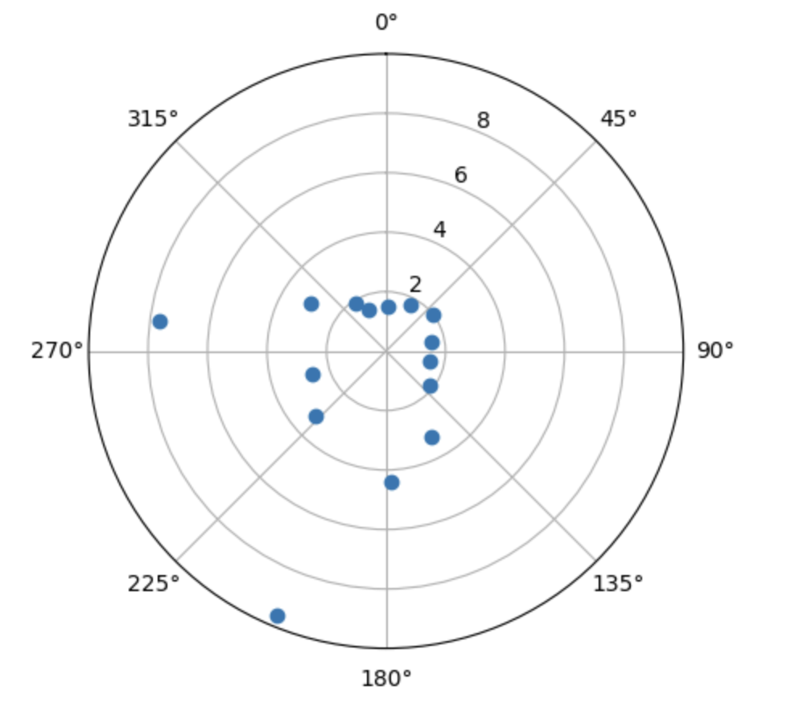
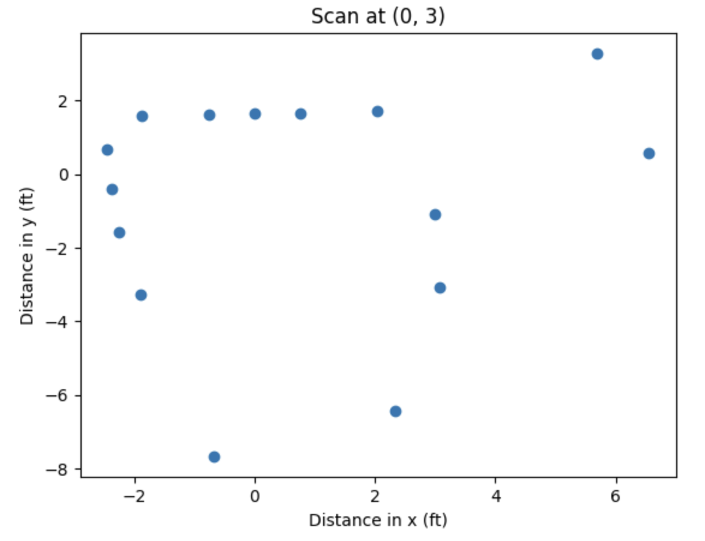
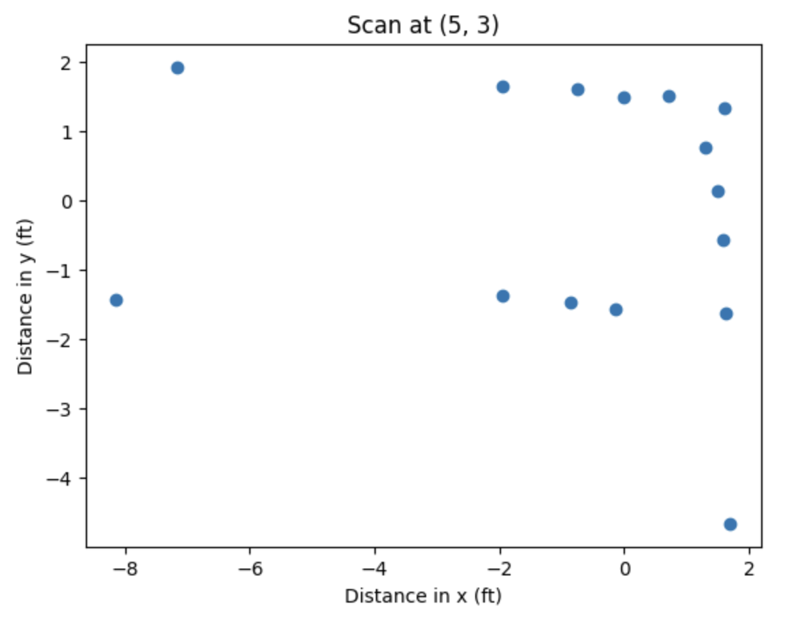
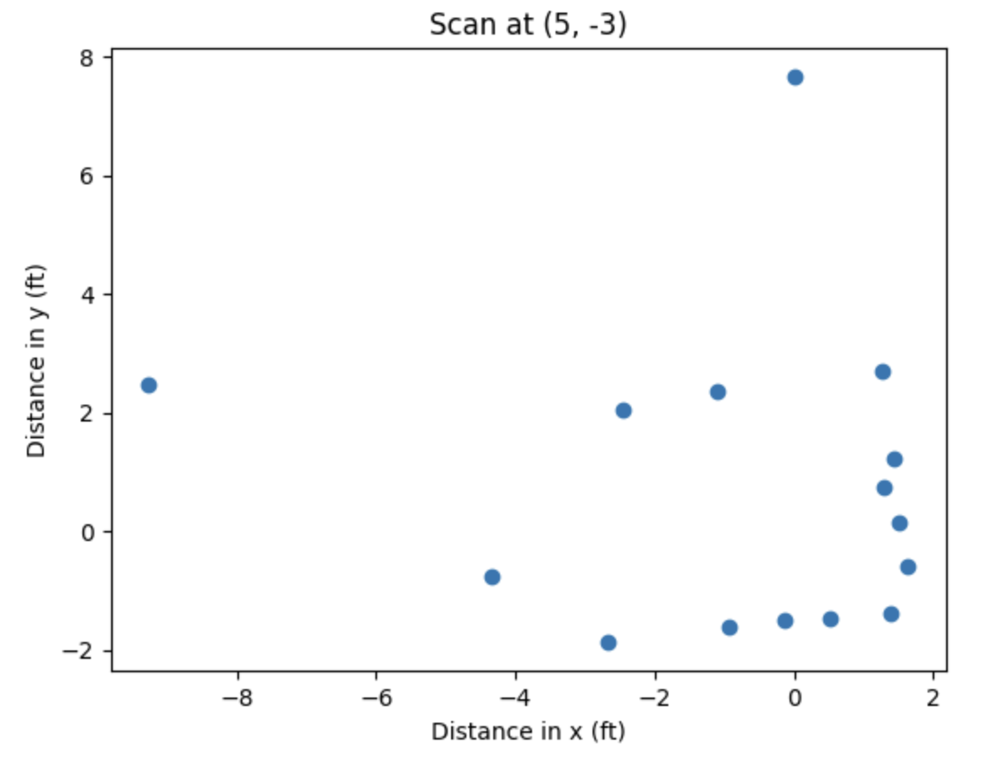
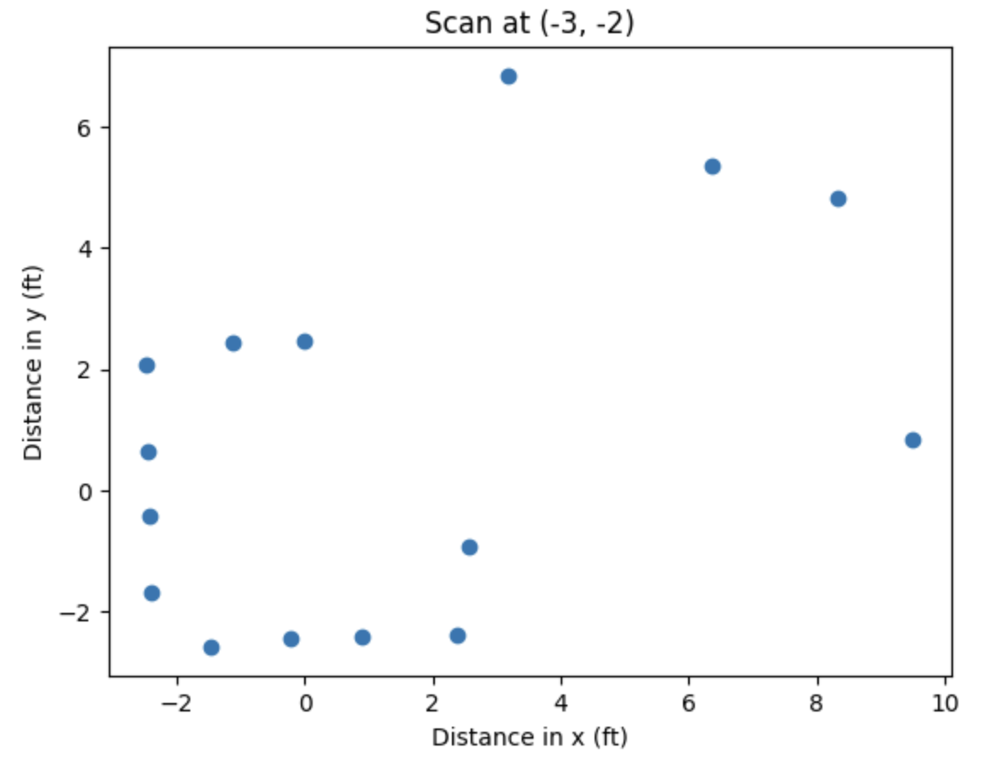
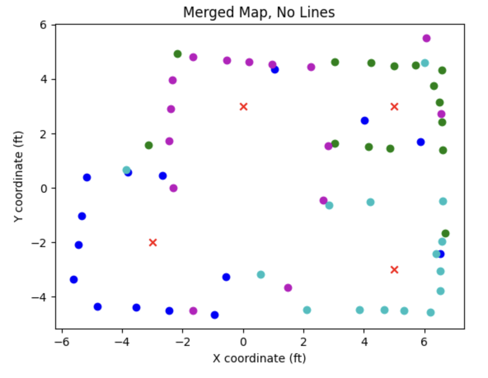

# Lab 9 Report

In this lab, we placed the robot in an environment and had it spin around to take measurements of its distance to the nearest obstacle. We then used this data to produce a map of the environment.

## Lab Tasks

### Small and Accurate Turns (Control)

First, we need to program the robot to accurately perform fourteen turns of 25 degrees each. We use our Lab 6 orientation control to accomplish this.

One issue that I ran into was because the DMP I was using in Lab 6 only outputs data in the range (-180, 180], whenever I turned across the boundary (-180 to +180), the robot would freak out and start spinning non-stop. This happened because as it crosses the -180/+180-degree boundary, the PID controller has a huge discontinuity in its measured value and, therefore, its error as well, causing the control action to saturate and the robot to unstable. To remedy the problem, I added some code in the main `loop()` function to count how many times the DMP output wrapped since the movement started, which is used to adjust the DMP output by an integer multiple of 360 degrees before being logged. Below is the Arduino code, along with the global variables used:

```cpp
// *************** ADDED GLOBAL VARIABLES (on top of existing DMP variables) *********** //
double q0, q1, q2, q3, qw, qx, qy, qz, t3, t4, yaw, prev_yaw = 0.0;
int multiplier = 0;

#define WRAP_BUF 30 // buffer for wrap detection

//...

// ******************************* IN handle_command() ******************************* //
case START_PID_MVMT:
    run_pid_loop = true;
    integral = 0.0;
    prev_err = 0.0;
    angle_setpoint = 0.0;
    forward_speed = 0.0;
    mvmt_state = MEASURE;
    mvmt_state_start_time = millis(); // start the time
    multiplier = 0; // <------------- NEW LINE HERE -----------

//...

// ******************** 
// if want to run pid loop
if (run_pid_loop) {

    // if space in the TOF sensor array
    if (tof_arr_ix < tof_log_size) {
        // get ToF sensor data, see Lab 3, 5
    }

    // Is valid data available and space in array?
    if ((imu_arr_ix < imu_log_size) && ((myICM.status == ICM_20948_Stat_Ok) || (myICM.status == ICM_20948_Stat_FIFOMoreDataAvail))) {
        // We have asked for GRV data so we should receive Quat6
        if ((data.header & DMP_header_bitmap_Quat6) > 0) {
            // quaternion calculation same as before to compute yaw, see Lab 6

            // yaw (z-axis rotation)
            t3 = +2.0 * (qw * qz + qx * qy);
            t4 = +1.0 - 2.0 * (qy * qy + qz * qz);
            yaw = atan2(t3, t4) * 180.0 / PI;  

            // detect wrapping and calculate the actual yaw value
            if (yaw < 0.0 && prev_yaw > (180.0 - WRAP_BUF)) {
                multiplier += 1; // increase the multiplier; we want the angle to keep going UP
            } else if (yaw > 0.0 && prev_yaw < (-180.0 + WRAP_BUF)) {
                multiplier -= 1; // decrease the multiplier; we want the angle to keep going DOWN
            }

            // put the calculated value into the array
            imu_yaw[imu_arr_ix] = yaw + (360.0 * multiplier);
            imu_times[imu_arr_ix] = micros();
            imu_arr_ix++;

            // save value of yaw
            prev_yaw = yaw;

            
            run_pid();
        }
    }
}
```

This code allowed me to use `imu_yaw[]` in my PID orientation controller as the measured value and not have to worry about the wrapping.

Next, we add code to make the robot alternate turning and stopping (to take a measurement). I added a state `enum` at the top of the code which enumerated the different states that the robot could be in when the scan was run: `TURN` (we are turning), `MEASURE` (we are stopped and reading the ToF sensor), and `End`, which prevents the robot from continuing once it has finished rotating the full (nearly) 360 degrees. The logic to switch between the two, as well as the global variables and macros that make that happen, are shown below:

```cpp

// ********************** GLOBAL VARIABLES ****************** //
// movement state
int mvmt_state = 0;

// timer for movement state
unsigned long mvmt_state_start_time = 0;

// degrees per turn
#define DEG_PER_TURN 25.0

// how long for each turn (ms)
#define TURN_TIME 500

// max. angle we're at at the end of our 14th turn
#define MAX_ANGLE 350.0

// number of data points
#define NUM_POINTS 15

enum MvmtStates {
    TURN,
    MEASURE,
    END
};

// ******************* 

// if want to run pid loop
if (run_pid_loop) {

    // if space in the TOF sensor array
    if (tof_arr_ix < tof_log_size) {
        // get ToF data, see Labs 3, 5
    }

    // Is valid data available and space in array?
    if ((imu_arr_ix < imu_log_size) && ((myICM.status == ICM_20948_Stat_Ok) || (myICM.status == ICM_20948_Stat_FIFOMoreDataAvail))) {
        // We have asked for GRV data so we should receive Quat6
        if ((data.header & DMP_header_bitmap_Quat6) > 0) {
            // quaternion calculation, wrapping calculations, as mentioned above

            // save value of yaw
            prev_yaw = yaw;
            
            // turn the robot OFF when not turning (do not run PID while measuring or after we've finished:
            if (mvmt_state == TURN) {
                run_pid();
            } else {
                analogWrite(MTR1_IN1, 0);
                analogWrite(MTR1_IN2, 0);
                analogWrite(MTR2_IN1, 0);
                analogWrite(MTR2_IN2, 0);
            }
        }
    }
    
    // ************************************** ADDITIONAL CODE TO SWITCH BETWEEN TURN AND MEASURE ************** //
    // if in measure state, take ToF data, store it, and then flip to turn state
    if (mvmt_state == MEASURE) {
        // take ToF data (will implement later)
        turn_counter++;

        // if we are at the max angle, we're done
        if (angle_setpoint == MAX_ANGLE) {
            mvmt_state = END;
        } else {
            mvmt_state = TURN;
        }
        mvmt_state_start_time = millis();
    }

    // if in turn state and the allotted time for a turn has passed, increment the setpoint and flip to measure state
    if (mvmt_state == TURN && millis() - mvmt_state_start_time > TURN_TIME) {
        angle_setpoint += DEG_PER_TURN;
        mvmt_state = MEASURE;
    }
}
``` 

Running this code from Python results in the following video:

<iframe width="560" height="315" src="https://www.youtube.com/embed/wx9G2EhJ9iU?si=utsKR_oQQqQtE9Ni" title="YouTube video player" frameborder="0" allow="accelerometer; autoplay; clipboard-write; encrypted-media; gyroscope; picture-in-picture; web-share" referrerpolicy="strict-origin-when-cross-origin" allowfullscreen></iframe>

The reason the robot does not really spin around the axis was because my deadbands needed to be adjusted (this video was taken when the battery was somewhat discharged). However, it still illustrates that the robot is performing the 14 spins at equal angles. The data returned is as follows:


It is clear that the robot is following the changing setpoint as it steps by 25 degrees every half a second!

**REASON ABOUT ERROR DO NOT FORGET**

### Measure Distances

We add a couple lines in the code from the previous section to actually take sensor data in the `MEASURE` state:

```cpp
// if in measure state, take ToF data, store it, and then flip to turn state
if (mvmt_state == MEASURE) {
    // take ToF data ********************* HERE *********************
    if (tof_arr_ix < 3) {
        continue;
    }
    distance_data[turn_counter] = tof_data_two[tof_arr_ix - 1];
    turn_counter++;

    // if we are at the max angle, we're done
    if (angle_setpoint == MAX_ANGLE) {
        mvmt_state = END;
    } else {
        mvmt_state = TURN;
    }
    mvmt_state_start_time = millis();
}
```

I also had to re-tune my PID controller and adjust the deadbands to get the robot to turn much more accurately. Here were the steps that allowed me to execute the turns well:

* Lowered all of my gains to about 80% of the values that I had in Lab 6. Since in Lab 6, I had the robot turning roughly 90 degrees per turn, high gains were okay, but in this lab, we're turning only 25 degrees per turn; the high gains were causing it to overshoot and settle slower.
* Defined separate deadbands for the left and right motors; I was experiencing some issues where one motor would turn while the other one wouldn't. To remedy this issue, I increased the deadband on the motor that wasn't turning until both motors were consistently starting and stopping simulataneously.
* Lowered the deadband somewhat. I did this because I had some issues with the robot continuously oscillating about the setpoint. Since I'm adding my control output to my deadband and sending the result as the PWM value to the motors, if my deadband is too high, the PWM value to the motors will still be too high, and the robot won't slow down as it approaches the setpoint.
* Increased my derivative LPF alpha value. Since my maximum step change in setpoint is 25 degrees instead of 90 degrees like in Lab 6, I can afford to trust the current value of the error more (derivative kick is less of an issue). This allows the motor to properly slow down as it approaches the setpoint without oscillating violently about it.

After proper tuning, here is a video of the robot performing a scan at the (5, 3) point on the map. You can see that the turning performance is much improved from the first video:

<iframe width="560" height="315" src="https://www.youtube.com/embed/-JqtMzXyY0A?si=c8FlLIhaJBJbCC_p" title="YouTube video player" frameborder="0" allow="accelerometer; autoplay; clipboard-write; encrypted-media; gyroscope; picture-in-picture; web-share" referrerpolicy="strict-origin-when-cross-origin" allowfullscreen></iframe>

Once I have the ToF data returned and stored in the `distance_data` array on my computer in Python, I use the following code to generate the polar plot. I started my robot pointing along the +x axis (i.e. theta = 0 degrees corresponds to the +x axis), and then rotated clockwise. I **do** perform some pre-processing on the data to clean it up a little bit; by adding the distance between the center of rotation and the ToF of the robot (8 cm for me) and by rotating the whole plot by a constant offset to correct for errors in robot placement.

```python
# plot the data
distance_data = [285.29, 282.79, 75.3, 94.5, 70.3, 66.8, 82.59, 81.59, 66.9, 69.3, 90.59, 73.8, 67.4, 222.0, 245.69]
theta = np.linspace(0, 350.0, 15)
theta *= (np.pi / 180.0)
theta -= np.pi / 8.0

# add the distance from the theoretical center of rotation to the ToF sensor
# also convert the distance from cm to feet to prepare for data for merging
for i in range(len(theta)):
    distance_data[i] += 8.0
    distance_data[i] /= (2.54 * 12)

ax = plt.subplot(111, polar=True)
ax.set_theta_zero_location("N")
ax.set_theta_direction(-1)
ax.plot(theta, distance_data, marker='o', linestyle = 'None', label = 'Distance by Angle')
plt.show()
```

Here are the resulting polar plots, which look pretty close to the expected results given the shape of the obstacles at those points!

**Scan at (0, 3)**



**Scan at (5, 3)**



**Scan at (5, -3)**



**Scan at (-3, -2)**


This data looks pretty clean, so I elected not to spin twice to get more data points.

### Merge and Plot Readings

Looking at the direction of my rotation and the orientation of my robot at the start, we can intuit what the transformation matrix from polar coordinates to (x, y) coordinates is. For a given value of theta (in degrees), below is a table that gives the factors we need to multiply our distance sensor values by to get the x-y coordinates:

| theta | x  | y  |
|-------|----|----|
| 0     | +1 | 0  |
| +90   | 0  | -1 |
| +180  | -1 | 0  |
| +270  | 0  | +1 |

This looks like x = r * cos(theta) and y = -r * sin(theta), or written as a transformation "matrix":


Here is the Python code that calculates the transformation:

```python
x = list()
y = list()

for i in range(len(theta)):
    x.append(distance_data[i] * np.cos(theta[i]) / (2.54 * 12))
    y.append(-1.0 * distance_data[i] * np.sin(theta[i]) / (2.54 * 12))

plt.figure()
plt.scatter(x, y, marker='o')
plt.xlabel('Distance in x (ft)')
plt.ylabel('Distance in y (ft)')
plt.title('Scan at (-3, -2)')
plt.show()
```

Below are the resulting plots in a local Cartesian coordinate system that has the same orientation as the world's Cartesian coordinate system:









Finally, we take these data points and move them to the world's Cartesian coordinate system by adding the coordinates of the center of rotation from which those points were taken to each of the (x, y) pairs. For example, for the scan taken from the point (0, 3), we added 0 to each x-coordinate and 3 to each y-coordinate in that set of data. Below is the python code to do this (each three-line segment was in separate Jupyter Notebook cells and was ran when the variables `x` and `y` contained the data corresponding to that point):

```python
# for (-3, -2) data
x_m3_m2 = np.array(x) - 3.0
y_m3_m2 = np.array(y) - 2.0

####################
# for (5, 3) data
x_5_3 = np.array(x) + 5.0
y_5_3 = np.array(y) + 3.0

####################
# for (0, 3) data
x_0_3 = np.array(x)
y_0_3 = np.array(y) + 3.0

####################
# for (5, -3) data
x_5_m3 = np.array(x) + 5.0
y_5_m3 = np.array(y) - 3.0
```

Finally, we plot these resulting data sets together, with the four colors representing points taken from the four scan points. Below is the Python code to make this plot:

```python
plt.figure()
plt.scatter(x_m3_m2, y_m3_m2, c='b', marker='o')
plt.scatter(x_5_3, y_5_3, c='g', marker='o')
plt.scatter(x_0_3, y_0_3, c='m', marker='o')
plt.scatter(x_5_m3, y_5_m3, c='c', marker='o')
plt.scatter([-3, 5, 0, 5], [-2, 3, 3, -3], c='r', marker='x', label='Turn Locations')
plt.xlabel('X coordinate (ft)')
plt.ylabel('Y coordinate (ft)')
plt.title('Merged Map, No Lines')
plt.show()
``` 

Here is the resulting figure (red X's indicate the points from which we took scans):



We can see that it was able to resolve the walls really well, capture two points per edge of the square-shaped obstacle in the middle of the room, and resolve the small protrusion along the "bottom" wall closest to the (-3, -2) scan point!

### Convert to Line-Based Map

Draw some lines hooray

## Acknowledgements

